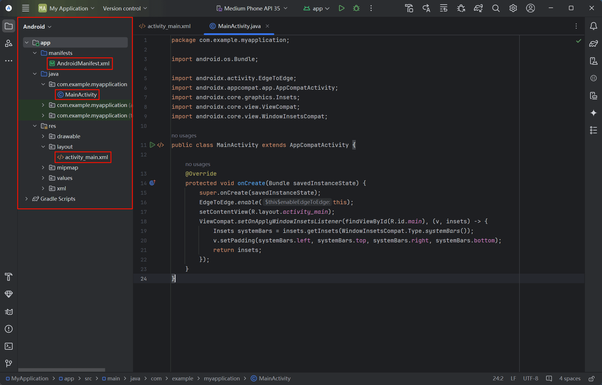
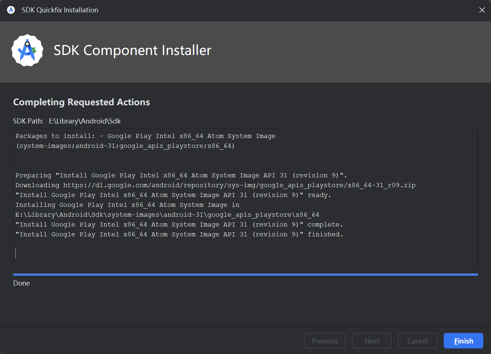

打开 Android Studio，在欢迎页选择 **"New Project"** 新建项目

---

模版选择 **"Phone and Tablet"**（手机和平板电脑）中的 **"Empty Views Activity"**

!!! warning "使用 Java 语言开发"

    为了使用 Java 语言开发，务必选择 "Empty Views Activity" 模板，不要选择默认的 "Empty Activity"（只能使用 Kotlin 语言）。

---

在项目配置界面，按照以下要求设置，并点击 **"Finish"** 完成

!!! example "推荐项目配置"

    - **Language**：`Java`
    - **Minimum SDK**：`API 24 ("Nougat"; Android 7.0)`
    - **Build configuration language**：`Groovy DSL (build.gradle)`

    !!! tip ""

        其中，**Minimum SDK** 建议选择兼容性较高版本（如 `API 19` 提供 100% 兼容）

---

在首次打开项目时，会自动下载和安装必要的构建工具（如 `Gradle` 等），并同步更新索引

??? warning "下载或构建失败"

    这一步骤需要安装的构建工具较多，下载速度可能较慢，如果提示下载或构建失败可以尝试更换网络，并点击左侧
    **"Build"**（构建）图标，在 **"Sync"**（同步）窗口中右键失败的条目，选择 `Reload Gradle Project` 重试。

    

---

在安装完构建工具并更新索引后，左侧项目窗口的文件结构会发生改变，可以在其中找到相应的 `AndroidManifest.xml`、`MainActivity.java` 和 `activity_main.xml` 文件

??? info "核心文件说明"

    - **AndroidManifest.xml**：Android 应用的全局配置文件，用于声明应用的核心信息，如包名、组件（Activity、Service
    等）、权限、最低 SDK 版本等。所有 Activity 均需在此注册（如主 Activity `MainActivity`），并通过
    `<intent-filter>` 定义其作为应用入口的行为。它还声明应用所需的权限（如网络访问、相机使用），并配置应用图标、主题等全局属性，是
    Android 系统识别应用结构和运行规则的关键文件。
    - **MainActivity.java**：定义主 Activity 的 Java 类文件，通常是应用启动时第一个被执行的 Activity
    类。在此文件中，开发者可以处理用户界面交互、业务逻辑、数据操作和生命周期方法等。常用的方法有
    `onCreate()`、`onStart()`、`onResume()`、`onPause()` 等，分别对应 Activity 生命周期的不同阶段。
    此外，开发者还可以通过监听按钮点击事件、执行网络请求、更新 UI 元素等来实现实际功能。
    - **activity_main.xml**：用于定义主 Activity 布局的 XML 文件。在此文件中，开发者可以设计和配置 Activity
    的用户界面，声明视图组件（如 Button、TextView、ImageView 等），并设置它们的位置、大小、颜色、字体等属性。通过 XML
    文件的布局方式，开发者可以轻松调整界面样式，并与 Java 代码中的逻辑进行结合，实现动态交互。布局文件的元素可以通过
    `findViewById()` 与 Java 代码进行关联，从而可以操作视图组件的行为。

---

## 添加 Android 设备

在右侧侧边栏中点击 **"Device Manager"** 图标，打开设备管理窗口，并点击 **"+"** 号添加 Android 虚拟设备

!!! tip "另外添加较低版本的设备"

    在先前安装 Android SDK 组件时，会默认勾选较新的 API 组件并附带安装相应的设备（如图中所示），但由于通常该设备
    Android 版本较新，可能并不适合实际软件开发，因此建议手动添加较低版本的设备。

---

在虚拟设备配置界面选择 **"Phone"** 类中的任意竖屏手机设备（如 `Pixel 8 Pro`），并点击 **"Next"** 下一步

---

根据开发所需的 Android 和 API 版本选择一个系统镜像，并点击左侧 **"Download"** 图标执行下载安装

!!! example ""

    考虑到兼容性，建议优先选择 `Android 12.0 (S)` 或 `Android 11.0 (R)` 的系统镜像

---

选择右下角的 `Accept`，同意许可证协议，并点击 **"Next"** 开始下载安装

---

安装完成后，点击 **"Finish"** 关闭

---

回到配置界面，选择安装好的系统镜像，点击 **"Next"** 下一步

---

AVD 配置保持默认即可，点击 **"Finish"** 完成创建

---

在主界面上方的 **"Available devices"**（可用设备）选项中，选择已安装的 Android 设备即可

---

## 安装设备对应的 SDK

在主界面右上方点击 **"Setting"**（设置）图标，并选择 **"SDK Manager"** 打开 SDK 管理

---

在 **"SDK Platforms"**（SDK 平台）栏下，勾选设备对应 Android 版本的 SDK，点击 **"Apply"** 应用

---

再点击 **"OK"** 确认应用更改，开始下载和安装

---

安装完成后，点击 **"Finish"** 完成

---

## 构建并运行 Android 应用

安装完虚拟设备和 SDK 后，点击上方绿色的 **"Run"**（运行）按钮开始构建和运行 Android 应用

---

等待应用项目的构建，可能需要下载某些构建依赖 (1)
{ .annotate }

1. 可以点击左侧 **"Build"**（构建）图标，在 **"Build Output"**（构建输出）窗口中查看构建详情

---

项目构建完成后，会自动运行选择的 Android 设备（首次开机可能需要较长时间），并在设备中运行本项目的应用程序（`Hello, World!`）(1)
{ .annotate }

1. 可以在右侧边栏中点击 **"Running Devices"** 图标，查看当前运行中的设备

---

## 查看 XML 布局代码

打开 `activity_main.xml` 文件，默认是视图为 **"Design"** 预览模式，可以在右上方分别切换 **"Code"**（代码）、**"Split"**（分离）、**"Design"**（设计）三个视图

---

例如，切换至 **"Split"**（分离）视图可以同时查看设计预览和 XML 代码，方便同时编辑和预览

