## 安装 Android Studio

访问 [Android Studio 中国官网](https://developer.android.google.cn/studio)，下载 Android Studio IDE

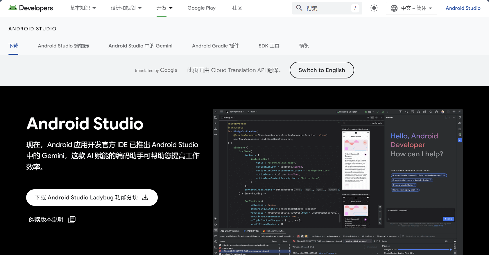

---

下载完成后，运行 **"Android Studio Setup"** 安装程序，点击 **"Next"** 开始安装

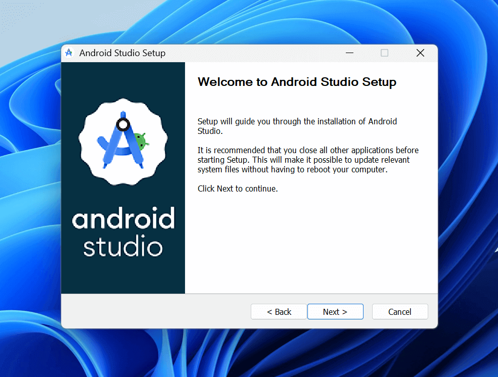

---

安装组件勾选 `Android Studio` 和 `Android Virtual Device`

!!! info "Android Virtual Device (AVD)"

    **Android Virtual Device** 是一种安卓虚拟设备配置，用于定义在 Android Emulator（安卓模拟器）中模拟的
    Android 手机、平板电脑、Wear OS、Android TV 或 Automotive OS 设备的特性。附带的设备管理器可以帮助创建和管理 AVD。

    在安装组件时勾选 `Android Virtual Device`，即代表附带安装 Android Emulator（安卓模拟器）用于管理 AVD。

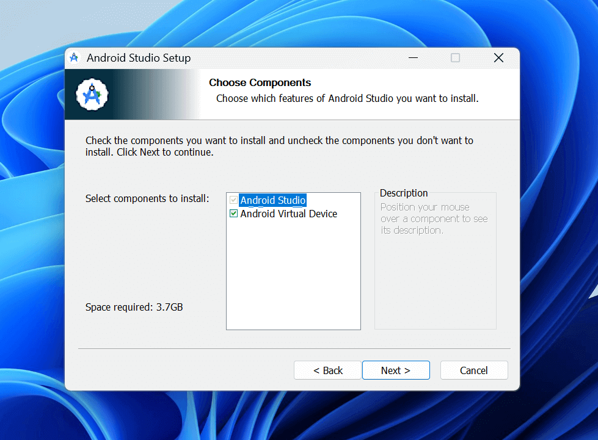

---

选择安装位置，如需更换至其他盘符，建议将默认路径前缀的 `C:`直接改成所需盘符，如 `D:`

!!! warning "路径不应包含特殊字符"

    安装路径不应包含任何特殊字符（如中文），避免安装路径无法被识别！

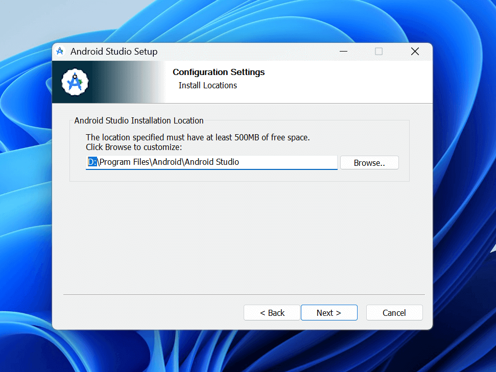

---

选择 Windows 开始菜单的快捷文件夹，保持默认并点击 **"Install"** 执行安装

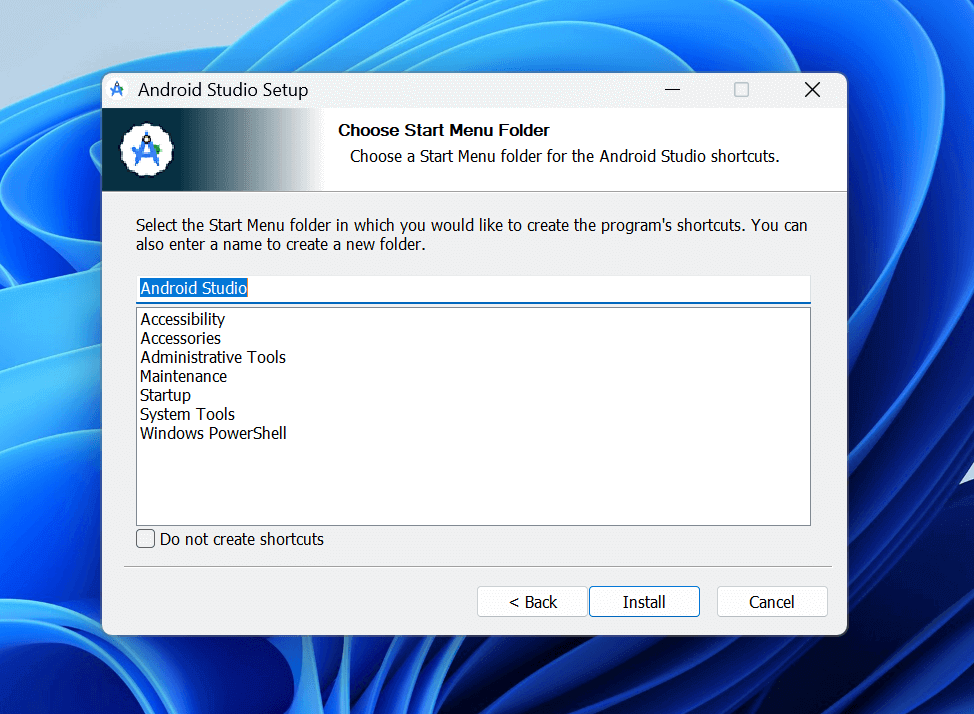

---

等待安装，安装完成后点击 **"Finish"** 即可

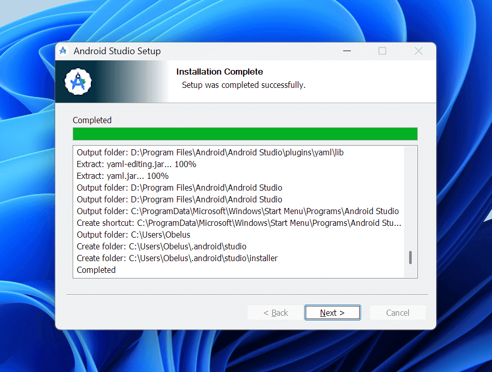

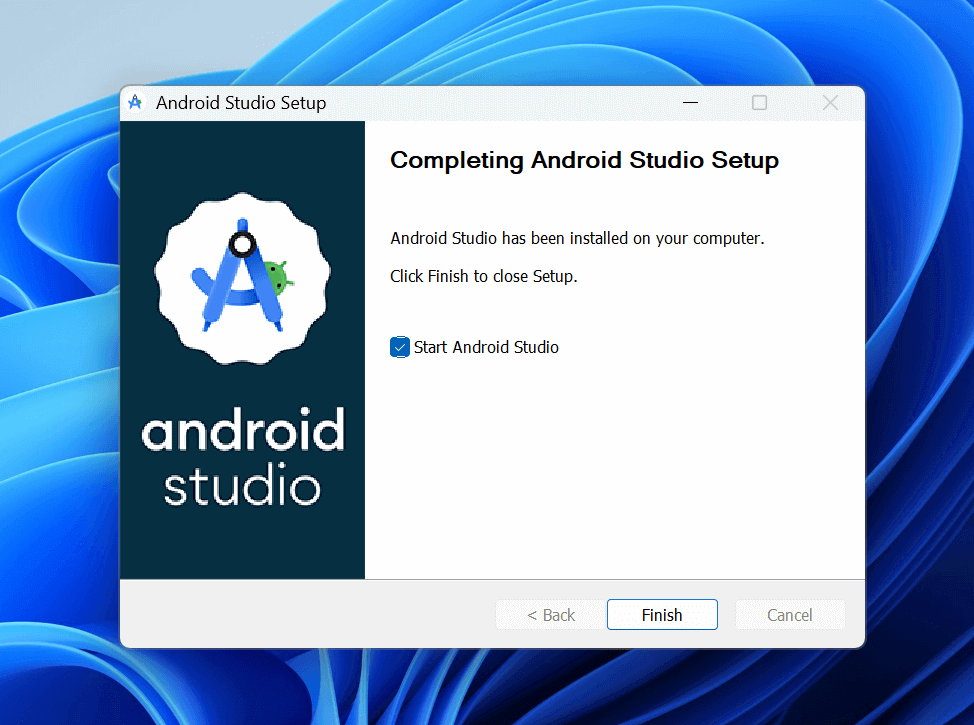

---

## 安装 Android 组件

打开 Android Studio，如果提示 **"Help improve Android Studio"**（分享使用数据帮助改进 Android Studio），可以选择 `Don't Send`，不分享和发送使用数据

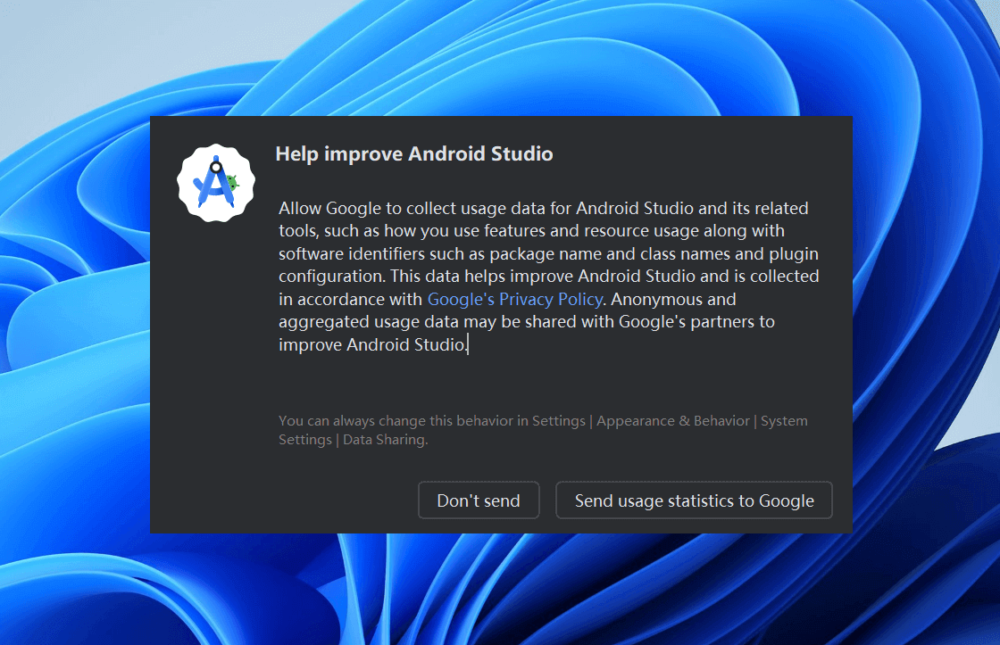

---

使用 **"Android Studio Setup Wizard"** 安装向导，选择可用组件并下载安装

!!! tip ""

    如果之前未安装过 Android SDK，会在线查找可用的 SDK 组件列表，务必确保网络可用

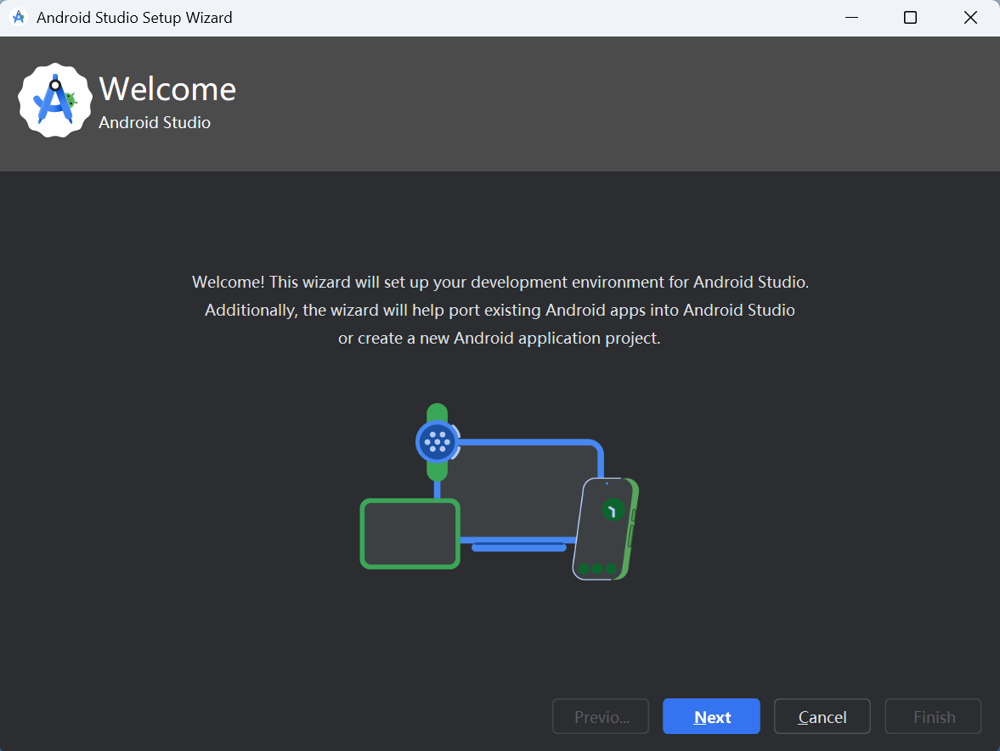

---

**"Install Typer"**（安装类型）建议选择 `Custom` 进行自定义安装

!!! warning "不建议选择 `Standard`"

    如果选择 `Standard` 标准安装，将自动选择所有组件并安装至用户数据文件夹（C 盘），如果需要更改路径则选择自定义安装。

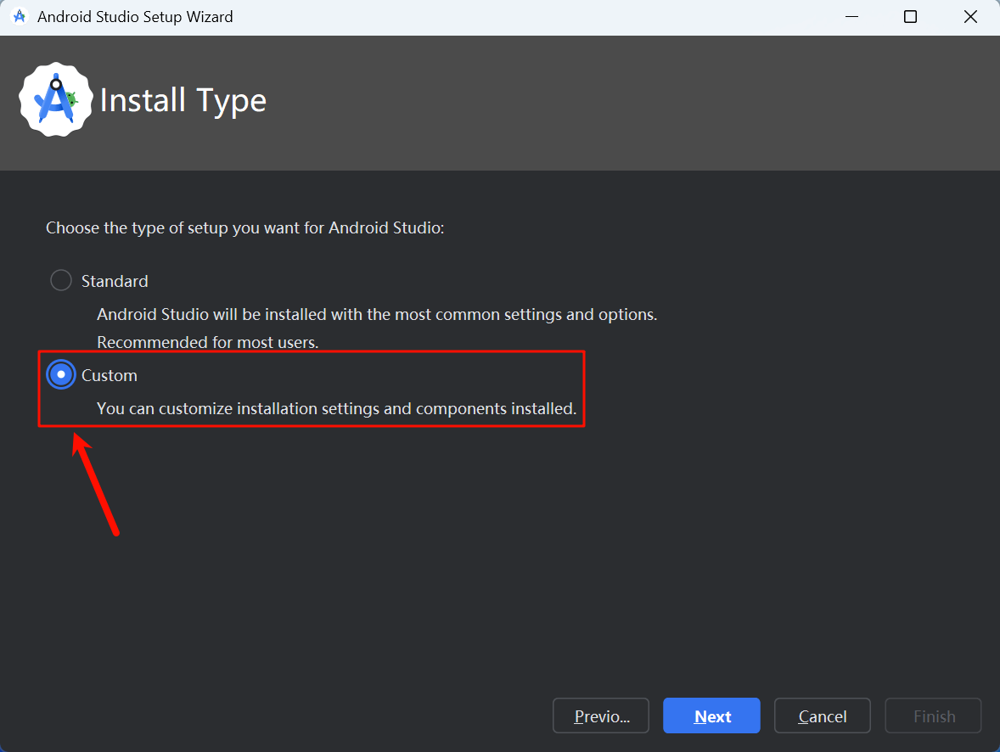

---

根据需要选择 SDK 组件，其中 `Android SDK` 和 `Android Vritual Device` 为必选项

??? info "SDK 组件说明"

    - **Android SDK**：Android 软件开发工具包，包含了开发 Android 应用程序所需的工具、库和样例代码，提供了开发者所需的 API、调试工具和其他必要的资源。
    - **Android SDK Platform**：Android 操作系统的软件开发包，包含了特定版本的 Android 系统的 API 级别和系统图像，开发者可以利用这些平台来编写、编译和运行针对特定 Android 版本的应用程序。
    - **Performance (Interl HAXM)**：Intel 硬件加速执行管理器是一个可选的性能组件，它可以在 Intel 处理器的计算机上加速 Android 模拟器的性能，提高 Android 模拟器的运行速度。
    - **Performance (Android Emulator hypervisor driver)**：Android 模拟器虚拟化驱动程序是另一个可选的性能组件，它提供了一种虚拟化技术来改善 Android 模拟器的性能，借助这个组件可以在模拟器中更快速地运行和测试应用程序。
    - **Android Virtual Device**：Android Virtual Device（AVD）是 Android 模拟器的配置模拟器，可以模拟不同类型和版本的 Android 设备，创建不同配置的 AVD 来测试应用在不同设备上的运行情况，以确保应用的兼容性和稳定性。

    !!! warning ""

        其中，`Performance (Interl HAXM)` 和 `Performance (Android Emulator hypervisor driver)` 只需选择两者之一进行安装即可；
        如果安装失败或无法选中可以先不勾选，之后再另行安装。

!!! tip "更改 SDK 安装位置"

    Android SDK 组件在后续配置中将可能占用至少 15GB 的空间，如果 C 盘空间较小建议将 SDK 
    安装位置更改为其他盘符，注意安装路径不应包含任何特殊字符（如中文）和空格，避免安装路径可能无法被识别。

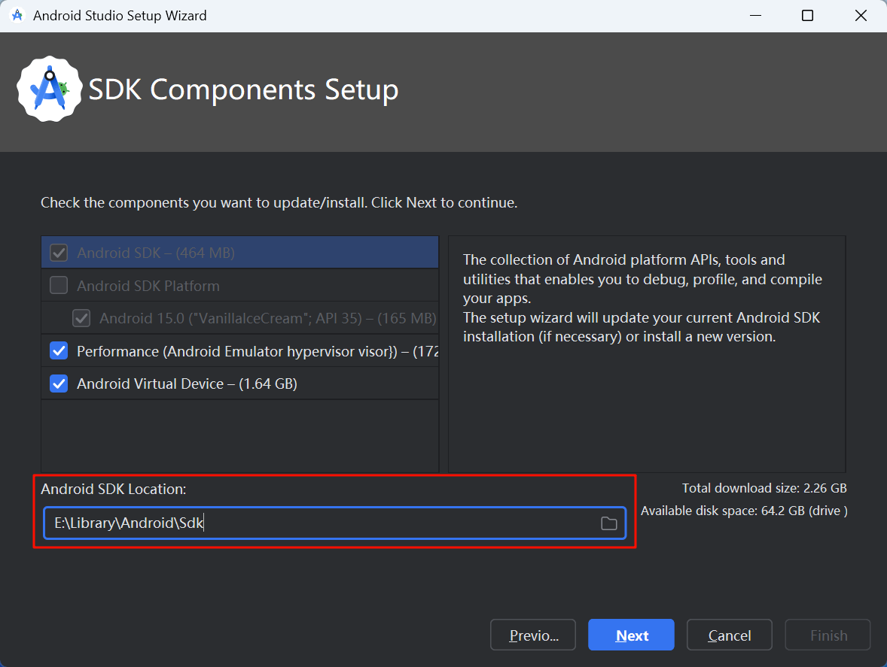

---

点击 **"Next"**，确认安装 Android 模拟器虚拟化驱动程序

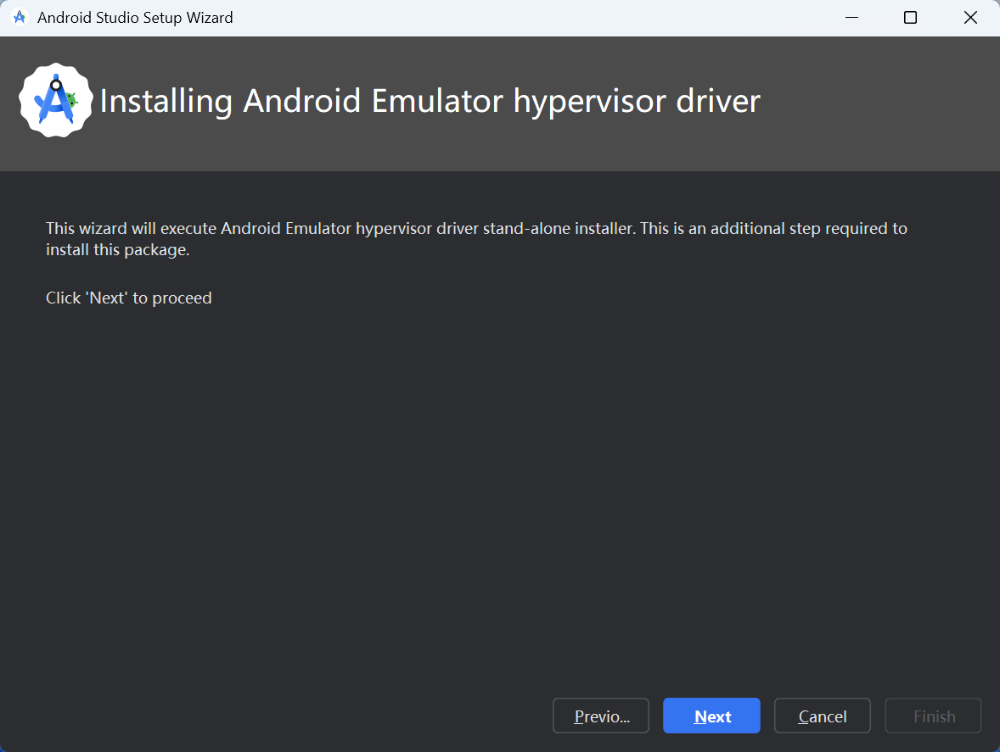

---

确认安装配置的安装类型、安装位置、下载大小和已选组件，点击 **"Next"** 继续

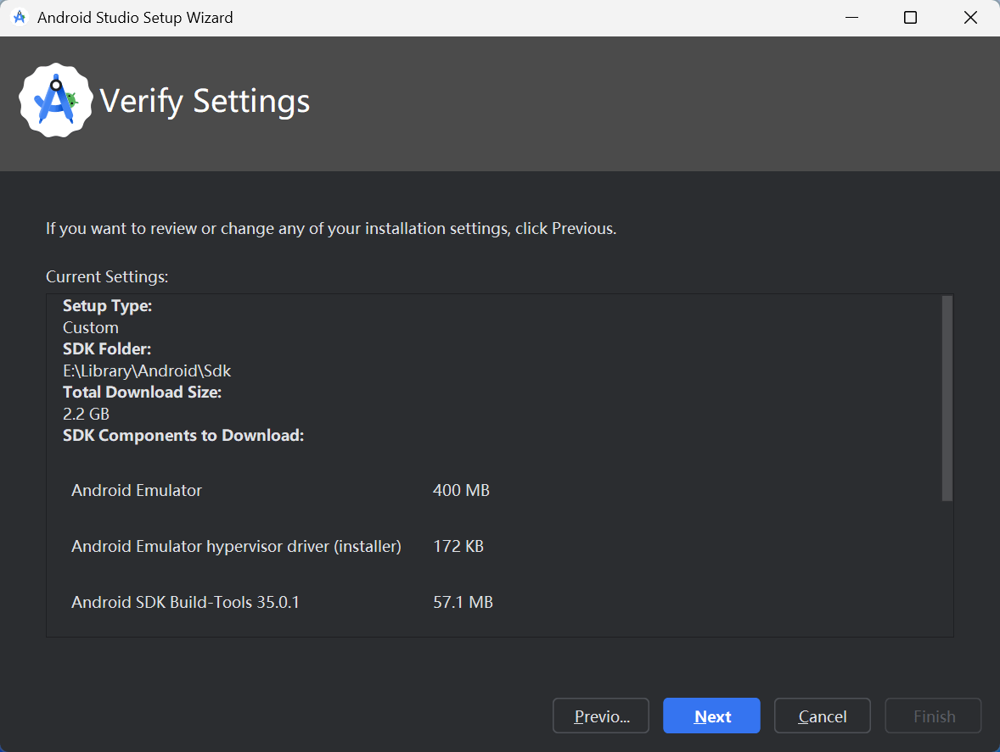

---

选择右下角的 **"Accept"**，同意所有组件的许可证协议，并点击 **"Finish"** 完成

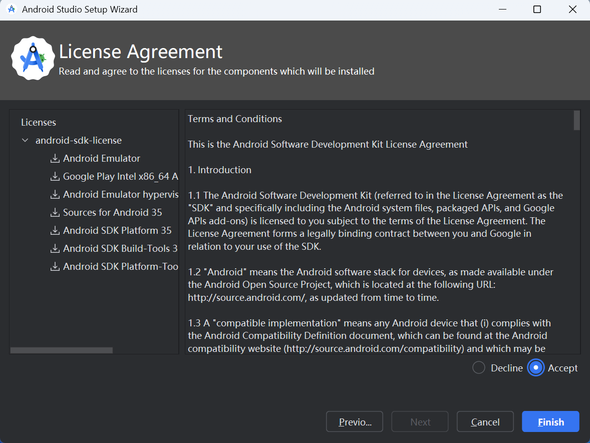

---

等待下载和安装所有已选的 SDK 组件

!!! question "不显示进度或下载太慢"

    下载的第一个组件 `Android Emulator` 约为 400MB，在下载完成前将不会显示进度，可以在任务管理器中查看
    `Android Studio Setup Wizard` 程序的网络速度是否正常。由于需要从 Google
    服务器下载，国内连接速度通常较慢甚至会下载失败，如果下载较慢建议尝试更换网络或使用魔法上网代理下载。

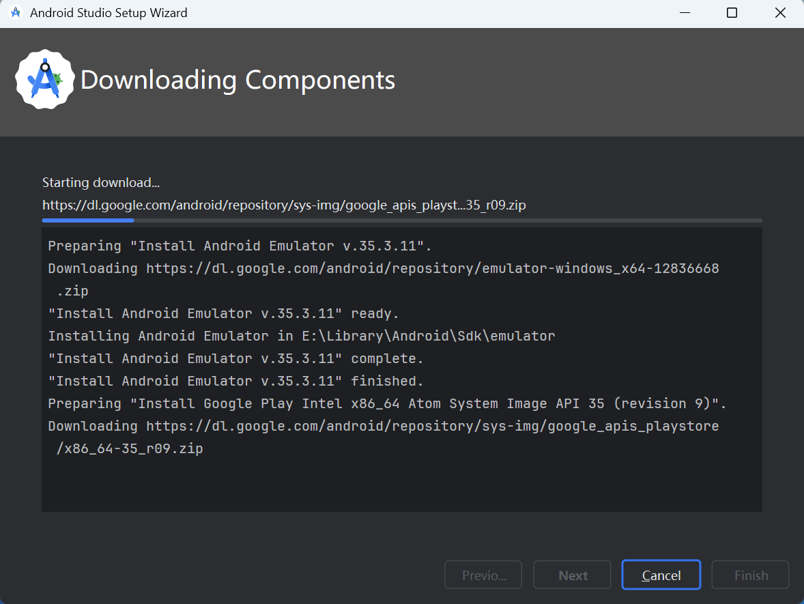

---

安装完成后，点击 **"Finish"** 即可

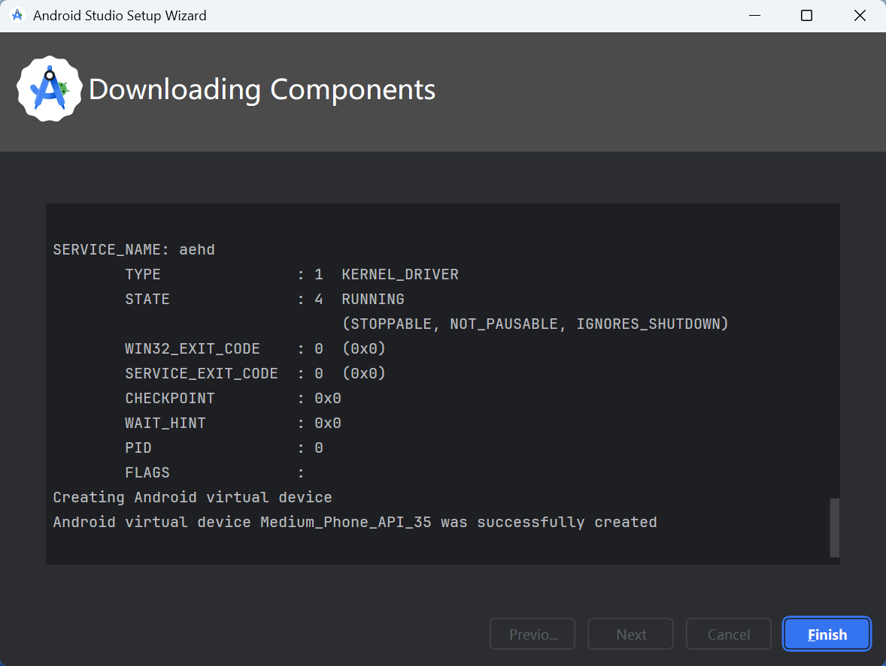

---

## Android Studio 文件目录

!!! info "Android Studio 涉及的所有文件目录"

    - **Android Studio**
        - `${安装根目录}\Android\Android Studio`
    - **Android SDK**
        - `${SDK根目录}\Android\Sdk`
    - **Gradle 缓存**
        - `%USERPROFILE%\.gradle`
    - **Android Studio 系统文件（本地）**
        - `%LOCALAPPDATA%\Google\AndroidStudio`
    - **Android Studio 系统文件（漫游）**
        - `%APPDATA%\Google\AndroidStudio`
    - **Android Studio 项目**
        - `%USERPROFILE%\AndroidStudioProjects`

    !!! tip ""

        如果需要完全卸载 Android Studio，可以通过删除以上所有目录来清理所有文件
