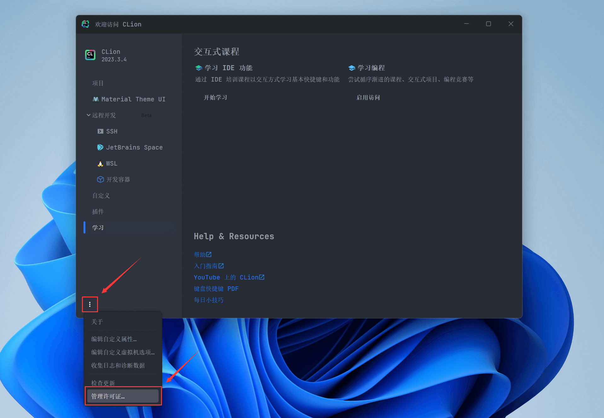
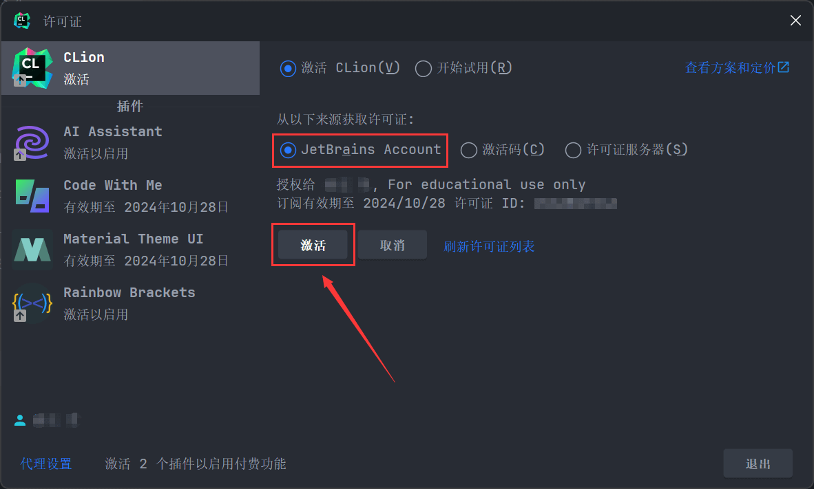

以 CLion 为例，打开 CLion，在欢迎页面左下方点击更多按钮，并点击 **"管理许可证..."** 选项

---

在许可证界面，选择 CLion ，并选择从 **JetBrains Account** 获取许可证，点击 **"激活"** 即可

!!! tip "其他产品授权"

    教育许可证授权的其他产品或插件（如 Material Theme UI）也可以通过同样的方式激活

