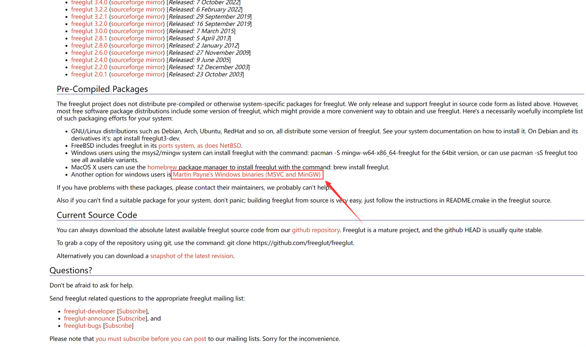
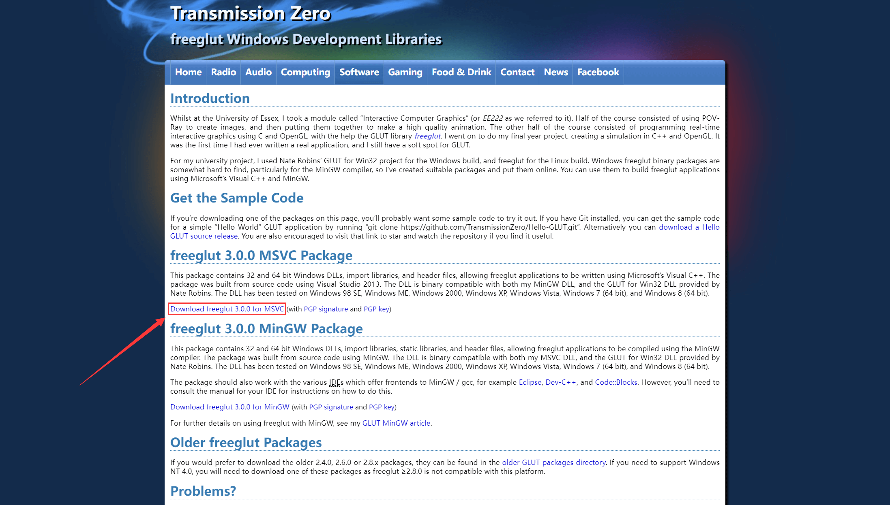
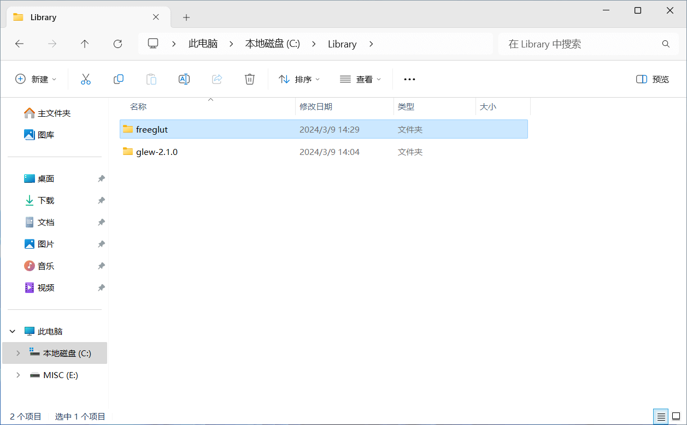
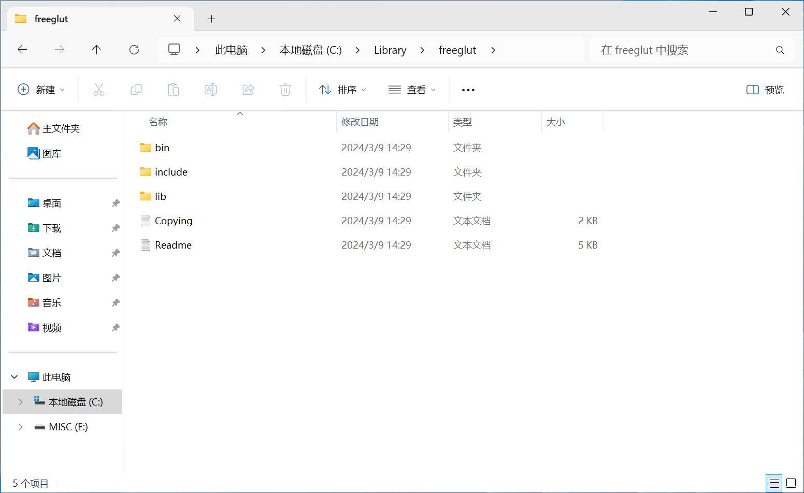
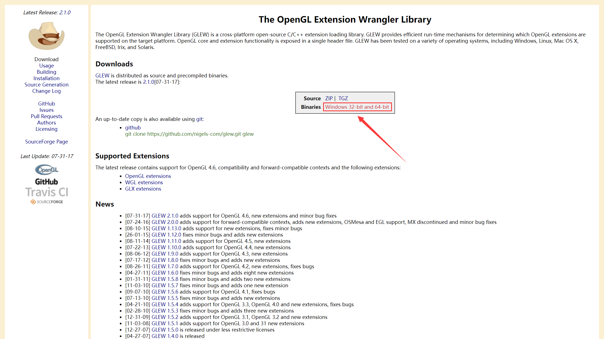
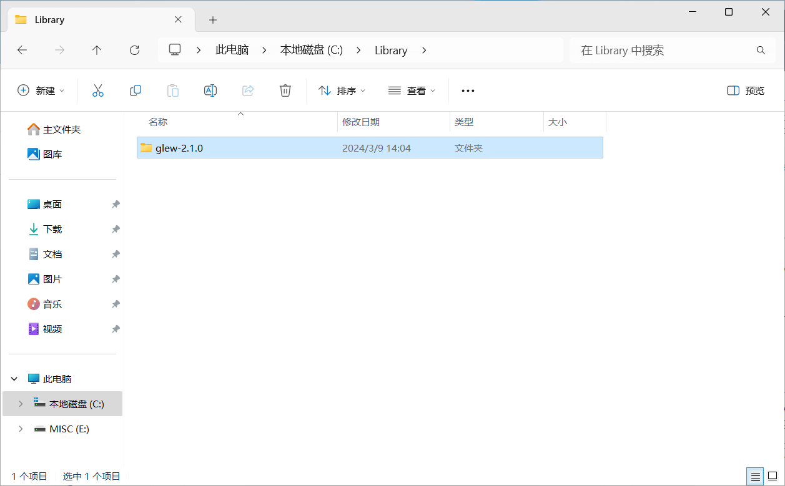
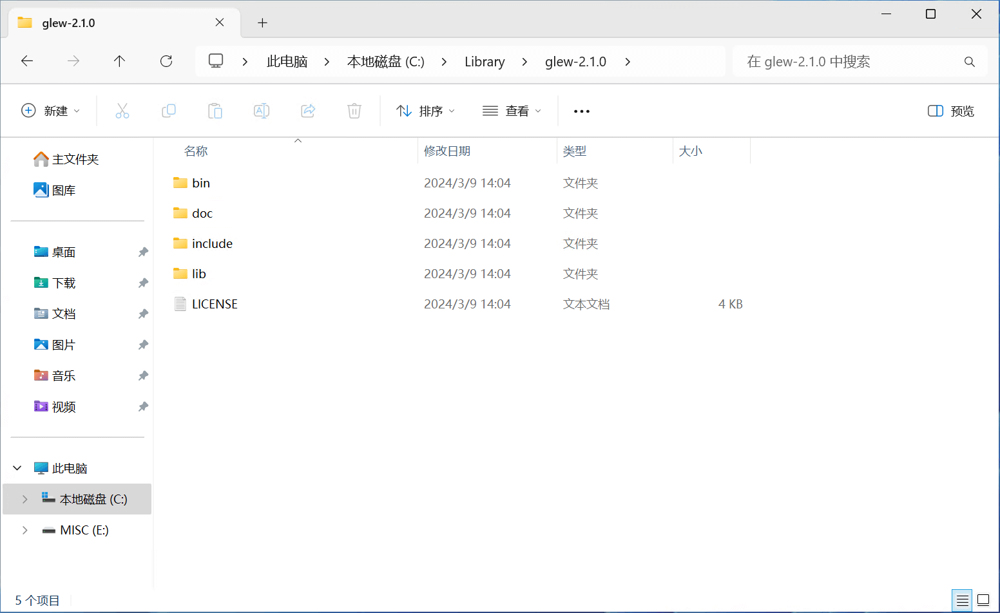

## 下载 freeglut

!!! abstract "freeglut（Free OpenGL Utility Toolkit）[^1]"

    **freeglut** 是一个用于创建和管理 OpenGL 窗口的工具库，它是原始 GLUT（OpenGL Utility Toolkit）的一个免费的开源替代品，提供了更多功能和跨平台支持。通过
    freeglut 可以更轻松地创建窗口、处理输入事件、管理窗口的位置和大小等操作。

访问 [freeglut 官网](https://freeglut.sourceforge.net)，在 **"Pre-Compiled Packages"** 栏下，点击
**`Martin Payne's Windows binaries (MSVC and MinGW)`** 访问 Martin Payne 的网站（freeglut Windows Development Libraries）

---

在网站的 **"freeglut 3.0.0 MSVC Package"** 栏下，点击 **`Download freeglut 3.0.0 for MSVC`** 下载适用于
Microsoft Visual C++（MSVC）的二进制文件

!!! tip "使用最新版"

    在此网站下载的 freeglut 版本可能较旧，如需使用新版本可在 [Github](https://github.com/freeglut/freeglut)下载源文件自行编译

---

将下载的二进制文件压缩包解压至任意路径，例如：`C:\Library`

---

??? example "freeglut 动态库的文件目录结构（Windows 平台）"

    - **bin**：存放二进制文件
        - **x64**：64 位版本的动态链接库文件
            - `freeglut.dll`：64 位的动态链接库
        - `freeglut.dll`：32 位的动态链接库
    - **include**：存放头文件
        - **GL**：OpenGL 相关的头文件
            - `freeglut.h`：freeglut 的核心头文件
            - `freeglut_ext.h`：扩展功能的头文件
            - `freeglut_std.h`：标准接口的头文件
            - `glut.h`：OpenGL 辅助库的头文件
    - **lib**：存放库文件
        - **x64**：64 位版本的导入库文件（动态链接）
            - `freeglut.lib`：64 位的导入库文件
        - `freeglut.lib`：32 位的导入库文件
    - `Copying.txt`：版权和许可证信息
    - `Readme.txt`：关于 freeglut 的简要说明和使用方法

---

## 下载 GLEW

!!! abstract "GLEW（OpenGL Extension Wrangler Library）[^2]"
    **GLEW** 是一个开源的、跨平台的 C/C++ 库，用于管理 OpenGL 的扩展。在实际的 OpenGL 开发中，有许多功能是由扩展提供的，而 GLEW
    可以帮助我们轻松地管理这些扩展。它提供了一组简洁的接口，方便我们查询、加载和管理 OpenGL 的扩展，使得在不同平台上编写 OpenGL 代码变得更加简单和统一。

访问 [GLEW 官网](https://www.opengl.org)，在 **"Downloads"** 标题下，点击 **`Windows 32-bit and 64-bit`** 下载适用于 Windows
平台的二进制文件（Binaries）(1)
{ .annotate }

1. 二进制文件包含了从源文件（Source）编译的适用于特定平台的可执行文件、头文件、静态/动态库文件等

---

将下载的二进制文件压缩包解压至任意路径 (1)，例如：`C:\Library`
{ .annotate }

1. 库路径不建议包含任何特殊字符（如中文）和空格

---

??? example "GLEW 动态库的文件目录结构（Windows 平台）"

    - **bin**：存放二进制文件
        - **Release**：发行版本
            - **Win32**：32 位版本的可执行文件
                - `glew32.dll`：32 位的动态链接库
                - `glewinfo.exe`：用于显示 OpenGL 扩展信息的可执行文件
                - `visualinfo.exe`：用于显示 OpenGL 可视化信息的可执行文件
            - **x64**：64 位版本的可执行文件
                - `glew32.dll`：64 位的动态链接库
                - `glewinfo.exe`：用于显示 OpenGL 扩展信息的可执行文件
                - `visualinfo.exe`：用于显示 OpenGL 可视化信息的可执行文件
    - **doc**：存放文档文件
        - `*.html`：各种 HTML 文件，包括文档、安装说明等
        - `*.txt`：各种文本文件，包括许可证、版权等
        - `*.png`：各种图片文件
    - **include**：存放头文件
        - **GL**：OpenGL 相关的头文件
            - `eglew.h`：EGL 扩展的头文件
            - `glew.h`：GLEW 核心头文件
            - `glxew.h`：GLX 扩展的头文件
            - `wglew.h`：WGL 扩展的头文件
    - **lib**：存放库文件
        - **Release**：发行版本
            - **Win32**：32 位版本的导入库文件（动态链接）
                - `glew32.lib`： 32 位的导入库
                - `glew32s.lib`：32 位的导入库（多线程版本）
            - **x64**：64 位版本的导入库文件（动态链接）
                - `glew32.lib`：64 位的导入库
                - `glew32s.lib`：64 位的导入库（多线程版本）
    - `LICENSE.txt`：许可证文件

[^1]: [The freeglut Project](https://freeglut.sourceforge.net)
[^2]: [OpenGL - The Industry Standard for High Performance Graphics](https://www.opengl.org)
