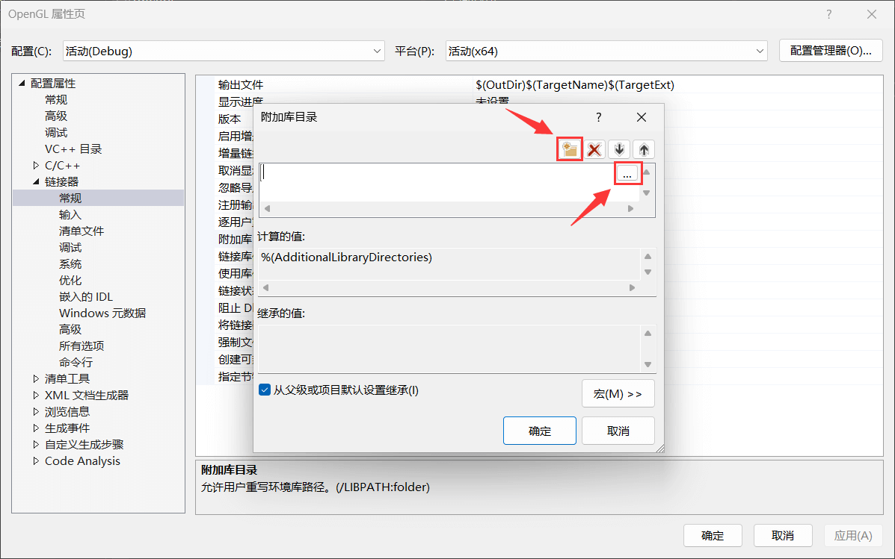
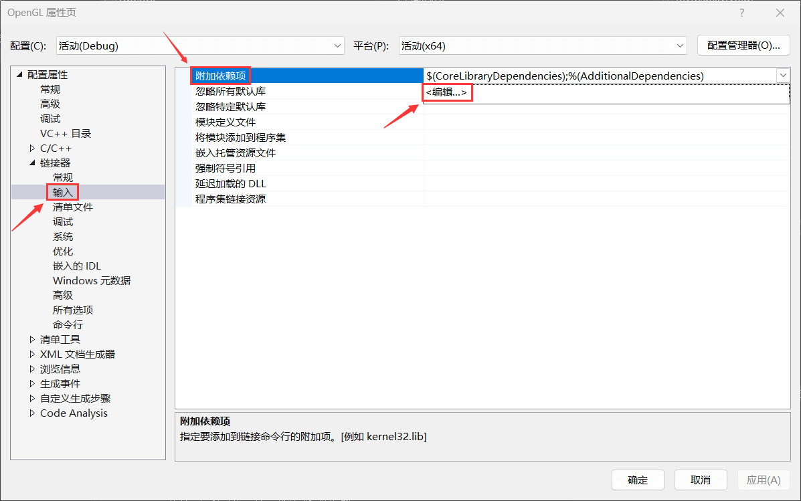

!!! abstract "项目级环境配置"

    **项目级环境配置**是指仅将环境配置应用于单个项目，不同项目间不共享，如果新建项目需要重新配置。

在 **"解决方案资源管理器"** 栏中，右键单击项目名称，并选择 **"属性"** 打开项目属性页

> 注意：打开项目的属性页，而非 `.cpp` 文件的属性页

---

!!! tip "配置与平台"

    在修改项目属性之前，注意当前选择的所应用的**`配置`**和**`平台`**，建议设置为：
    
    - `配置`：**所有配置**
    - `平台`：**x64**

!!! warning "区分 64 位和 32 位平台"

    此处选择的平台，需要与之后选择的不同位数（Win32/x64）程序的库目录（`.lib`）相对应！

---

## 设置附加包含目录（`.h`）

在项目属性页 **"配置属性 > C/C++ > 常规"** (1)中的**`附加包含目录`**右侧选择编辑
{ .annotate }

1. `C/C++` 选项仅在有 C/C++ 源文件（`.c/.cpp`）时才能设置，如果没有此选项可以尝试新建源文件

---

点击 **"新行"** 图标，新建目录属性并将值设为 GLEW 和 freeglut 的 **`include`** 目录

---

设置完成后，如图所示

---

## 设置附加库目录（`.lib`）

在项目属性页 **"配置属性 > 链接器 > 常规"** 中的**`附加库目录`**右侧选择编辑

---

点击 **"新行"** 图标，新建目录属性并将值设为 GLEW 和 freeglut 的 **`lib`** 目录（区分 32/64 位程序）

!!! info "64 位与 32 位的 lib 目录"

    对于 **64 位程序（x64）**，**`lib`** 目录设置为：
    
    - `...\glew\lib\Release\x64`
    - `...\freeglut\lib\x64`
    
    对于 **32 位程序（Win32）**，**`lib`** 目录设置为：
    
    - `...\glew\lib\Release\Win32`
    - `...\freeglut\lib`

---

设置完成后，如图所示

/// caption
图中，以 64 位程序为例
///

---

## 设置附加依赖项 [可选]

!!! tip "此步骤可跳过"

    这一步骤并不是必要的，编译器会自动查找所需依赖项，可以跳过此设置

在项目属性页 **"配置属性 > 链接器 > 输入"** 中的**`附加依赖项`**右侧选择编辑

---

在其中写入 GLEW 和 freeglut 的动态库文件名称：**`glew32.lib`**、**`freeglut.lib`**，如图所示

!!! danger "注意拼写"

    如果动态库文件名称拼写有误（如将 `freeglut` 错写为 `freelut` ），编译器将报错无法找到 `.lib` 文件

