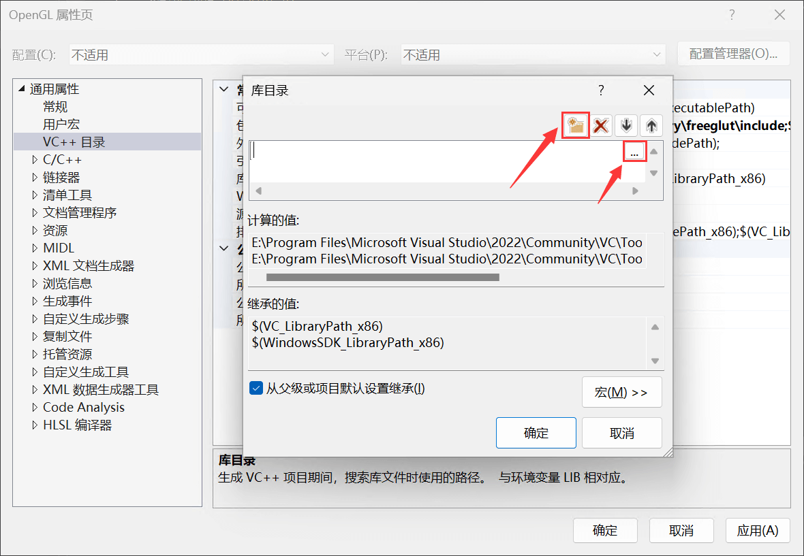
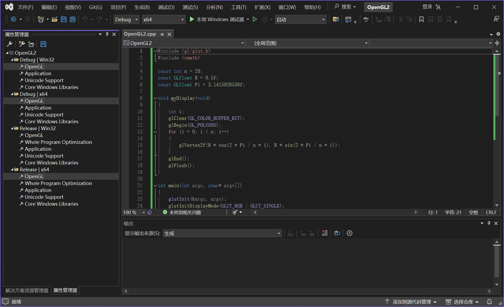

!!! abstract "共享式项目配置"

    **共享式项目配置**是指将环境配置保存至新建属性表文件（.props），使用公共属性表可以在不同解决方案和项目间实现配置共享或重用，甚至在不同设备之间分享。

    参考文档：[共享或重用 Visual Studio 项目设置](https://learn.microsoft.com/zh-cn/cpp/build/create-reusable-property-configurations?view=msvc-170)

## 创建项目属性表

打开已有的解决方案（项目），在界面左上角选择 **"视图 > 属性管理器"**

---

在属性管理器页面左上角，点击 **"新建属性表"** 图标，打开添加新项界面

---

在添加新项界面选择 **"属性表(.props)"**，并设置属性表名称和保存位置

!!! tip "保存备用"

    建议将属性表保存至专门用于 OpenGL 项目的文件夹，或是放置桌面备用

---

打开属性管理器中的任意配置文件夹，右键单击刚刚创建的属性表，并选择 **"属性"** 打开属性页

---

## 设置包含目录（`.h`）

在项目属性页 **"配置属性 > VC++ 目录"** 中的**`包含目录`**右侧选择编辑

---

点击 **"新行"** 图标，新建目录属性并将值设为 GLEW 和 freeglut 的 **`include`** 目录

---

设置完成后，如图所示

---

## 设置库目录（`.lib`）

在项目属性页 **"配置属性 > VC++ 目录"** 中的**`库目录`**右侧选择编辑

---

点击 **"新行"** 图标，新建目录属性并将值设为 GLEW 和 freeglut 的 **`lib`** 目录（区分 32/64 位程序）

!!! info "64 位与 32 位的 lib 目录"

    对于 **64 位程序（x64）**，**`lib`** 目录设置为：
    
    - `...\glew\lib\Release\x64`
    - `...\freeglut\lib\x64`
    
    对于 **32 位程序（Win32）**，**`lib`** 目录设置为：
    
    - `...\glew\lib\Release\Win32`
    - `...\freeglut\lib`

---

设置完成后，如图所示

/// caption
图中，以 64 位程序为例
///

---

## 设置附加依赖项 [可选]

!!! tip "此步骤可跳过"

    这一步骤并不是必要的，编译器会自动查找所需依赖项，可以跳过此设置

在项目属性页 **"配置属性 > 链接器 > 输入"** 中的**`附加依赖项`**右侧选择编辑

---

在其中写入 GLEW 和 freeglut 的动态库文件名称：**`glew32.lib`**、**`freeglut.lib`**，如图所示

!!! danger "注意拼写"

    如果动态库文件名称拼写有误（如将 `freeglut` 错写为 `freelut` ），编译器将报错无法找到 `.lib` 文件

---

!!! danger "务必保存"

    属性表配置完成后，务必点击 **"保存"** 选项进行保存！

---

## 添加项目属性表 [可选]

如果要将配置拷贝至另一个解决方案，可以打开其属性管理器页面，点击 **"添加属性表"** 图标

---

选择之前已经创建好的项目属性表，打开导入即可

---

导入后，在四种配置项中都会添加该属性表

!!! danger "区分 64 位和 32 位配置"

    四种配置项都会应用该属性表的配置，意味着如果该属性表的导入库文件（`.lib`）设置为 64 位程序专用，那么在将项目的当前配置切换至构建
    x86（32位）程序后，将无法进行编译，需要手动修改！

