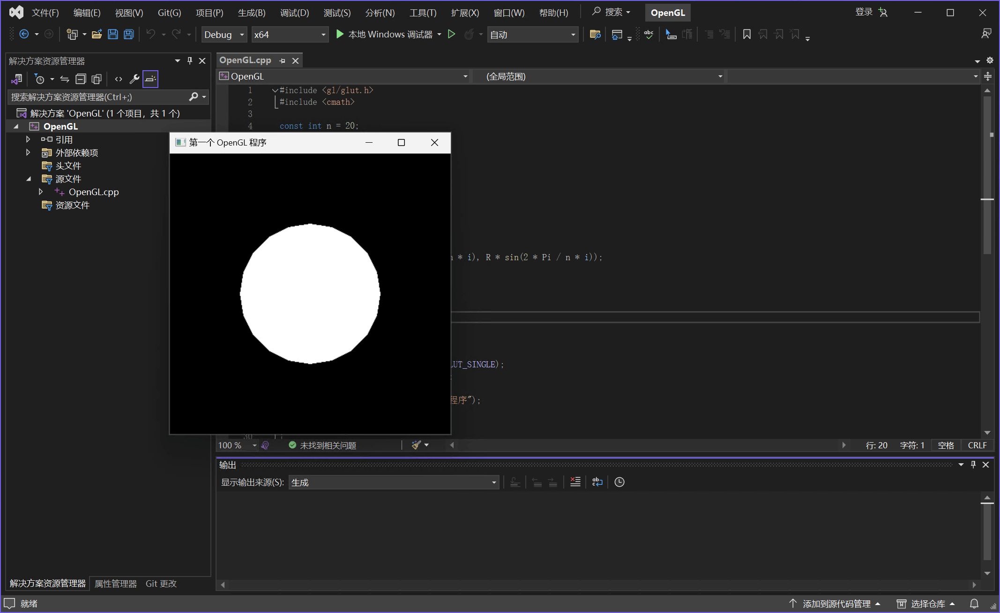

!!! danger "务必检查环境配置"

    如果在编译或运行程序时提示报错（如代码标红线、链接错误、无法解析符号或找不到 `.dll` 文件等），
    请检查环境配置的**所有目录项**和**系统环境变量**是否已正确设置！（也可能之前设置的未能保存）

```c++ title="OpenGL.cpp" linenums="1"
#include <gl/glut.h>
#include <cmath>

const int n = 20;
const GLfloat R = 0.5f;
const GLfloat Pi = 3.1415926536f;

void myDisplay(void)
{
    int i;
    glClear(GL_COLOR_BUFFER_BIT);
    glBegin(GL_POLYGON);
    for (i = 0; i < n; i++)
    {
        glVertex2f(R * cos(2 * Pi / n * i), R * sin(2 * Pi / n * i));
    }
    glEnd();
    glFlush();
}

int main(int argc, char *argv[])
{
    glutInit(&argc, argv);
    glutInitDisplayMode(GLUT_RGB | GLUT_SINGLE);
    glutInitWindowPosition(100, 100);
    glutInitWindowSize(400, 400);
    glutCreateWindow("第一个 OpenGL 程序");
    glutDisplayFunc(&myDisplay);
    glutMainLoop();

    return 0;
}
```


