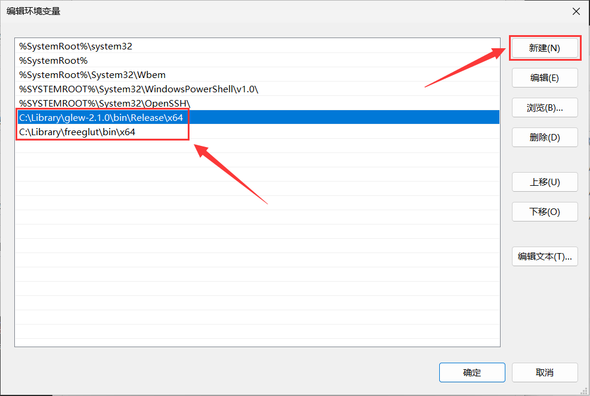

!!! abstract "系统环境变量"

    **环境变量**是一种存储操作系统和应用程序所需配置信息的机制，这些信息通常以键值对的形式存在。其中，`PATH` 变量定义了系统在哪些目录中寻找依赖库（`.dll`）、
    可执行文件（`.exe`）和其他资源，当试图运行一个程序而未提供完整路径时，系统能够根据 `PATH` 环境变量中列出的目录顺序查找并运行该程序。

在 Windows 搜索栏搜索 **"环境变量"**，并点击 **"编辑系统环境变量"**，打开系统环境变量配置

---

在 **"系统属性 > 高级"** 页面下点击 **"环境变量"**，并双击打开在 **"环境变量 > 系统变量"** 下的 **"Path"** 变量

---

在右上方点击 **"新建"** 变量并将值设为 GLEW 和 freeglut 的 **`bin`** 目录（区分 32/64 位程序）

!!! info "64 位与 32 位的 bin 目录"

    对于 **64 位程序（x64）**，**`bin`** 目录设置为：
    
    - `...\glew\bin\Release\x64`
    - `...\freeglut\bin\x64`

    对于 **32 位程序（Win32）**，**`bin`** 目录设置为：
    
    - `...\glew\bin\Release\Win32`
    - `...\freeglut\bin`

!!! danger "需要保存并重启 Visual Studio"

    设置系统环境变量后，需要**完全关闭并重启 Visual Studio** 才能生效，重启前务必**全部保存**项目更改！

/// caption
图中，以 64 位程序为例
///
