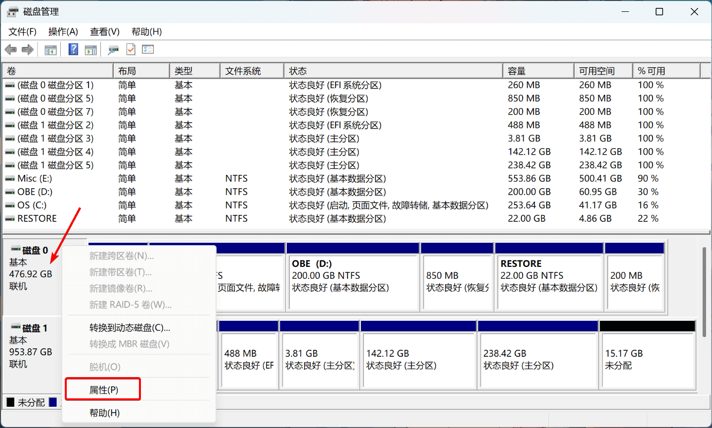
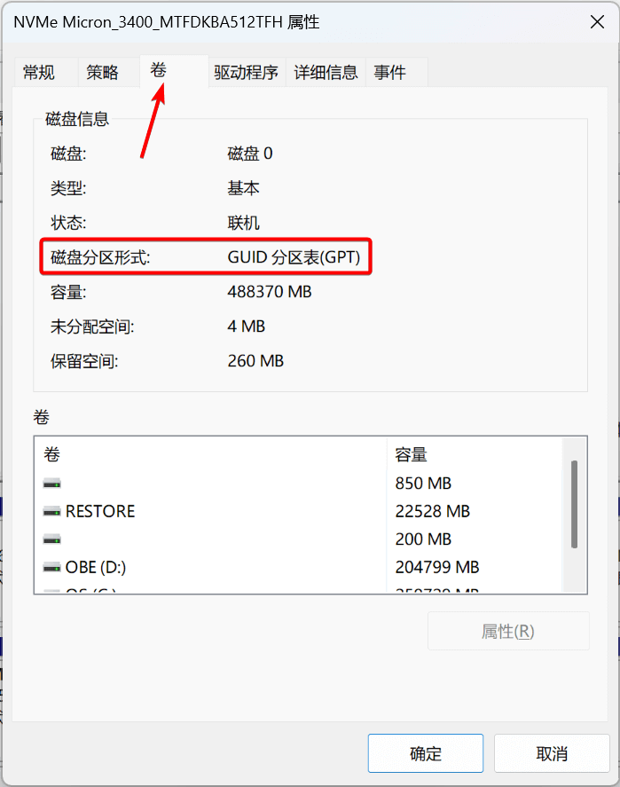
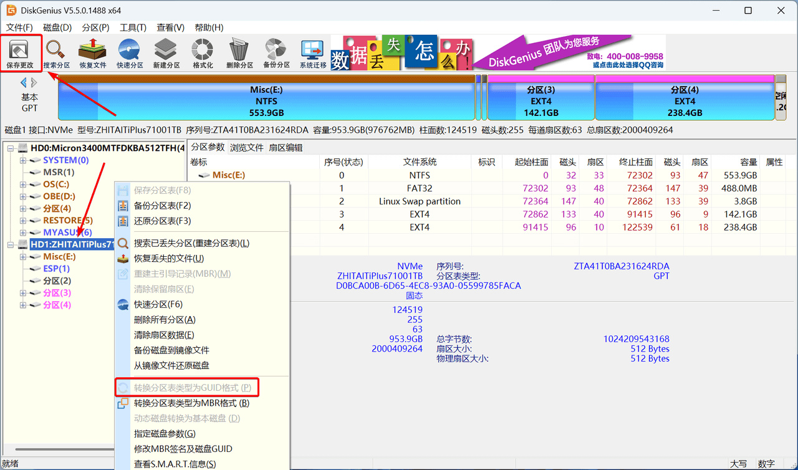
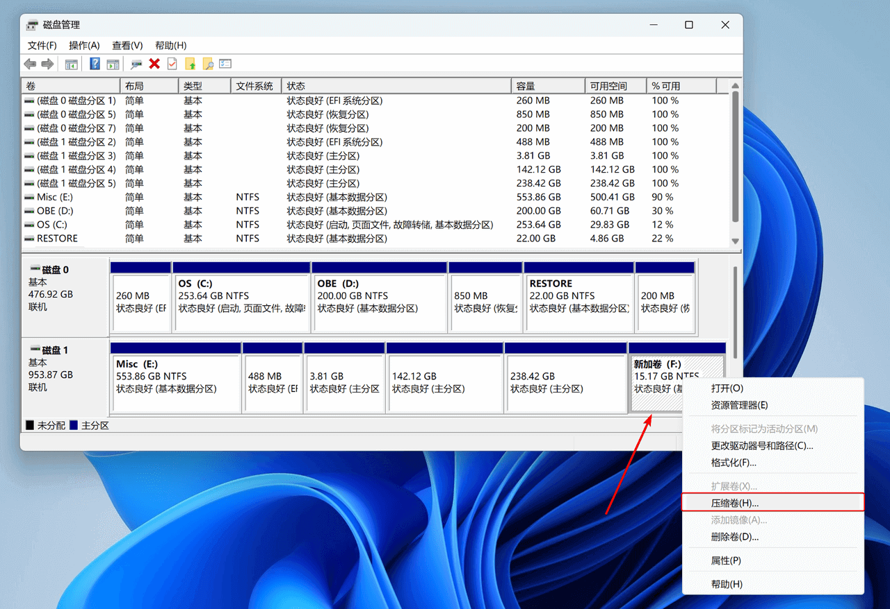
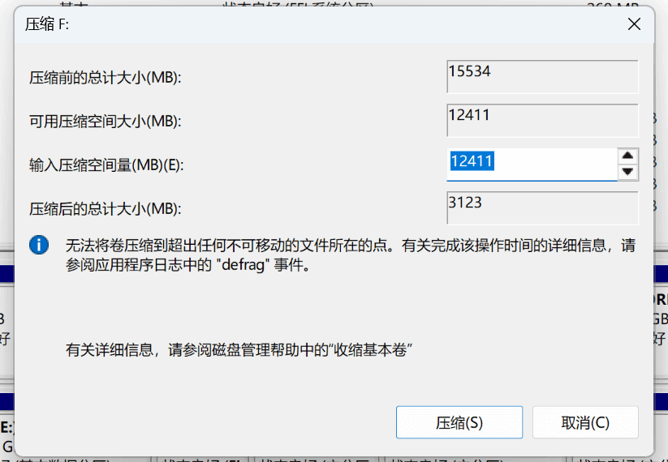

!!! example "如果只需安装 Ubuntu 单系统，可以跳过此步骤"

    如果要在保留 Windows 系统的情况下，安装 Ubuntu 系统（双系统），需要提前设置 BIOS 的引导模式，并分配/预留磁盘空间；如果只需安装
    Ubuntu 单系统，可以跳过这一步骤。

---

## 认识引导模式与分区表

!!! abstract "BIOS（Basic Input/Output System）[^1]"

    **BIOS**，即基本输入/输出系统，是指位于计算机主板的芯片中最底层的固件。主要功能是在计算机启动时初始化硬件设备，并执行引导程序，
    为操作系统的启动做准备。BIOS 的引导模式通常有两种：**Legacy Boot** 和 **UEFI Boot**。

=== "Legacy Boot"

    Legacy Boot（传统引导）是一种 BIOS 引导模式，被广泛应用于旧版本的计算机系统中。在 Legacy Boot 模式下，计算机系统会首先执行
    BIOS 固件，然后从硬盘、光盘或其他存储设备中寻找可执行的引导程序来启动操作系统。这种方式需要使用主引导记录（MBR）作为启动扇区。

=== "UEFI Boot"

    UEFI（Unified Extensible Firmware Interface，统一可扩展固件接口）[^2]是一种新的引导模式。相比 Legacy Boot，UEFI
    引导模式提供了更高的安全性、可靠性和灵活性。不再使用主引导记录（MBR）而是 EFI 系统分区（ESP）作为启动扇区。当计算机启动时，UEFI
    固件会搜索所有可启动的 EFI 系统分区，并尝试从中启动一个 `.efi` 文件。

---

### 磁盘分区形式（分区表）

!!! abstract "磁盘分区形式（Disk partitioning）"

    **磁盘分区形式**，是指将硬盘划分成若干个逻辑部分（分区）的方式。在计算机中，磁盘通常是被划分为多个分区，
    每个分区看作是一个逻辑上的磁盘，可以分别安装操作系统、存储文件等。硬盘的分区信息会被记录在磁盘分区表中，分区表分为 MBR 和 GPT 两种形式。

=== "MBR（Master Boot Record）"

    Master Boot Record（MBR）[^3]，主引导记录（主引导扇区），是一种传统的磁盘分区表形式。它是计算机开机后访问硬盘时所必须要读取的首个扇区。
    主引导扇区记录着硬盘本身的相关信息、硬盘各个分区的大小及位置信息，是数据信息的重要入口。MBR 最大能支持 2TB 的硬盘空间，
    最多只能有 4 个主分区或 3 个主分区加 1 个扩展分区。

=== "GPT（GUID Partition Table）"

    GUID Partition Table（GPT）[^4]，全局唯一标识符分区表，是一种更现代的分区表形式。在 GPT 硬盘中，分区表的位置信息储存在 GPT 头中。
    但出于兼容性考虑，硬盘的第一个扇区仍然用作 MBR，之后才是 GPT 头。GPT 采用了 UEFI（统一固件接口）标准，其主引导记录在 UEFI BIOS 中。
    GPT 最大支持 9.4ZB 的硬盘空间，且直接将分区类型定义为普通分区；启动分区和数据分区没有区别，最多支持 128 个分区。

---

### 两大分区引导模式

!!! abstract "Legacy + MBR / UEFI + GPT"

    引导模式决定了如何查找并读取磁盘的分区表，在安装 Ubuntu 时需要根据引导模式设置不同的引导区。
    一般而言，Legacy Boot 仅支持读取 MBR 分区表，而 UEFI Boot 既可以读取 MBR 分区表，也可以读取 GPT 分区表，
    因此引导方式与分区表通常互相配合为两种模式：**Legacy + MBR** 和 **UEFI + GPT**。

!!! tip "建议优先考虑 UEFI + GPT 模式"

    相比而言，UEFI + GPT 模式更先进、更强大且更易用，因此在较新的硬件/电脑上，通常为 UEFI + GPT 模式。

=== "Legacy + MBR"

    - 系统引导顺序：加载 BIOS 固件 → 执行 MBR 引导 → 读取 Boot Loader → 载入 Linux 内核 ...
    - 系统引导分区：`/boot`

=== "UEFI + GPT"

    - 系统引导顺序：加载 UEFI 固件 → 执行 UEFI 引导 → 读取 Boot Loader  → 载入 Linux 内核 ...
    - 系统引导分区：`/boot/efi`

---

## 查看引导模式与分区表

### 查看 BIOS 引导模式

- 使用工具：**磁盘管理**（Windows 系统自带）

在任务栏的 **"开始"** 右键选择，或搜索 **"磁盘管理"** 即可打开

/// caption
右键单击左侧需要查看的磁盘，选择 **"属性"**
///

{ width=190 }

/// caption
选择 **"卷"** 即可查看
///

---

## 更改引导模式与分区表

### 更改 BIOS 引导模式

!!! danger "不建议更改 BIOS 引导模式"

    由于引导模式与分区表需要相互配合，**更改引导模式可能会导致无法正常启动系统**，且在较新的硬件/电脑上，通常为
    UEFI 模式，同时兼容MBR 和 GPT，因此**不建议也不需要更改 BIOS 引导模式**。

!!! question "如何进入 BIOS"

    不同的主板/电脑进入 BIOS 的按键和操作方法不尽相同，常见的如：++f2++、++f12++、++delete++、++esc++
    等，建议根据主板品牌/型号查询，如搜索 "华硕主板如何更改启动项"。

---

### 更改磁盘分区形式

!!! info "转换分区表形式"

    在较新的硬件/电脑上，自带的磁盘的分区表通常为 GPT，无需转换为 MBR，否则可能会导致无法正常启动操作系统；
    对于新买的硬盘，默认的分区表形式可能为 MBR，如果要在该硬盘上安装 Ubuntu 系统，可以自行选择是否将其转换为 GPT 分区。
    转换分区表形式不会破坏文件数据，但为了防止操作失误，**务必提前备份重要数据**。

---

- 使用工具：**[DiskGenius](https://www.diskgenius.cn/)**（Windows）

!!! abstract "DiskGenius"

    DiskGenius 是一款功能强大的磁盘分区管理及数据恢复软件。作为磁盘分区工具，不仅支持创建分区、删除分区、格式化分区、隐藏分区、
    分配盘符等基本功能，还提供了快速分区、无损调整分区大小，分区表备份恢复等高阶功能，并且支持 GPT 分区格式，和 EXT4 文件系统。

---

右键单击需要转换的磁盘，选择 **"转换分区表类型为GUID格式/MBR格式"**，然后点击 **"保存更改"** 即可。

/// caption
图中，磁盘已转换为 GPT 类型，因此转换选项不可选
///

---

## 划分未分配空间

!!! info "预留空余空间"

    对于编程开发、机器学习等项目，建议预留至少 **100GB** 的未分配空间，用于单独安装 Ubuntu 系统。未分配的空间将留在安装
    Ubuntu 时再进行自动/手动分区。新建卷/压缩卷通常不会破坏文件数据，但为了防止操作失误，**务必提前备份重要数据**。

---

- 使用工具：**磁盘管理**（Windows 系统自带）

在任务栏的 **"开始"** 右键选择，或搜索 **"磁盘管理"** 即可打开

/// caption
图中，15.17 GB 的未分配空间可以用于安装 Ubuntu 系统（但显然不够）
///

---

如果当前磁盘无未分配空间或需要额外扩展，需要通过**压缩卷**来从现有卷中划出未分配空间：

/// caption
右键单击需要划分的主分区，选择 **"压缩卷"**
///

{ width=450 align=left }

在 **"输入压缩空间量"** 中输入需要分配的大小后，点击 **"压缩"** 即可。

如需划分出整数的空间大小，可使用：

- [整数分区计算工具](https://tool.lu/partition/index.html)

常用的整数分区数值（NTFS）：

- 80 GB —— 81926 MB
- 100 GB —— 102407 MB
- 200 GB —— 204806 MB

[^1]: [BIOS - 维基百科，自由的百科全书](https://zh.wikipedia.org/wiki/BIOS)
[^2]: [UEFI - 维基百科，自由的百科全书](https://zh.wikipedia.org/wiki/UEFI)
[^3]: [主引导记录 - 维基百科，自由的百科全书](https://zh.wikipedia.org/wiki/%E4%B8%BB%E5%BC%95%E5%AF%BC%E8%AE%B0%E5%BD%95)
[^4]: [全局唯一标识分区表 - 维基百科，自由的百科全书](https://zh.wikipedia.org/wiki/GUID%E7%A3%81%E7%A2%9F%E5%88%86%E5%89%B2%E8%A1%A8)
