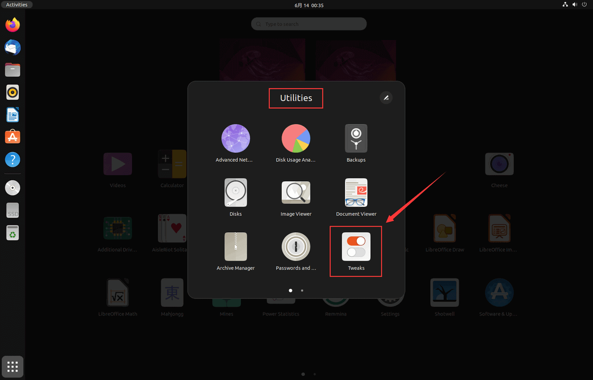
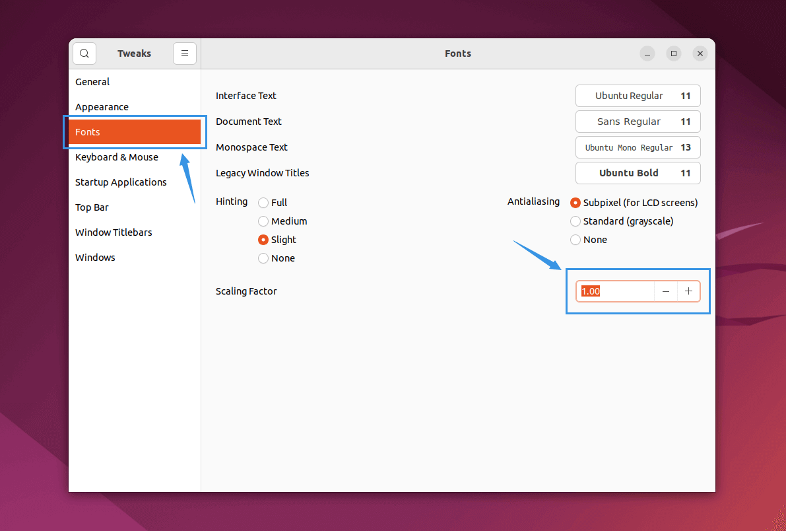

!!! note "屏幕缩放比"

    在一些特殊的屏幕比例（如 16:10、4:3）、高分辨率（如 2K、4K）的显示器中，Ubuntu GNOME 
    桌面的默认屏幕缩放可能并不合适，而直接在设置中更改效果极差，因此可以借助 GNOME 社区开发的个性化工具进行修改。

---

- 使用工具：**[GnomeTweak](https://wiki.gnome.org/Apps/Tweaks)**

!!! abstract "Gnome Tweak（优化）"

    Gnome Tweak 是一种在 Ubuntu 中管理 GNOME 桌面环境的系统工具。它允许用户对桌面外观、行为、应用程序、顶部面板等方面进行各种个性化设置和调整。

安装 Gnome Tweak

```bash
sudo apt install gnome-tweaks # (1)!
```

1. 早期版本名为 `gnome-tweak-tool`

---

打开应用列表 **"Utilities"**（工具）中的 **"Tweaks"**（优化）(1)
{ .annotate }

1. 也可以在搜索栏中搜索 **"Tweaks"**



---

在 **"Fonts"**（字体）栏中，修改 **"Scaling Factor"**（缩放比例）的数值

> 例如，对于 16:10 2.5K 屏幕，设置为 `1.24` 左右较为合适


