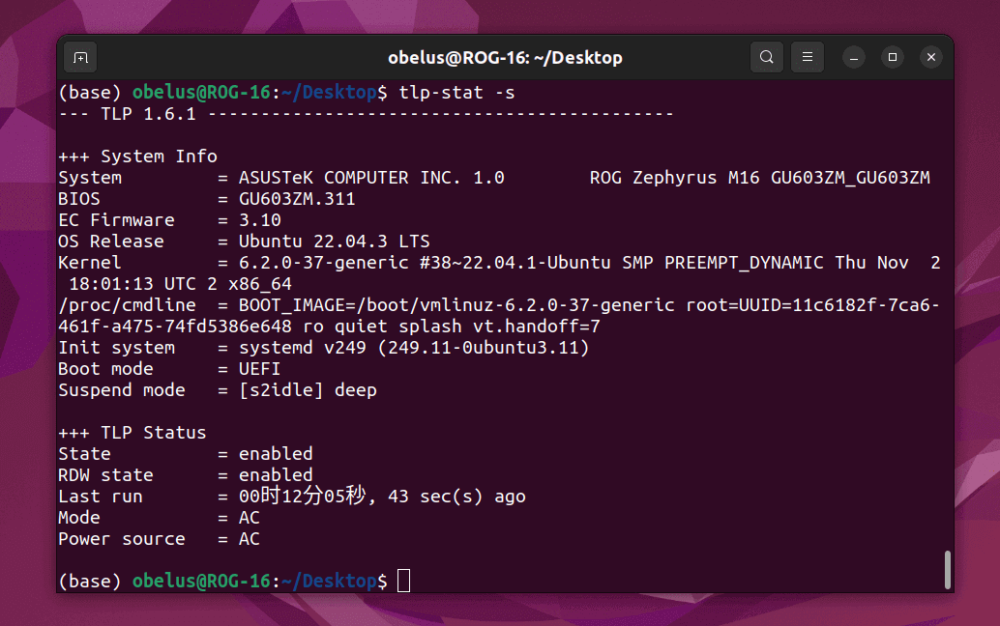
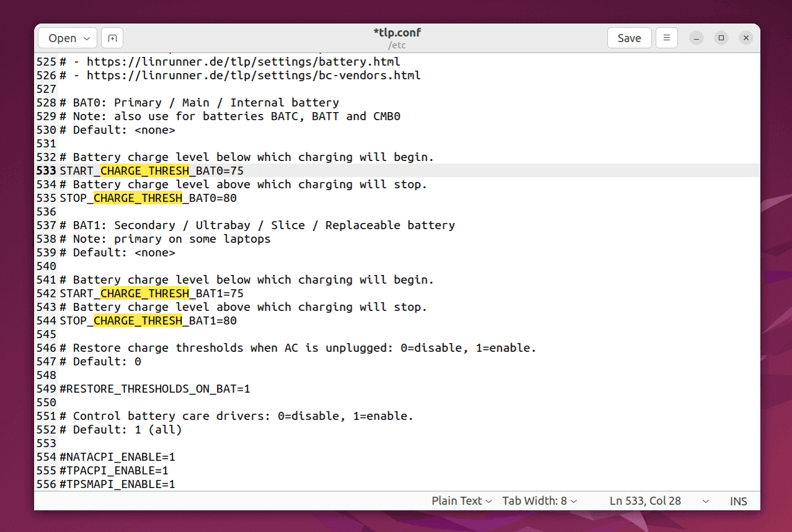
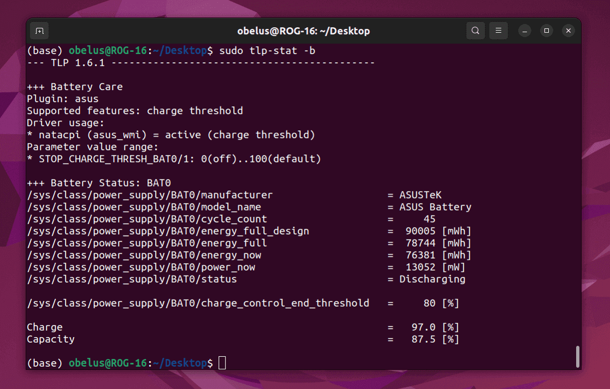

!!! note "电池充电阈值"

    某些笔记本电脑在 Windows 系统上自带了电池管理软件（例如华硕管家的 "电池健康充电"），在长期插电使用时，
    可以设置电池充电阈值（例如 80% 电量时停止充电），以此延长电池的使用寿命并减少可用容量的损失。

    更换 Ubuntu 后原有的电池管理软件不再生效，但可以使用专业的工具 TLP 来进行管理。
    以下仅介绍如何设置电池充电阈值，其他功能可参见 [TLP 官方文档](https://linrunner.de/tlp/settings/battery.html)。

---

- 使用工具：**[TLP](https://linrunner.de/tlp)**

!!! abstract "TLP"

    TLP 是一款适用于 Linux 的电池管理工具，可以通过调整系统设置和参数来最大限度地延长笔记本电脑的电池寿命，并提高其性能和稳定性。

```bash
sudo add-apt-repository ppa:linrunner/tlp  # 添加官方 PPA 仓库以获取最新版
sudo apt update
sudo apt install tlp tlp-rdw
```

---

启动 TLP，并确保 TLP 服务保持开机自启

```bash
sudo tlp start
sudo systemctl enable tlp.service
tlp-stat -s  # 检查 TLP 是否已启用并处于运行状态
```



---

编辑 TLP 配置文件，查找 `START/STOP_CHARGE_THRESH_BATx` 项 (1)
{ .annotate }

1. 可以使用快捷键 ++ctrl+f++ 快速查找关键字

```bash
sudo gedit /etc/tlp.conf
```

---

删除前缀 `#` 注释，并根据需要修改以下配置：

- `START_CHARGE_THRESH_BAT0`，主电池的开始充电阈值
- `STOP_CHARGE_THRESH_BAT0`，主电池的停止充电阈值
- `START_CHARGE_THRESH_BAT1`，副电池的开始充电阈值
- `STOP_CHARGE_THRESH_BAT1`，副电池的停止充电阈值

!!! tip "充电阈值设置"

    少数高端笔记本可能会内置两块主副电池，建议同步设置 `BAT0` 和 `BAT1` 的充电阈值。
    
    建议的开始/停止充电阈值：`75/80`、`55/60`，可以根据日常使用情况和可用电池容量来自行设置。

!!! warning "更新后可能需要重新配置"

    TLP 更新后可能会覆盖 `tlp.conf` 文件中的配置，因此需要重新配置。



---

保存文件后，执行下列命令使配置生效

```bash
sudo tlp start
```

---

检查 TLP 电池保养配置

```bash
sudo tlp-stat -b
```



/// caption
图中，`/sys/class/power_supply/BAT0/charge_control_end_threshold` 即为停止充电阈值
///
