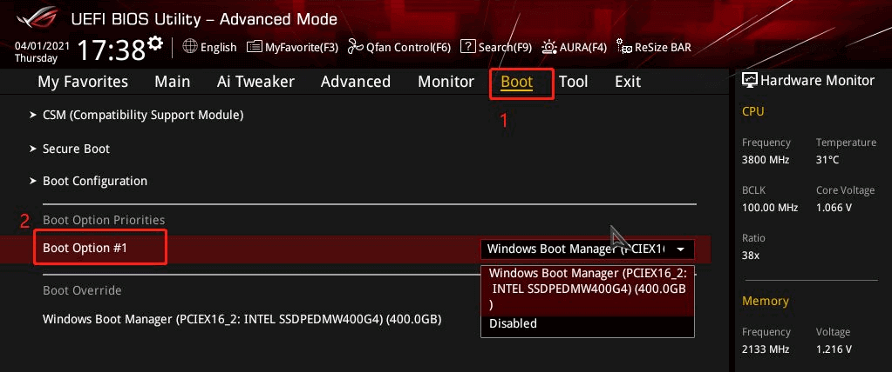
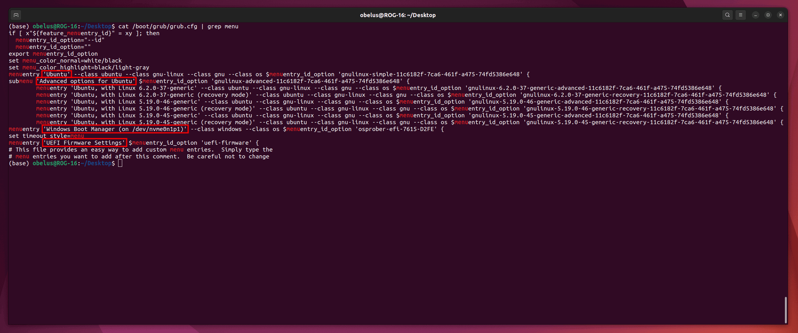
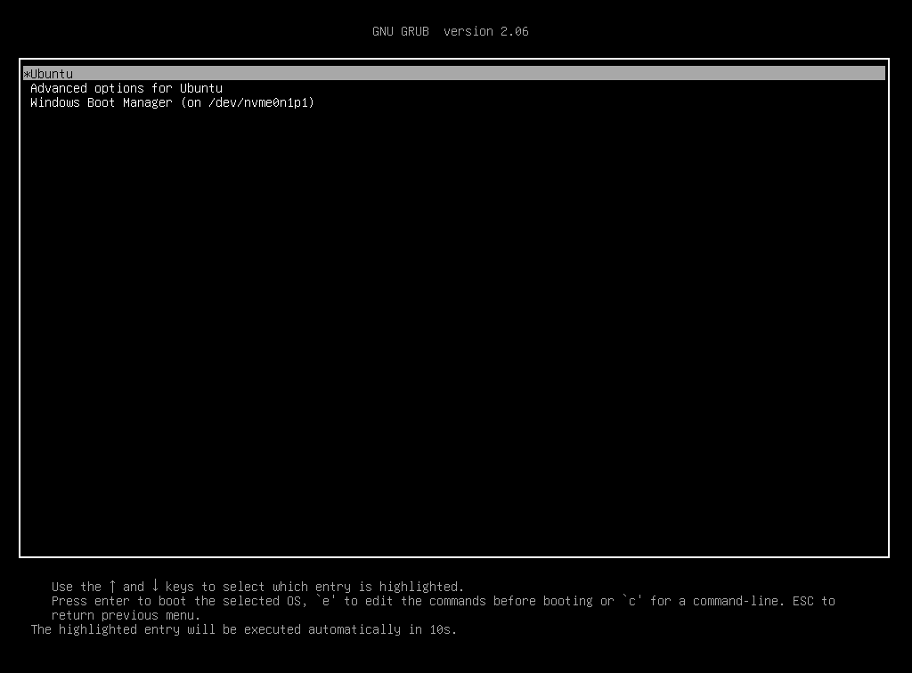
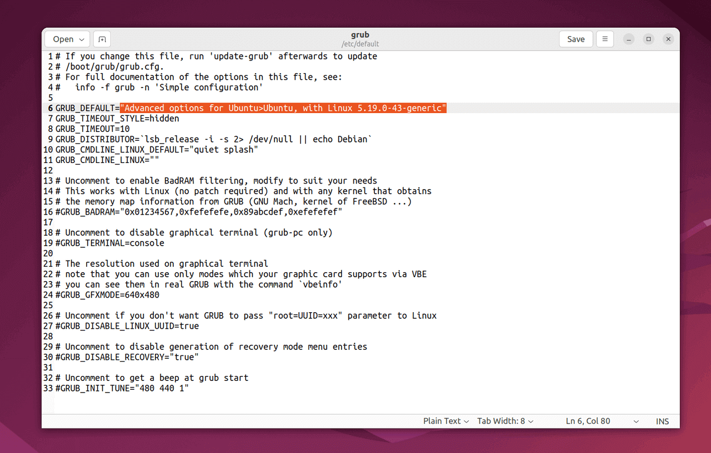

!!! abstract "引导加载程序（Boot Loader）"

    安装 Ubuntu 系统时，Ubuntu 的引导加载程序 GNU GRUB 会被安装至第一块硬盘的第一块扇区，即主引导记录（MBR）中，并且优先于
    Windows Boot Manager（Windows 启动管理器），因此开机后会进入 GNU GRUB 菜单（第一项），而不是 Windows 系统（第二项）。

    **可以通过更改 BIOS 或 GRUB 的启动项，设置开机后默认进入 Windows 或 Ubuntu 系统。**

!!! example "两种启动项配置方式"

    <div class="grid cards" markdown>
    
    -   **更改 BIOS 默认启动项（以 Windows 为主）**

        如需在开机后仍进入 GNU GRUB 菜单，但不使用初始默认项，可以对配置文件进行更改，使启动菜单默认选择此项，在倒计时后自动进入所选系统。
        另外，安装其他 Linux 内核版本后，也可以通过更改默认项优先使用指定的内核版本。
    
    -   **更改 GRUB 默认启动项（以 Ubuntu 为主）**

        如需在开机后仍进入 GNU GRUB 菜单，但不使用初始默认项，可以对配置文件进行更改，使启动菜单默认选择此项，在倒计时后自动进入所选系统。
        另外，安装其他 Linux 内核版本后，也可以通过更改默认项优先使用指定的内核版本。
    
    </div>

=== "更改 BIOS 默认启动项"

    首先进入 BIOS，启动电源/重启系统后，在载入前界面（通常只有 1~2s ）按下特定的按键进入

    !!! question "如何进入 BIOS"
    
        不同的主板/电脑进入 BIOS 的按键和操作方法不尽相同，常见的如：++f2++、++f12++、++delete++、++esc++
        等，建议根据主板品牌/型号查询，如搜索 "华硕主板如何更改启动项"。

    ---

    通常在 BIOS（Advanced Mode）的 **"Boot"**（启动）栏中，设置 **"Boot Option #1"**（启动选项 #1）为
    `Windows Boot Manager`（Windows 启动管理器），最后保存更改即可

    

    /// caption
    华硕主板的 BIOS 界面（旧版本），图片来源于华硕官网
    ///

=== "更改 GRUB 默认启动项"

    执行下列命令，查看 GRUB 配置文件中的所有启动项的顺序和名称

    ```bash
    cat /boot/grub/grub.cfg | grep menu
    ```
    
    

    !!! info "GRUB 菜单选项"

        每段首行的 `menuentry` 和 `submenu` 分别按顺序对应一级菜单的选项，其中 `submenu` 二级菜单下还有多个选项。

        单引号 `''` 内即为启动项的名称（如 `Windows Boot Manager (on /dev/nvme0n1p1)` ），可以根据此名称设置默认启动项。
    
    

    ---

    编辑 GRUB 配置文件

    ```bash
    sudo gedit /etc/default/grub
    ```

    ---

    将文件中 `GRUB_DEFAULT=0` 的原始值 `0`，改为指定启动项的项数（从 0 计数）或名称（加 `""` 双引号），修改完成后保存文件

    !!! info "二级菜单"
    
        如果启动项在二级菜单，需要使用 `>` 符号连接，并用 `""` 双引号括起来，例如：

        `GRUB_DEFAULT="Advanced options for Ubuntu>Ubuntu, with Linux 5.19.0-43-generic"`

        `GRUB_DEFAULT="1>2"`
        
        !!! tip ""

            如果 Ubuntu 系统为中文，其启动项的名称也为中文

    

    /// caption
    图中，将默认启动项更改为 Ubuntu 高级选项（一级菜单）中的 Linux 5.19.0-43 内核版本（二级菜单）
    ///

    ---

    重新生成 GRUB 配置文件，使更改生效

    ```bash
    sudo update-grub
    ```
