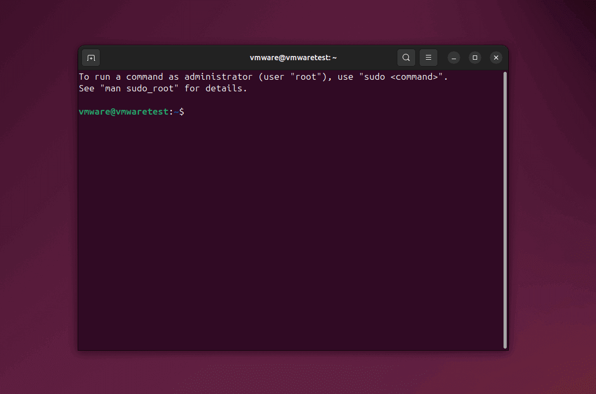

## Linux 终端

!!! abstract "Linux Shell"

    在 Ubuntu 系统中，大部分的操作都需要通过 **Shell** 终端输入命令执行，而不像 Windows 系统一样使用图形界面，因此认识并熟练使用
    Shell 尤为重要。可以在任意目录下右键单击，在菜单中选择 "Open in Terminal"（在终端中打开）或使用快捷键 ++ctrl+alt+t++ 打开终端。



/// caption
Ubuntu 终端默认使用 Bash（Bourne-Again Shell）
///

---

Bash 命令提示符中，如 `vmware@vmwaretest:~$`、`root@mypc:/home#`

- `vmware`、`root`：当前用户名
- `vmwaretest`、`mypc`：当前主机名
- `~`、`/home`：当前路径（工作目录）
- `$`：表示终端准备接收命令输入
- `#`：表示正在使用管理员用户（root）权限

!!! tip "Shell 使用提示"

    - 在终端中要求输入密码时，为确保安全，输入的密码不会被显示。
    - Bash 提供了命令自动补全功能，按下 ++tab++ 键可以根据当前已输入到字符自动补全完整的命令/参数/路径。

    建议参考：[Linux 常用命令学习 | 菜鸟教程](https://www.runoob.com/w3cnote/linux-common-command-2.html)

---

## 文本编辑器

!!! info "文本编辑器（Text Editor）"

    当使用命令打开文本文件并编辑时，需要用到文本编辑器，WSL 的 Ubuntu 可能并未默认安装，主要推荐三款文本编辑器：**Vim**、**Gedit** 和 
    **GNOME Text Editor**。

    **本篇指南所有涉及文本编辑的命令，均使用具有图形界面的 `gedit` 编辑，可自行更换。**

=== "Vim"

    [Vim](https://www.vim.org/) 是一款功能强大的、基于命令行的文本编辑器，支持语法高亮、智能缩进、代码折叠等高级编辑功能，
    还可以通过插件扩展它的功能，特别适合于程序员和系统管理员等专业人士使用。
    
    ``` bash
    sudo apt install vim
    ```

=== "Gedit"

    [Gedit](https://gedit-text-editor.org/) 是一款轻量级的、基于图形界面的文本编辑器，具有代码高亮、自动缩进、多标签编辑、插件扩展等功能，是
    Ubuntu GNOME 桌面环境中预安装的编辑器之一。
    
    ``` bash
    sudo apt install gedit
    ```

=== "GNOME Text Editor"

    [GNOME Text Editor](https://apps.gnome.org/TextEditor/) 是一款专注于会话管理的简单文本编辑器，致力于跟踪更改和状态，
    具有现代化的界面和功能，包括语法高亮显示、搜索替换、内联拼写检查、文档打印等特性，并且支持 Vim 键绑定。目前在 Ubuntu 24.04 上，已取代 Gedit
    成为 GNOME 默认的文本编辑器（Text Editor）。
    
    ``` bash
    sudo apt install gnome-text-editor
    ```
