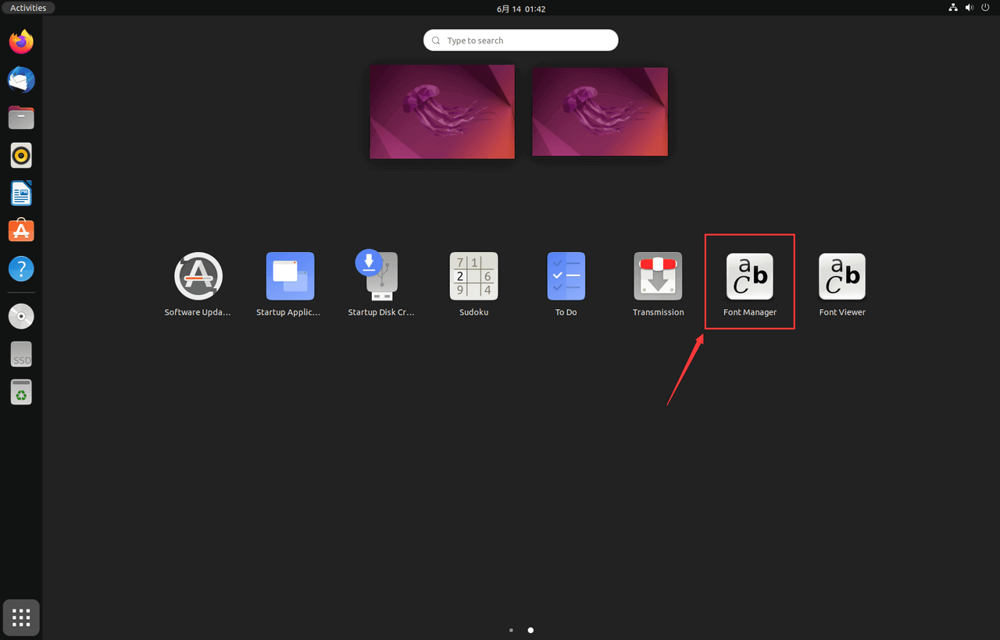
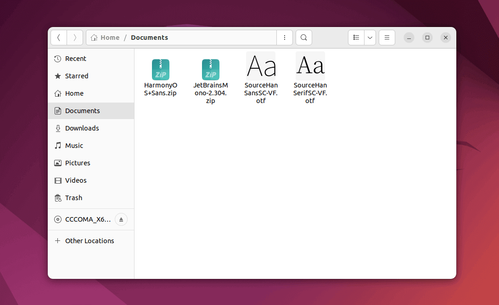
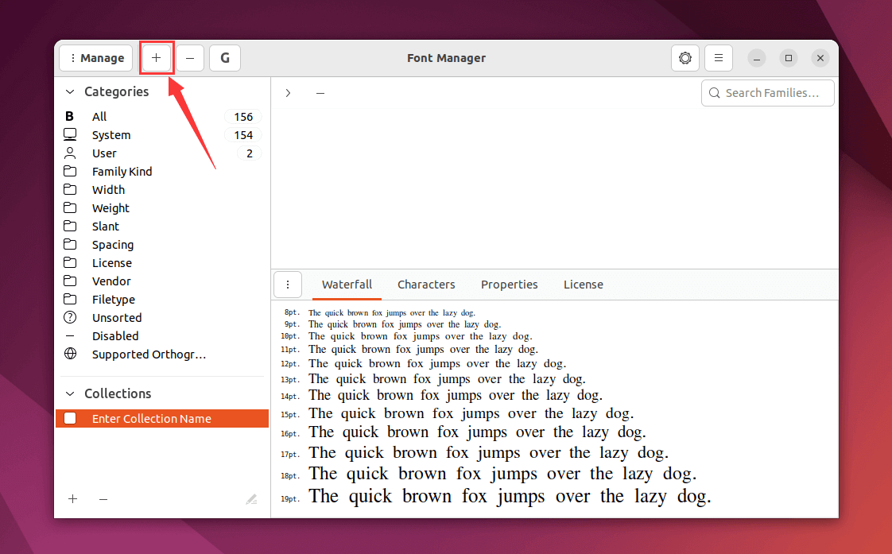
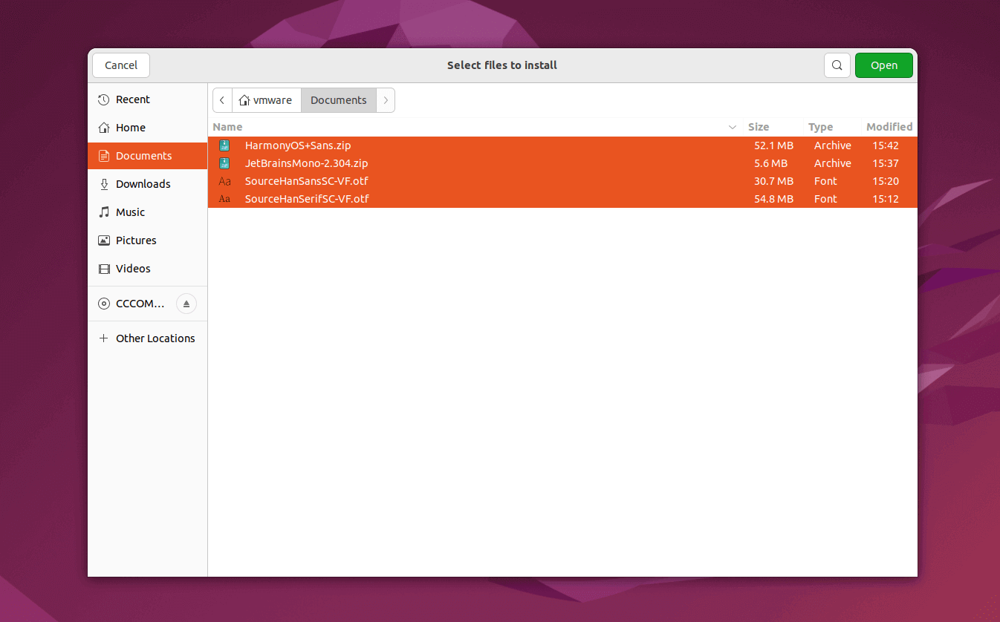
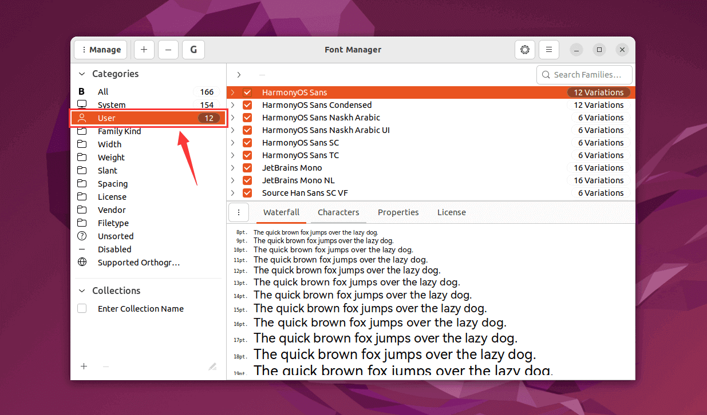

!!! note "Ubuntu 自带字体"

    Ubuntu 自带的字体库较少，可以手动安装其他字体库。下面介绍了几种常用的字体，并使用字体管理器一次性安装多种字体。

---

- 使用工具：**[FontManager](https://github.com/FontManager/font-manager)**

!!! abstract "Font Manager"

    **Font Manager** 是一款用于管理和组织字体的工具，主要用于 GNOME 桌面环境中，它允许用户轻松查看、安装、删除和分类字体，同时支持字体的预览功能，帮助用户选择合适的字体。


---

安装 Font Manager（字体管理器）

```bash
sudo apt install font-manager
```

---

打开应用列表中的 **"Font Manager"**（字体管理器）

> 由于需要加载所有字体，因此启动时间可能较长



---

获取常用字体

<div class="grid cards" markdown>

- :material-microsoft:{ .lg .middle } **[Microsoft's Core Fonts（微软字体库）](https://en.wikipedia.org/wiki/Core_fonts_for_the_Web)**
- :material-format-font:{ .lg .middle } **[Source Han Serif（思源宋体）](https://source.typekit.com/source-han-serif/cn/)**
- :simple-harmonyos:{ .lg .middle } **[HarmonyOS Sans（鸿蒙字体）](https://developer.huawei.com/consumer/cn/doc/design-guides/font-0000001157868583-V1)**
- :simple-jetbrains:{ .lg .middle } **[JetBrains Mono](https://www.jetbrains.com/lp/mono/)**

</div>

---

将下载的字体包/文件放置在同一目录下



---

在 **"Font Manager"**（字体管理器）中，点击左上的 "+" 号添加字体



---

选择相应目录中的所有字体包/文件，点击右上角的 **"Open"**（打开）即可



---

在 **"User"**（用户）栏中，可以预览用户安装的所有字体


