!!! warning "安装过程可能会遇到各种错误"

    在 Linux 上安装 NVIDIA 显卡驱动并非易事，由于兼容性（如 Linux 内核）等问题，在安装过程中可能会遇到莫名其妙的未知错误，
    有些问题甚至需要重装驱动/系统才能解决，因此**建议在安装完系统后优先安装 NVIDIA 显卡驱动**，以免造成更大的损失。

??? example "NVIDIA 显卡驱动、CUDA、PyTorch 和 Python 的兼容版本要求"

    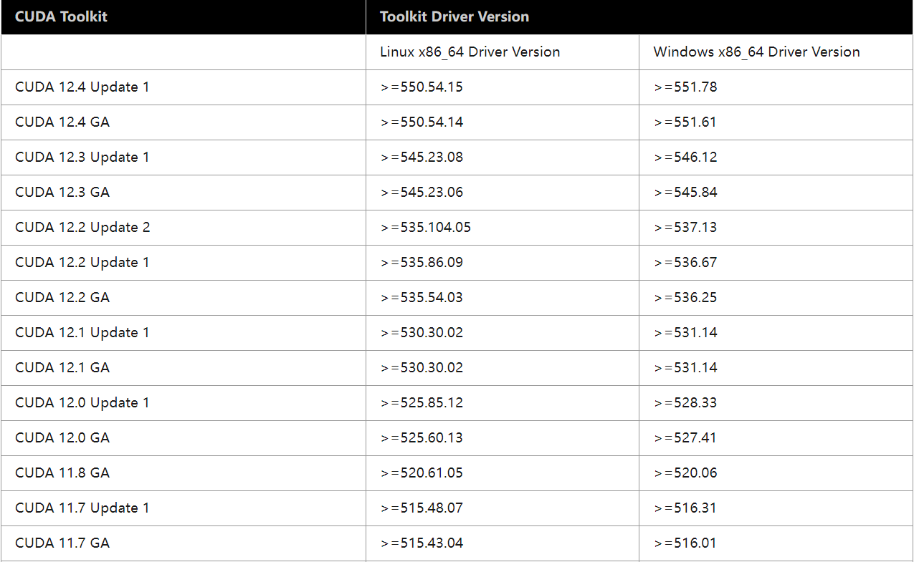
    
    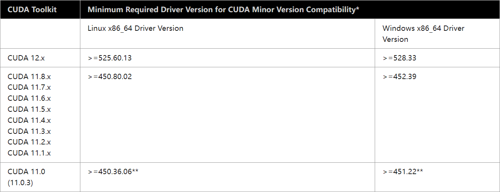
    
    <table><thead>
      <tr>
        <th>PyTorch</th>
        <th>CUDA</th>
        <th>CUDNN</th>
        <th>Python</th>
      </tr></thead>
    <tbody>
      <tr>
        <td>2.6</td>
        <td>11.8, 12.4, 12.6</td>
        <td rowspan="3">~ 9.1.0.70</td>
        <td rowspan="2">&gt;=3.9, &lt;=3.13</td>
      </tr>
      <tr>
        <td>2.5</td>
        <td rowspan="2">11.8, 12.1, 12.4</td>
      </tr>
      <tr>
        <td>2.4</td>
        <td rowspan="3">&gt;=3.8, &lt;=3.12</td>
      </tr>
      <tr>
        <td>2.3</td>
        <td rowspan="3">11.8, 12.1</td>
        <td rowspan="3">~ 8.7.0.84</td>
      </tr>
      <tr>
        <td>2.2</td>
      </tr>
      <tr>
        <td>2.1</td>
        <td rowspan="2">&gt;= 3.8, &lt;=3.11</td>
      </tr>
      <tr>
        <td>2.0</td>
        <td>11.7, 11.8</td>
        <td>~ 8.5.0.96</td>
      </tr>
      <tr>
        <td>1.13</td>
        <td>11.6, 11.7</td>
        <td rowspan="2">~ 8.3.2.44</td>
        <td rowspan="2">&gt;= 3.7, &lt;=3.10</td>
      </tr>
      <tr>
        <td>1.12</td>
        <td>11.3, 11.6</td>
      </tr>
    </tbody>
    </table>

    详见：[CUDA Toolkit Major Component Versions](https://docs.nvidia.com/cuda/cuda-toolkit-release-notes/index.html#cuda-toolkit-major-component-versions)
    和 [Releasing PyTorch | Release Compatibility Matrix](https://github.com/pytorch/pytorch/blob/main/RELEASE.md#release-compatibility-matrix)

---

=== "在"软件和更新"中安装"

    打开应用列表中的 **"Software & Update"**（软件和更新）

    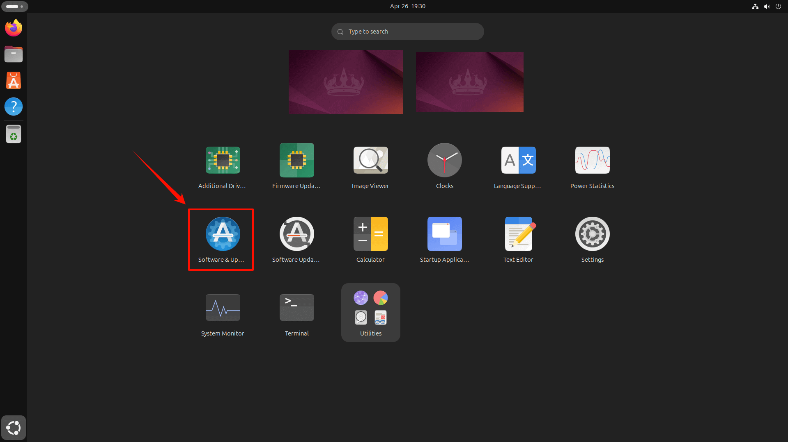

    ---

    在 **"Additional Drivers"**（附加驱动）栏中，选择一个合适的 NVIDIA 驱动版本，然后点击 **"Apply Changes"**（应用更改）自动安装

    !!! info "版本标签（Tags）"

        - `server`：适用于服务器环境
        - `open`、`open source`：包含开源的内核驱动
        - `non-free`、`proprietary`：不开源、专有驱动
        - `recommended`、`tested`：稳定的、经过测试的推荐版本

        最稳定的较新版本可以根据带有 `server` 标签的最新版判断，如下图中的 `550` 版本。

    !!! warning "不推荐安装开源版本"

        带有 `-open`、`open kernel` 标签的版本，使用的是开源的 GPU 内核，而非原生的 NVIDIA
        内核，可能存在兼容性问题，影响一定的性能和稳定性，导致无法正常显示，**不推荐安装此版本！**
        
        参考：[NVIDIA/open-gpu-kernel-modules](https://github.com/NVIDIA/open-gpu-kernel-modules)

    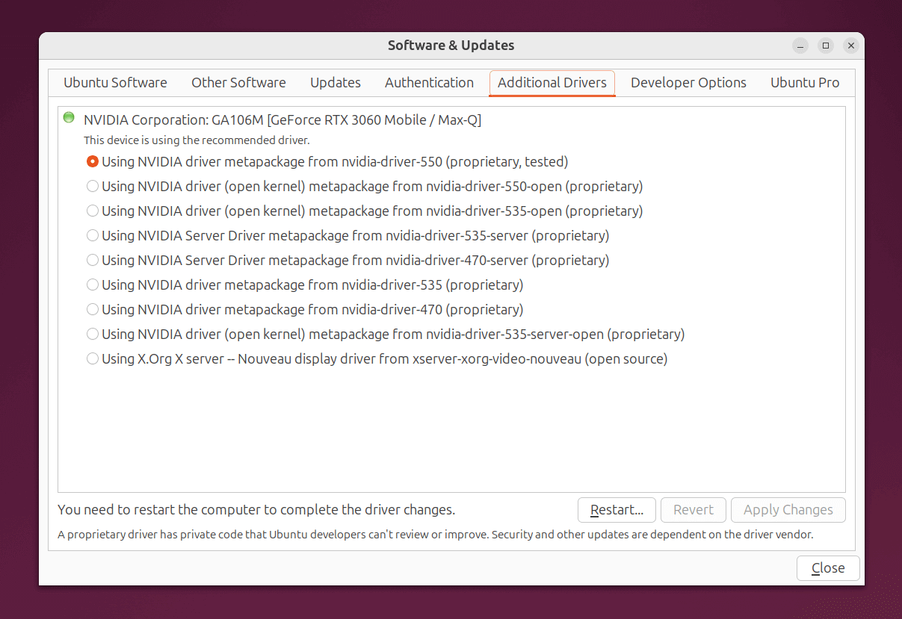

    /// caption
    图中，较新最稳定的版本为：`nvidia-driver-550 (proprietary, tested)`
    ///

    ---

    安装完成后，需要重启才能生效（Restart）

    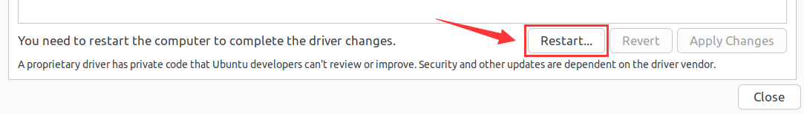

=== "使用 APT 安装"

    在终端中执行下列命令，查看当前可安装的驱动

    ```bash
    ubuntu-drivers devices # (1)!
    ```

    1. 如果提示找不到 `ubuntu-drivers` 命令，需要使用 `sudo apt install ubuntu-drivers-common` 命令安装

    !!! info "版本标签（Tags）"

        - `server`：适用于服务器环境
        - `open`、`open source`：包含开源的内核驱动
        - `non-free`、`proprietary`：不开源、专有驱动
        - `recommended`、`tested`：稳定的、经过测试的推荐版本

        最稳定的较新版本可以根据带有 `server` 标签的最新版判断，如下图中的 `535` 版本。

    !!! warning "不推荐安装开源版本"

        带有 `-open`、`open kernel` 标签的版本，使用的是开源的 GPU 内核，而非原生的 NVIDIA
        内核，可能存在兼容性问题，影响一定的性能和稳定性，导致无法正常显示，**不推荐安装此版本！**
        
        参考：[NVIDIA/open-gpu-kernel-modules](https://github.com/NVIDIA/open-gpu-kernel-modules)

    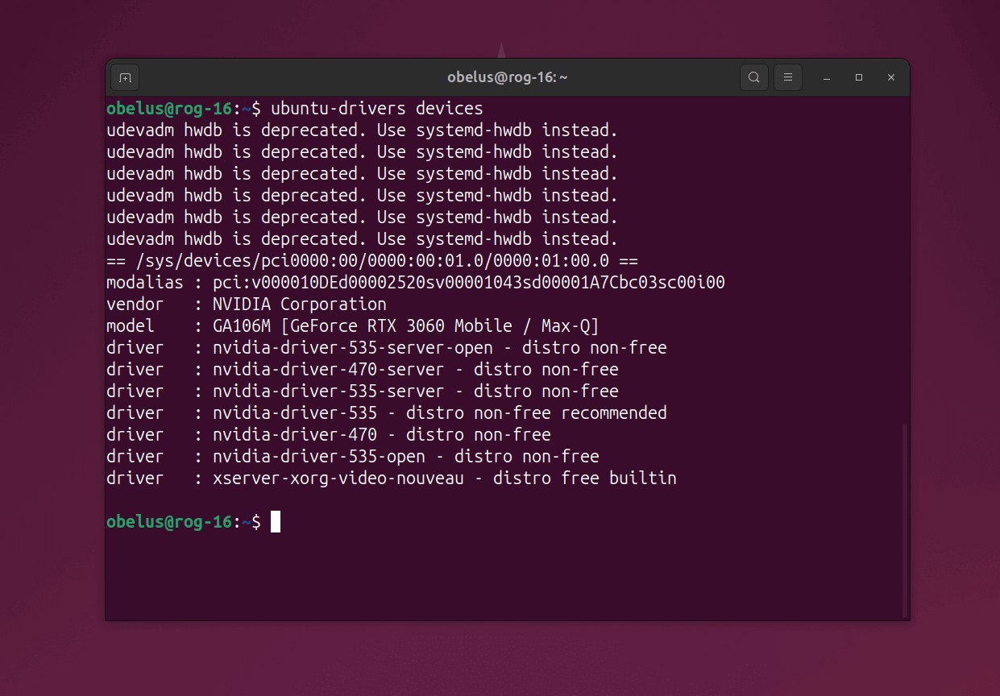

    /// caption
    图中，较新最稳定的版本为：`nvidia-driver-535`
    ///

    ---

    选择一个合适的 NVIDIA 驱动版本，执行下列命令安装

    !!! tip "自动补全命令"

        文件名需要根据实际修改，可以输入前几个字符，再按下 ++tab++ 键即可自动补全完整的命令/名称

    ```bash
    sudo apt install ${driver-name} # (1)!
    ```
    
    1. 使用 `sudo ubuntu-drivers autoinstall` 命令可以自动安装官方推荐的驱动（不建议）

    ---

    安装完成后，需要重启才能生效（Reboot）
    
    ```bash
    sudo reboot
    ```

=== "使用软件包本地安装"

    !!! danger "不推荐使用此方法安装！"

        手动安装 NVIDA 驱动会比前两种方法复杂得多，安装过程中也可能会遇到更多出乎意外的问题。如果前两种方法均无法安装或遇到问题，可以再尝试手动安装。

    ---

    访问 [NVIDIA 驱动官网](https://www.nvidia.cn/drivers/lookup/)，选择一个合适的 NVIDIA 驱动程序下载

    !!! info "选项说明"

        - 根据电脑的显卡型号选择相应的选项，例如笔记本电脑上搭载的 `GeForce RTX 3060 Laptop GPU`，如图所示
        - 对于一般的 Ubuntu 系统，操作系统项选择 `Linux 64-bit`

    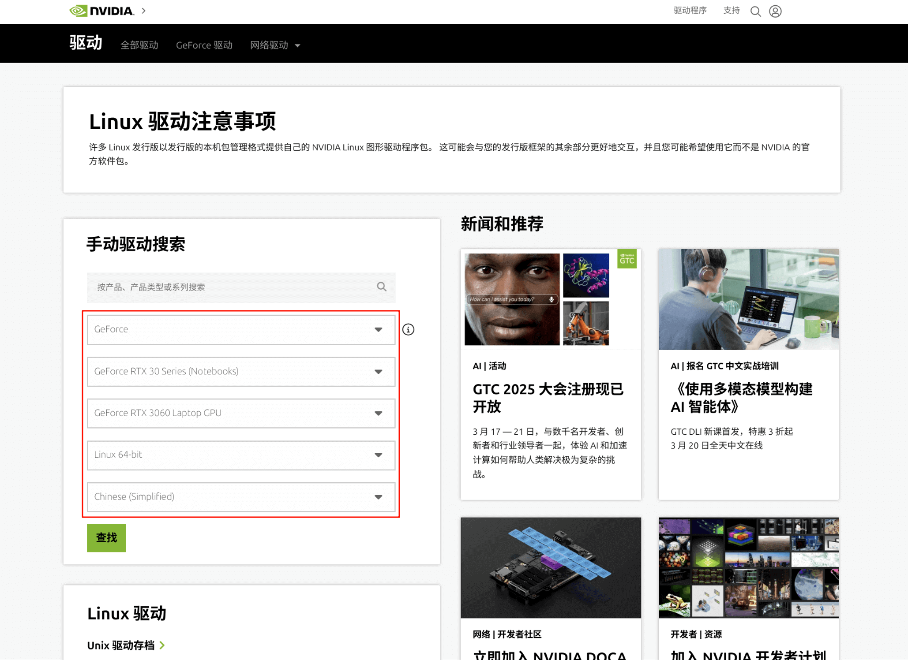

    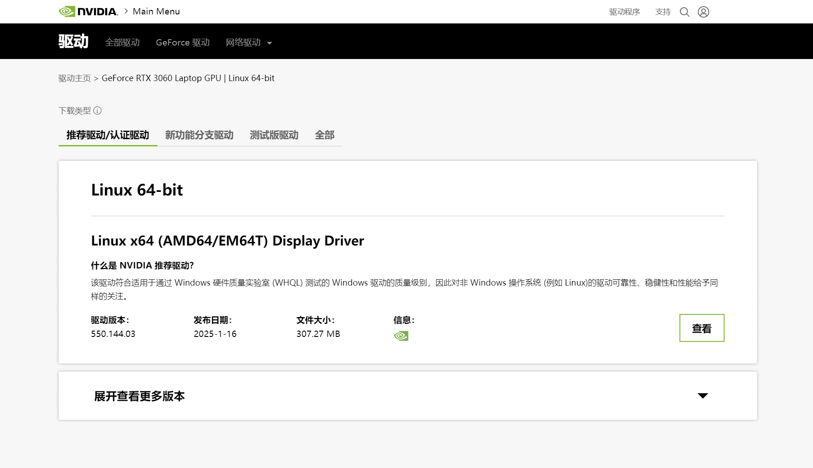

    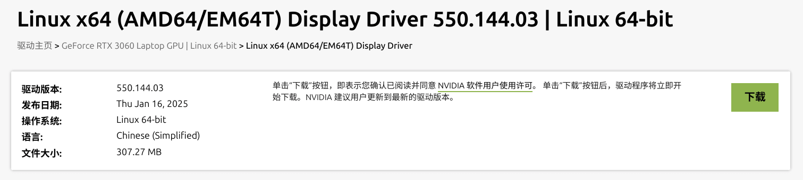

    ---

    将下载好的驱动程序安装包放置在合适的目录，例如 `~` 目录下 (1)
    { .annotate }

    1. 即 `/home/<username>` 目录，启动终端时的默认目录，方便查找

    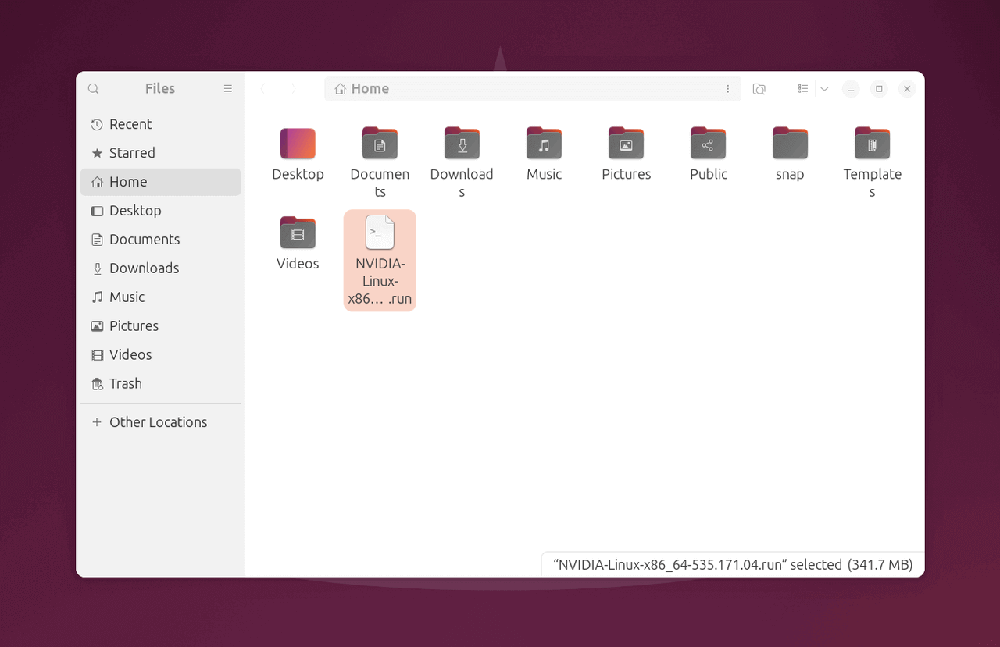

    /// caption
    图中，当前目录为 `/home/obelus`，即 `~` 目录
    ///

    ---

    执行下列命令，确保安装前卸载所有 NVIDIA 相关驱动及其配置文件

    > 如果当前正在使用 NVIDIA 驱动，执行后将卸载并自动更换为最初的开源驱动

    ```bash
    sudo apt --purge remove nvidia*
    ```

    ---

    安装 NVIDIA 驱动程序安装时所需的编译和链接工具

    ```bash
    sudo apt install build-essential libglvnd-dev pkg-config # (1)!
    ```
    
    1. `build-essential`、`libglvnd-dev`、`pkg-config` 包含了绝大部分常用的编译和链接工具

    ---

    编辑 Linux 内核模块的禁用列表文件 `blacklist`

    ```bash
    sudo gedit /etc/modprobe.d/blacklist.conf # (1)!
    ```
    
    1. 也可以在同路径下，新建 `blacklist-nvidia-nouveau.conf` 文件，专门用于禁用 Nvidia Nouveau 开源驱动程序

    ---

    在文件的末尾添加以下两行内容，禁用默认的 Nvidia Nouveau 开源驱动

    ```text title="blacklist.conf"
    blacklist nouveau
    options nouveau modeset=0
    ```
    
    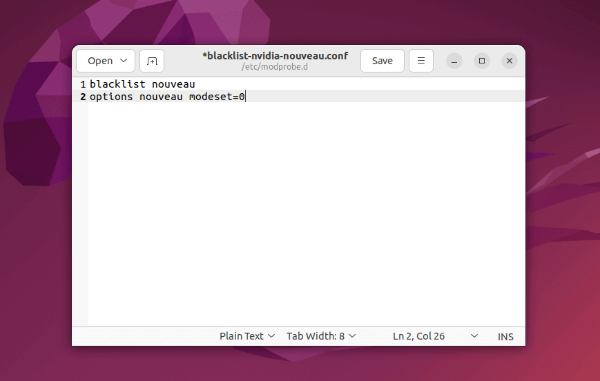

    /// caption
    图中，新建 `blacklist-nvidia-nouveau.conf` 文件
    ///

    ---

    更新 Linux 内核的配置文件

    ```bash
    sudo update-initramfs -u
    ```

    ---

    重启系统，使禁用列表生效
    
    ```bash
    sudo reboot
    ```

    !!! warning annotate "重启后黑屏"

        一旦禁用默认的 Nvidia Nouveau 驱动，重启后可能会黑屏，不再显示图形界面（GUI），此时按下 ++ctrl+alt+f2++
        按键，切换至第二终端（TTY2）(1)，继续下面的步骤

    1. 按下 ++ctrl+alt+f1++ 可以切换回第一终端，++ctrl+alt+f7++ 可以切换至图形界面

    ---

    在第一终端或第二终端，依次输入用户名和密码登录

    <div class="annotate" markdown>

    > 登录后，默认的工作目录为 `~`，即 `/home/<username>` (1)

    </div>

    1. 如果以 root 用户登录，默认目录为 `/root`

    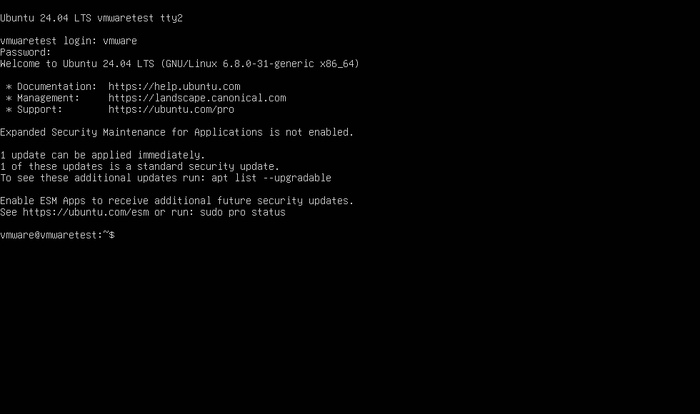

    ---

    将系统切换到运行级别 `3`，确保关闭 X 窗口系统（X11），禁用图形界面

    ??? example "telinit 命令参数"
    
        - `0` ：系统关机
        - `1` ：单用户模式
        - `2` ：多用户模式（无网络）
        - `3` ：多用户模式（有网络、命令行）
        - `4` ：系统预留，用户自定义
        - `5` ：图形界面模式（多用户）
        - `6` ：系统重启
    
    ```bash
    sudo telinit 3
    ```
    
    ---

    将当前目录切换至安装包所在目录下，并执行下列命令，开始安装 NVIDIA 驱动程序

    !!! tip "自动补全文件名"

        文件名需要根据实际修改，可以输入前几个字符，再按下 `tab` 键即可自动补全完整的命令/名称

    !!! warning "如果遇到问题可尝试不安装 OpenGL"
    
        在下列命令尾加上 `--no-opengl-files` 参数，不安装 OpenGL 文件，可能解决某些报错
    
    ```bash
    sudo bash ${NVIDIA-Linux-x86_64-xxx.xx.run}
    ```

    ---

    使用方向键和回车键，选择 `Continue installation` 继续安装，等待构建内核模块

    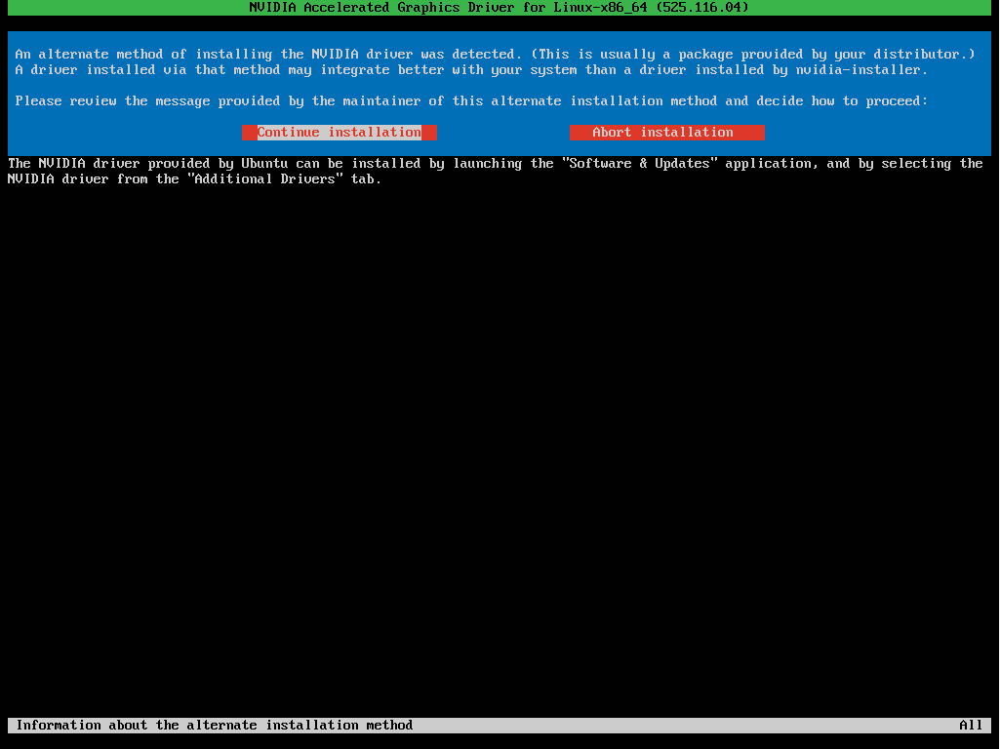

    ---

    构建完成后，会询问是否要安装 NVIDIA 的 32 位兼容库，可以根据需要自行选择，一般选择 `No`

    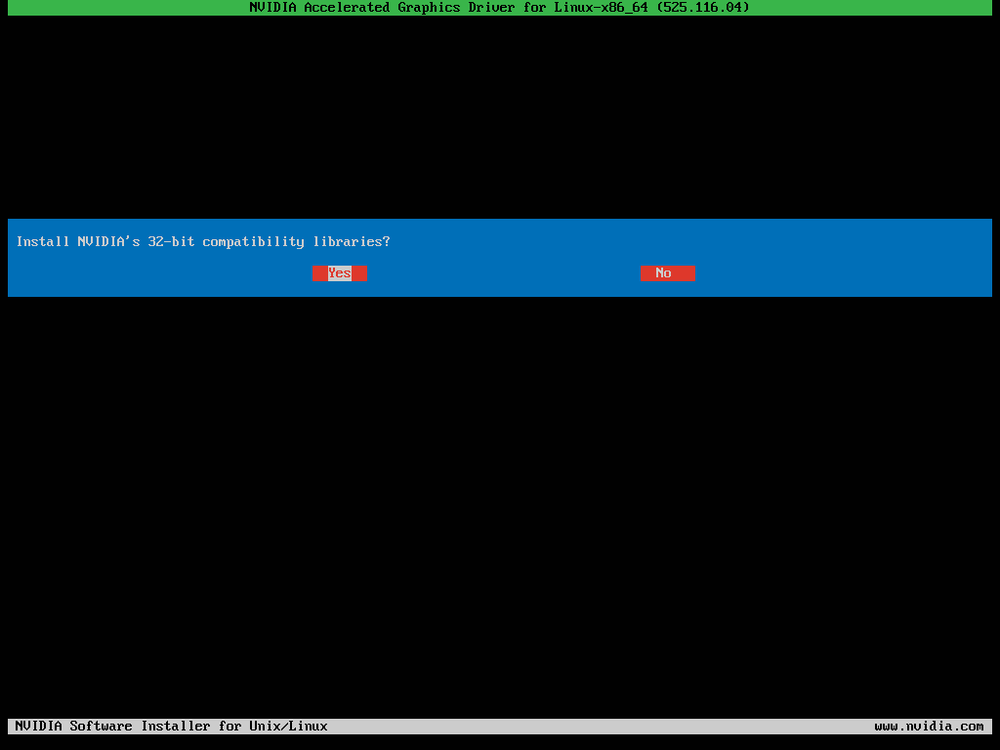

    ---

    在下一步中，可能会出现以下情况：

    ???+ warning "是否为 NVIDIA 内核模块签名"

        The target kernel has CONFIG_MODULE_SIG set, which means that it supports cryptographic signatures on kernel
        modules. On some systems, the kernel may refuse to load modules without a valid signature from a trusted key.
        This system also has UEFI Secure Boot enabled; many distributions enforce module signature verification on UEFI
        systems when Secure Boot is enabled. Would you like to sign the NVIDIA kernel module?

        > 目标内核启用了 `CONFIG_MODULE_SIG`，这意味着它支持对内核模块进行加密签名。在一些系统中，如果内核模块没有经过可信密钥的有效签名，
        将会被拒绝加载。此外，该系统已启用 UEFI 安全启动（UEFI Secure Boot）；许多发行版会在启用 Secure Boot 的 UEFI
        系统上执行模块签名验证。是否为 NVIDIA 内核模块签名？

        出现这段文本的原因是启用了 `CONFIG_MODULE_SIG`（内核模块签名检查），以及 UEFI 安全启动（Secure Boot），可以按
        [禁用 Secure Boot 功能](../installation.md/#禁用-secure-boot-功能) 中的步骤来禁用安全启动功能；或者根据提示完成/拒绝签名验证。

    ???+ warning "是否自动更新 X 配置文件"

        Would you like to run the nvidia-xconfig utility to automatically update your X configuration file so that the
        NVIDIA driver will be used when you restart X? Any pre-existing X configuration file will be backed up.
    
        > 是否运行 `nvidia-xconfig` 工具来自动更新 X 配置文件，以便在重新启动 X 时使用 NVIDIA 驱动程序？所有先前存在的 X 配置文件都将会被备份。

        其中，X 配置文件（X configuration file）指的是 X 窗口系统设置的文件，运行 `nvidia-xconfig`
        会更新此文件，确保在重启时使用正确的 NVIDIA 驱动程序，并确保正确配置显卡和显示器，一般选择 `Yes`。

    ???+ warning "是否在 DKMS 中注册内核模块源代码"

        Would you like to register the kernel module sources with DKMS? This will allow DKMS to automatically build
        a new module, if you install a different kernel later?

        > 是否在 DKMS 中注册内核模块源码，从而在以后安装不同的内核版本时，DKMS 可以自动构建新的内核模块？

        DKMS（Dynamic Kernel Module Support）是一个内核模块支持框架，它能够帮助用户在升级了新内核版本以后，
        轻松地重新编译和安装第三方内核模块，对于经常需要升级内核，或需要新功能或修复系统的用户非常有用。可以根据需要自行选择，一般选择 `No`。
    
    ---

    最后，等待 NVIDIA 驱动程序安装完成

    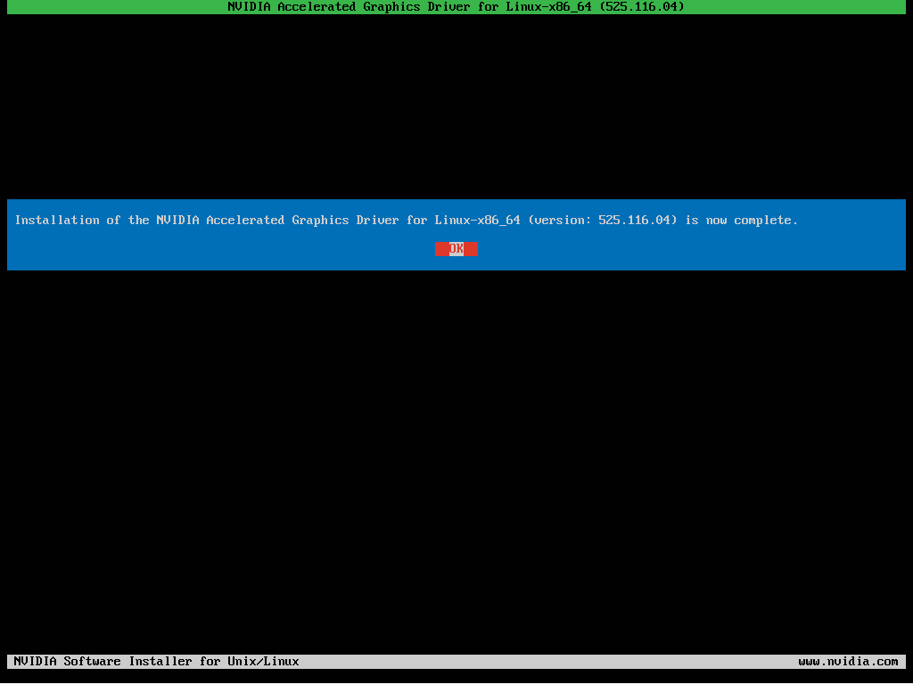

    ---

    重启系统，使驱动生效

    ```bash
    sudo reboot
    ```

---

重启后，执行下列命令，检查 NVIDIA 是否安装成功

```bash
nvidia-smi
```

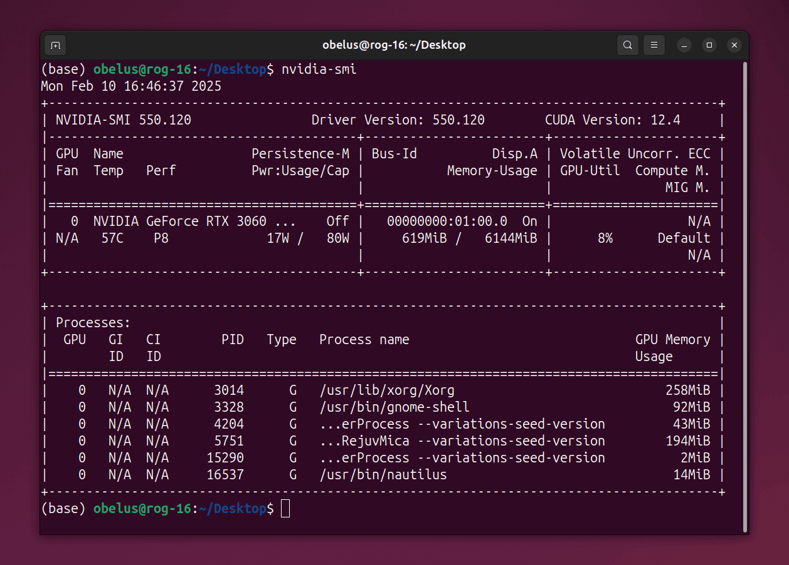

/// caption
显示此信息即表示安装成功
///
