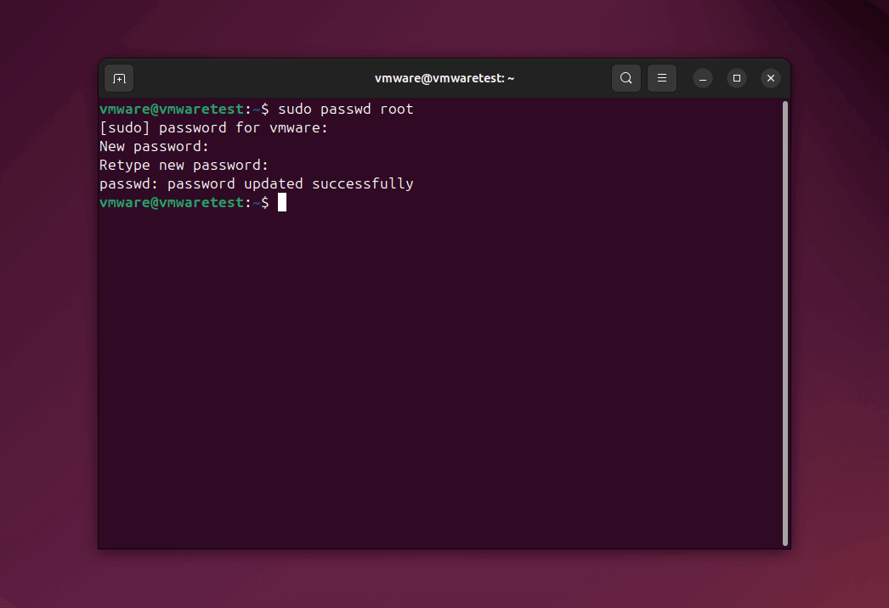
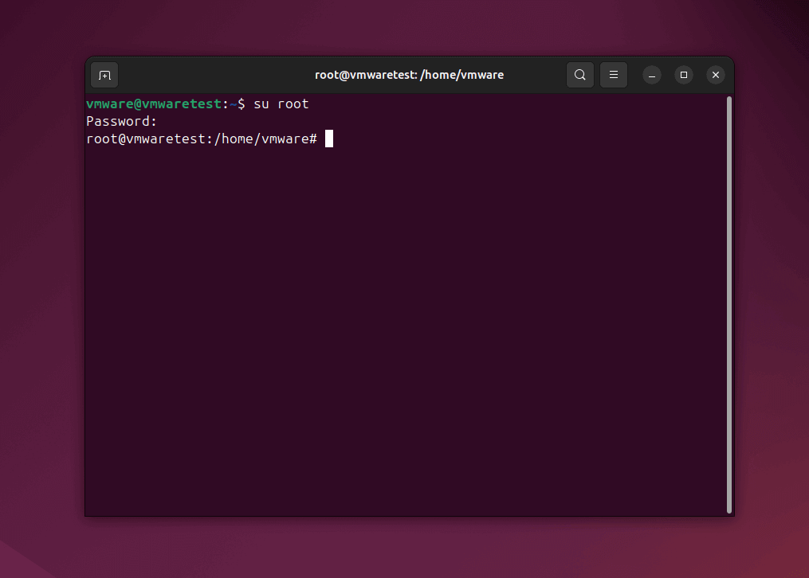

在终端中执行下列命令，依次输入当前用户密码、两次 Root 用户密码

```bash
sudo passwd root # (1)!
```

1. 同理，可以使用 `sudo passwd <username>` 更改其他用户的密码



---

可以使用下列命令在终端中切换用户（Switch User）

```bash
su ${username} # (1)!
```

1. 例如，使用 `su root` 命令切换至 Root 用户


