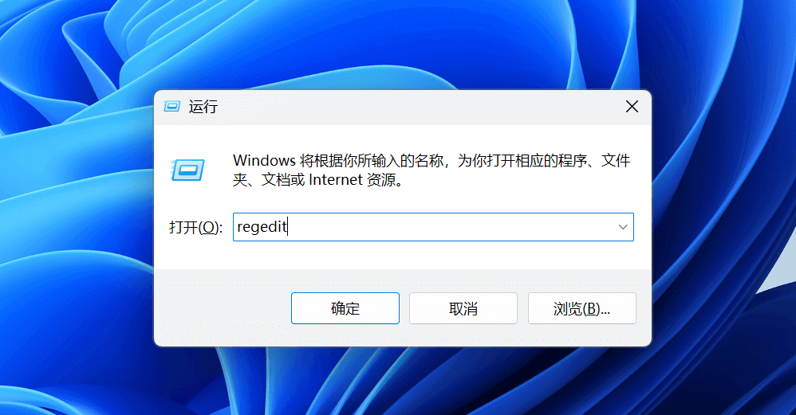
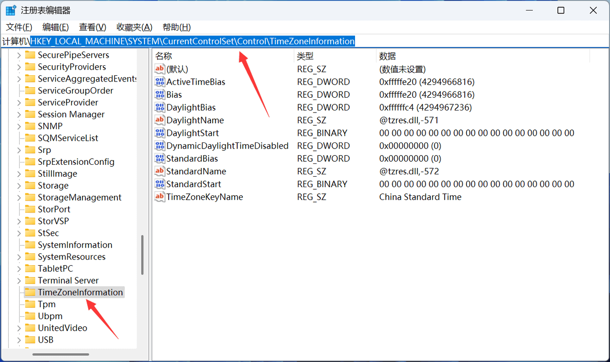
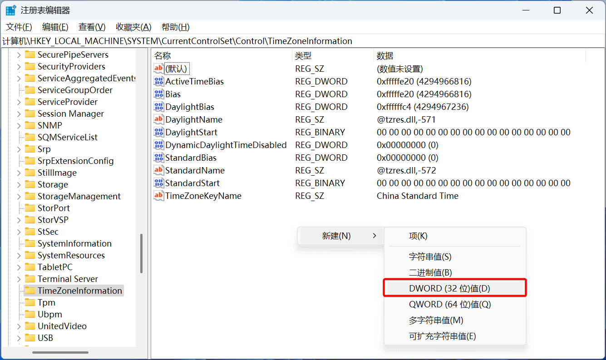
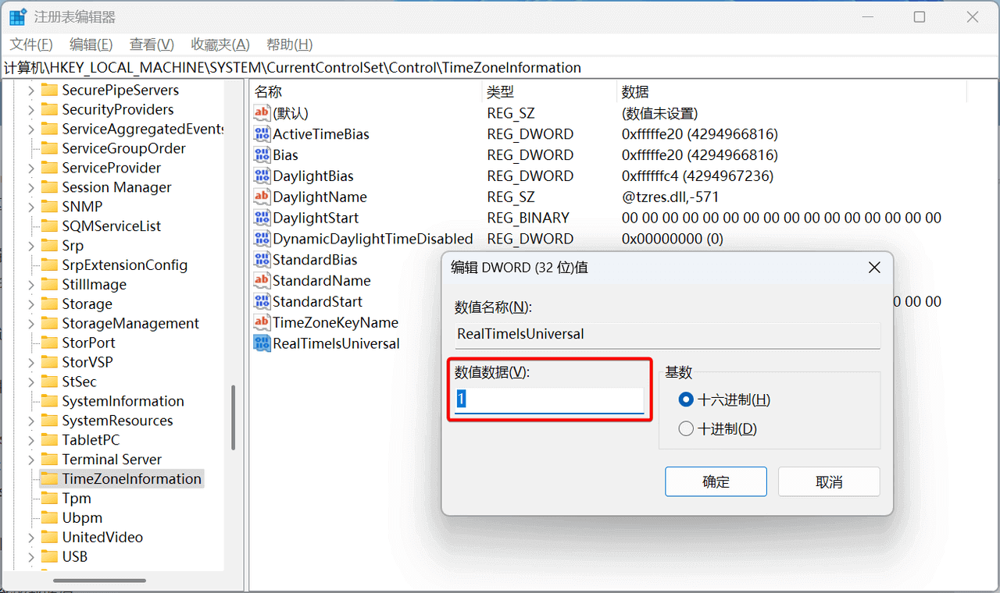

!!! note "Windows 和 Ubuntu 系统时间不同步"

    由于 Windows 和 Ubuntu 的时钟同步机制不同，导致安装 Ubuntu 后，再切换至 Windows
    系统，时间会显示慢了 8 个小时（CST），导致两者的系统时间不同步。

    <div class="grid cards" markdown>
    
    -   **Windows 时钟同步原理**

        - Windows 使用本地时钟（Local Time）
        - 时间同步过程：从 CMOS（BIOS）中获取时间 →  视为本地时间 →  联网后同步时间  →  显示本地时间 →  写入 CMOS（BIOS）
    
    -   **Ubuntu 时钟同步原理（CST）**

        - Ubuntu 使用协调世界时（UTC/GMT）
        - 时间同步过程：从 CMOS（BIOS）中获取时间 →  视为 UTC 时间  →  联网后同步时间 →  显示 UTC+8 时间 →  写入 CMOS（BIOS）
    
    </div>

    !!! tip ""

        使用 `timedatectl status` 命令，可以查看系统时间状态

!!! example "两种时钟配置方式"

    基于 Windows 和 Ubuntu 两种不同的时钟机制，同步双系统时间也有两种不同的解决方法，选择其中一种即可：

    - **将 Ubuntu 时钟设置为本地时钟**
    - **将 Windows 时钟设置为 UTC 时钟**

=== "将 Ubuntu 时钟设置为本地时钟"

    安装 `ntpdate` 时间同步工具

    ```bash
    sudo apt install ntpdate
    ```
    
    ---
    
    使用 `ntpdate` 工具，将系统时间与 `time.windows.com`（Windows 的 NTP 服务器）上的时间同步
    
    ```bash
    sudo ntpdate time.windows.com
    ```
    
    ---
    
    将系统时间视为本地时间，并将当前系统时间写入硬件时钟（BIOS）
    
    > `hwclock` 工具可能需要使用 `sudo apt install util-linux-extra` 命令安装
    
    ```bash
    sudo hwclock --localtime --systohc # (1)!
    ```
    
    1. 此外，也可以仅使用 `sudo timedatectl set-local-rtc 1` 命令，将系统时间视为本地时间

=== "将 Windows 时钟设置为 UTC 时钟"
    
    在 Windows 系统中，按下 ++win+r++ 启动运行，输入 `regedit`，打开注册表编辑器
    
    
    
    ---
    
    将地址定位至 `HKEY_LOCAL_MACHINE\SYSTEM\CurrentControlSet\Control\TimeZoneInformation` (1)
    { .annotate }
    
    1. 可以在地址栏中输入并回车跳转
    
    
    
    ---
    
    右键单击右侧的空白区域，选择 **"新建 > DWORD (32位)值"**，命名为 `RealTimeIsUniversal`
    
    
    
    ---
    
    将该项的 **"数值数据"** 设置为 `1`，重启后生效
    
    
