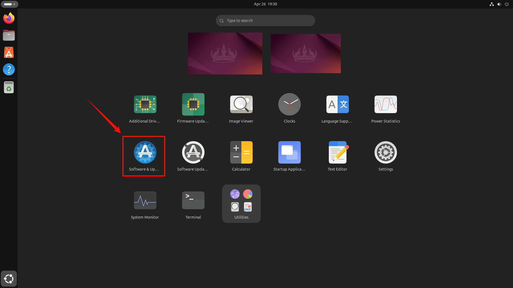

## 更换软件源

!!! info "国内镜像站"

    在安装和更新软件之前，建议先将软件包的下载源更换至国内的镜像站，以获得最佳的下载速度。

选择一个国内镜像站，建议优先选择地理位置较近、相同运营商的镜像站 (1)
{ .annotate }

1. 可在[校园网联合镜像站](https://mirrors.cernet.edu.cn/site)中查询

|       推荐镜像站       |   速度    | 镜像站帮助页（Ubuntu）                                              |
|:-----------------:|:-------:|:------------------------------------------------------------|
| 清华大学镜像站（tsinghua） | 10 Gbps | <https://mirror.tuna.tsinghua.edu.cn/help/ubuntu>           |
|   南京大学镜像站（nju）    | 10 Gbps | <https://mirror.nju.edu.cn/mirrorz-help/ubuntu/?mirror=NJU> |
| 中国科学技术大学镜像站（ustc） | ? Gbps  | <https://mirrors.ustc.edu.cn/help/ubuntu.html>              |
|  上海交通大学镜像站（sjtu）  | 1 Gbps  | <https://mirrors.sjtug.sjtu.edu.cn/docs/ubuntu>             |
|  阿里云镜像站（aliyun）   | ? Gbps  | <https://developer.aliyun.com/mirror/ubuntu>                |

---

??? note "DEB822 源格式 [^1]"

    自 Ubuntu 24.04 起，APT 软件源配置文件引入了新的 DEB822 格式（`.list`），以取代传统的 One-Line-Style 格式（`.sources`）。
    DEB822 允许在多行中定义单一的源，每个配置项都以键值对的形式出现，对于某些字段（如 `URIs`）支持列出多个值，并提供了
    `Enabled` 字段可以方便地启用或禁用源。
    
    DEB822 格式关键字段（Field）：

    - **Enabled**：指明该源是否启用，取值为 `yes` 或 `no`，默认为 `yes`
    - **Types**：定义从源中检索的包类型，取值为 `deb`（二进制包）或 `deb-src`（源代码包）
    - **URIs**：源的 `URI` 地址，支持列出多个 `URI`
    - **Suites**：对应分发版及其特定部分，比如 `noble` 或 `noble-updates`
    - **Components**：配合 `Suites` 使用，指明该源中的具体组件，如 `main`、`restricted`、`universe` 和 `multiverse`
    - **Architectures**：定义支持的架构类型，如 `amd64`、`arm64` 等
    - **Signed-By**：指定密钥文件的路径，用于验证从对应源下载的包的签名
    
    Ubuntu 软件源的存储位置：

    - **DEB822 格式**：`/etc/apt/sources.list.d/ubuntu.sources`
    - **One-Line-Style 格式**：`/etc/apt/sources.list`

    ``` yaml title="ubuntu.sources"
    Types: deb
    URIs: http://archive.ubuntu.com/ubuntu
    Suites: noble noble-updates noble-backports
    Components: main restricted universe multiverse
    Signed-By: /usr/share/keyrings/ubuntu-archive-keyring.gpg
    ```

=== "编辑配置文件更换"

    === "DEB822 格式（ubuntu.sources）"

        以南京大学镜像站为例，选择相应的 Ubuntu 版本和 DEB822 格式，并复制下方的镜像源

        

        ---

        在终端中执行下列命令，编辑软件源配置文件

        ``` bash
        sudo gedit /etc/apt/sources.list.d/ubuntu.sources
        ```

        ---

        将配置文件内容全部替换为镜像源，并保存文件

        

    === "One-Line-Style 格式（sources.list）"

        !!! quote "TODO"

=== "在"软件和更新"中更换"

    打开应用列表中的 **"Software & Update"**（软件和更新）

    

    ---

    在 **"Ubuntu Software"**（Ubuntu 软件）栏中，将 **"Download from"**（下载自）更改为 **"Other..."**（其他），并选择
    **"China"**（中国）下的一个镜像源，建议优先选择支持 **"https"** 协议（protocol）的软件源

    > 也可以点击右侧的 **"Select Best Server"**（选择最佳服务器），自动测速并选择最佳镜像源

    

    ---

    关闭设置时，会提示需要更新软件包列表，选择 **"Reload"**（重新载入）即可 (1)
    { .annotate }

    1. （相当于执行 `sudo apt update`）

    

---

## 更新软件包

!!! tip "获取最新软件包列表"
    
    每次更新/安装软件前，确保已获取最新的软件包列表

=== "使用 APT 更新"

    更新软件包列表以获取最新版本
    
    ``` bash
    sudo apt update
    ```
    
    ---
    
    更新所有可更新软件包
    
    ``` bash
    sudo apt upgrade
    ```

=== "在"软件更新器"中更新"

    打开应用列表中的 **"Software Updater"**（软件更新器），会自动检查可用更新

    

    ---

    点击右下角 **"Install Now"**（立刻安装）即可

    > 部分重要更新可能提示需要重启系统才能生效

    

[^1]: [Explanation of the DEB822 Source Format](https://repolib.readthedocs.io/en/latest/deb822-format.html)
