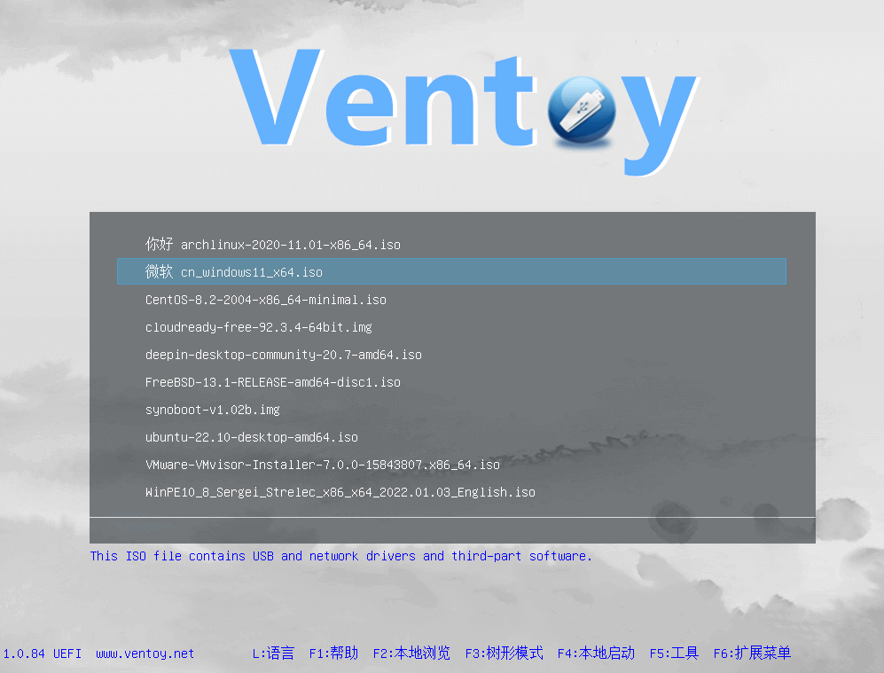
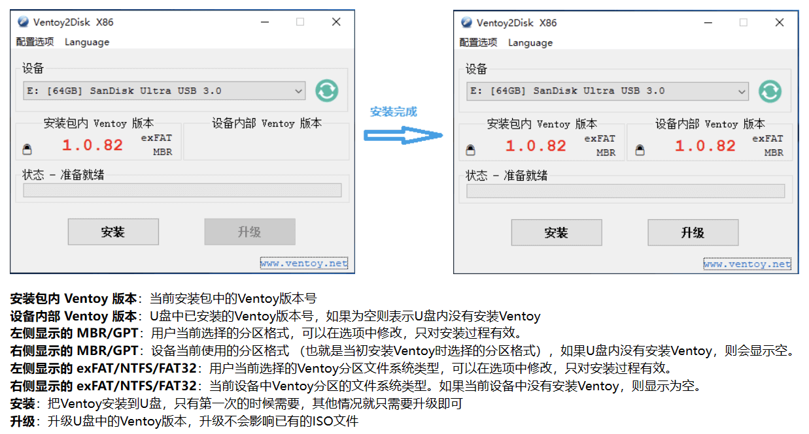
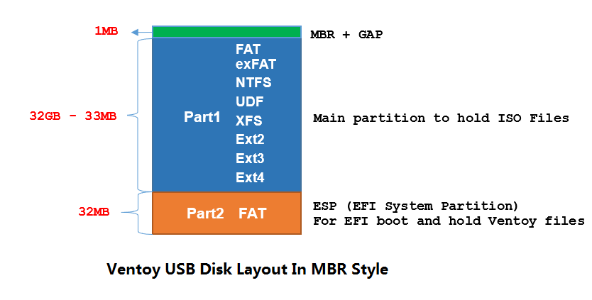
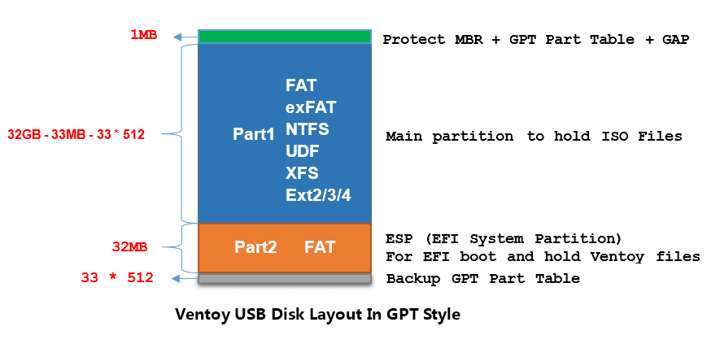
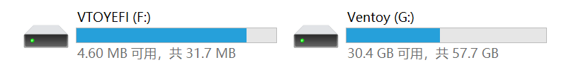
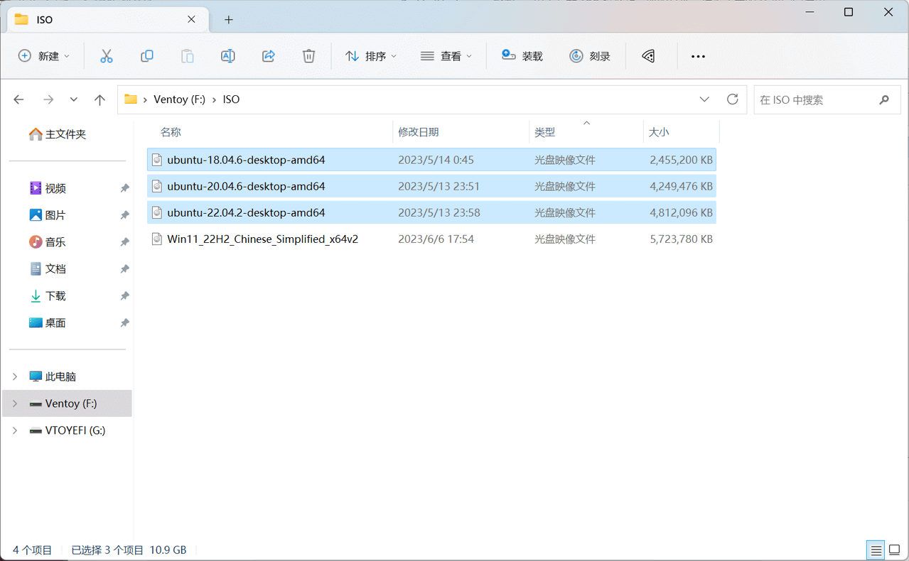

## 准备 U 盘

!!! warning "U 盘要求"
    - 可用空间至少为 8GB
    - 安装前无任何文件数据（需要格式化）

---

## 制作启动盘

- 使用工具：**[Ventoy](https://www.ventoy.net/)**

!!! abstract "Ventoy"

    **Ventoy** 是一款多系统启动盘制作工具。最大的特点是第一次格式化安装后，不仅支持多 ISO/系统启动引导（无需多次格式化写入镜像），
    并且不会影响文件存储的正常使用，兼容性较强，且完全开源。

!!! quote ""

    - **官方网站**：<https://www.ventoy.net/cn/download.html>
    - **GitHub**：<https://github.com/ventoy/Ventoy/releases>
    - **蓝奏云**：<https://www.lanzoui.com/b01bd54gb>
    - **南京大学镜像站**：<https://mirrors.nju.edu.cn/github-release/ventoy/Ventoy>

/// caption
从 U 盘引导启动后，自动检索可用的镜像文件
///

---

对于一般的启动盘而言，选择默认的配置/安装方式即可

> 分区格式与文件系统保持默认即可，不会影响 Ubuntu 安装，具体介绍可见下文

!!! danger "务必提前备份数据！"

    一旦安装将格式化 U 盘，务必提前转移/备份数据！

---

Ventoy 安装至 U 盘后，U 盘会被分为两个分区，**Part1（Ventoy）**和 **Part2（VTOYEFI）**，如下图所示：

{ width=375 }

/// caption
分区类型：MBR
///

{ width=400 }

/// caption
分区类型：GPT
///

- **Part1（Ventoy，exFAT）**：用于存放镜像文件和一般文件，作为正常的 U 盘空间使用
- **Part2（VTOYEFI，FAT）**：用于存放 Ventoy 的核心文件，以及 UEFI 引导启动文件等

---

!!! tip "Ventoy 会自动查找并识别 ISO 镜像文件"

    只需将 Ubuntu 的 ISO 镜像文件放置在 **Ventoy 分区**的任意路径（文件夹）下即可，选择该 U 盘引导启动时会自动查找并识别 ISO 镜像文件。

/// caption
例如，可以将镜像文件放置在 ISO 文件夹中
///
