## 禁用 Secure Boot 功能

!!! abstract "Secure Boot（安全启动）"

    **Secure Boot** 是 BIOS 的一种安全功能，旨在确保操作系统和启动项的完整性和可信性，可以防止未经授权的操作系统、
    病毒和恶意软件向计算机进行认证，进而保护系统不被攻击和篡改。

    **但在使用外部 U 盘运行某些程序或安装其他操作系统时，会被受到限制而无法运行/安装，因此需要临时禁用，直至所有配置完成（安装 NVIDIA 显卡驱动后）。**

---

首先进入 BIOS，启动电源/重启系统后，在 LOGO 界面（1~2s 内）按下特定的按键进入

!!! tip "进入 BIOS 界面"

    不同的主板/电脑进入 BIOS 的按键和操作方法不尽相同，常见的按键如：++f2++、++f12++、++delete++、++esc++等，
    建议根据主板品牌/型号查询，如搜索 "华硕主板如何禁用 Secure Boot 功能"。

---

通常在 BIOS（Advanced Mode）的 `Security`（安全）或 `Boot` 栏中，设置
`Secure Boot` 选项为 `Disabled`（Off）进行禁用，最后保存更改即可

> 有些主板除了禁用 Secure Boot 外，还需要更改 `OS Type` 为 `Other OS`

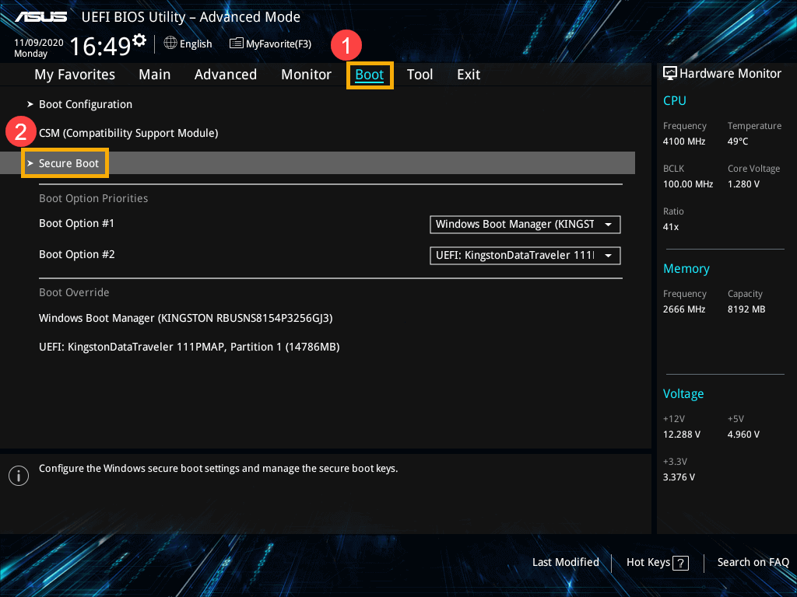

/// caption
例如华硕主板的 BIOS 界面（旧版本），图片来源于华硕官网
///

---

## 从 U 盘启动引导

!!! info "引导启动"
    
    安装 Ubuntu 系统需要从引导盘（U盘）使用 ISO 镜像安装。

=== "在 BIOS/Boot Manager 启动"

    进入 BIOS/Boot Manager，在 **"Boot Manager"** 或 **"启动选项"** 选择相应的 U 盘（USB Device）即可

    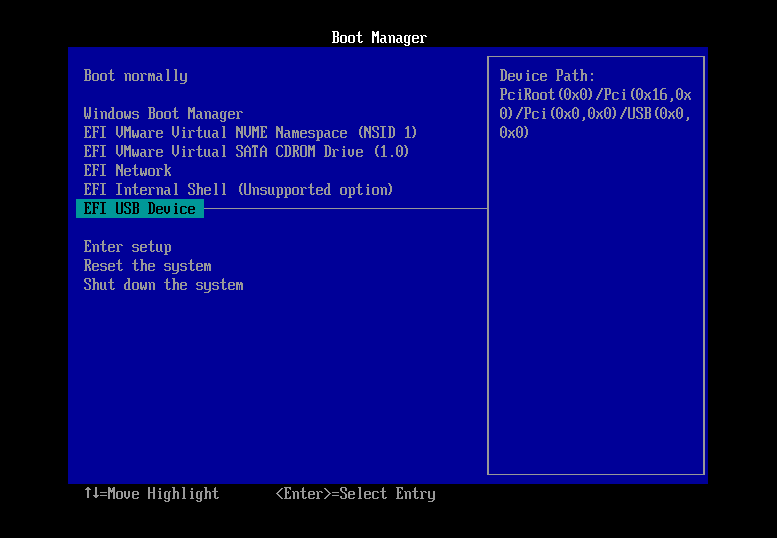

    
    /// caption
    VMware 的 Boot Manager
    ///

=== "使用高级启动（Windows）"

    如果使用 Windows 系统，可以通过 **"设置 → 系统 → 恢复 → 高级启动"** 立刻重新启动，进入高级启动界面

    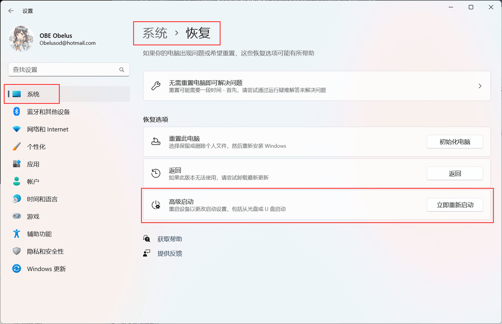

    
    /// caption
    系统设置（Windows 11）
    ///

    ---

    进入高级启动后，选择 **"使用设备"** 并选择相应的 U 盘（USB Device）即可

    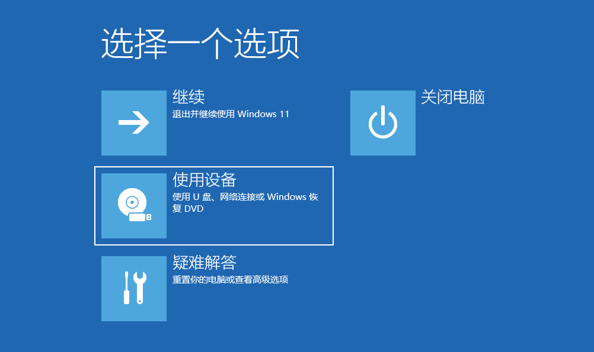

    
    /// caption
    高级启动（Windows 11）
    ///

---

## 选择 Ubuntu 镜像文件

!!! info "Ventoy 镜像"

    从 U 盘启动引导后，Ventoy 会自动查找镜像文件，并进入 Ventoy 的镜像选择菜单界面。

在 Ventoy 选择菜单中，选择需要安装的 Ubuntu 镜像文件（`ubuntu-xx.xx.x-desktop-amd64.iso`）

---

选择镜像后进入二级菜单，选择 **"Boot in normal mode"**（以正常模式启动）

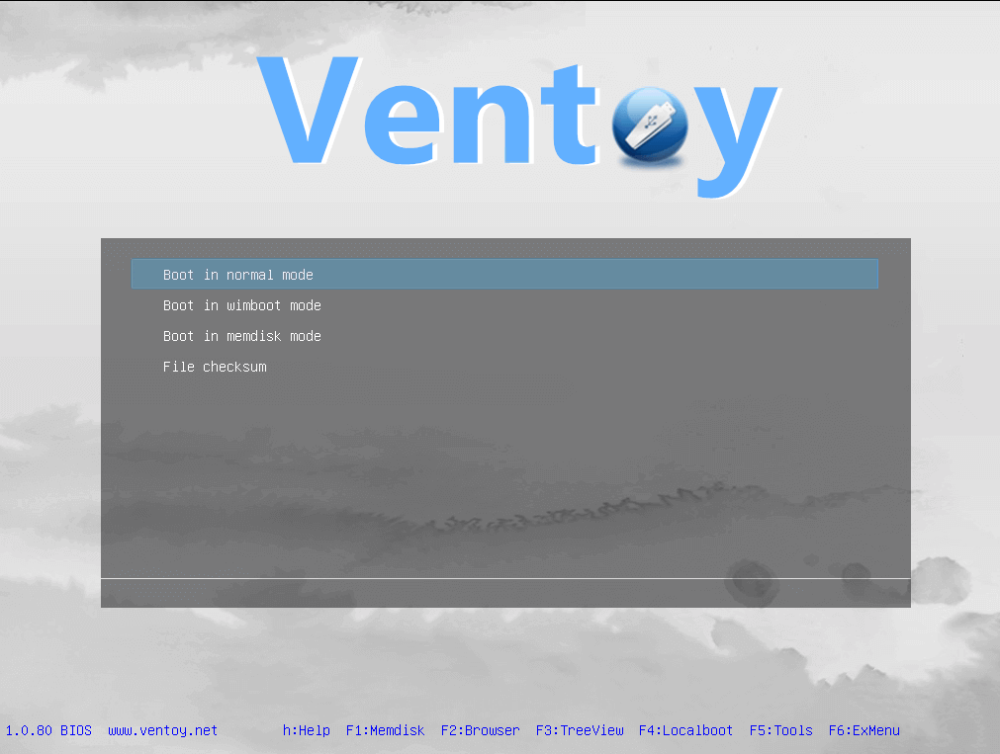

---

## Ubuntu 安装配置

在 GRUB 启动菜单中，选择 **"Try or Install Ubuntu"**（尝试或安装 Ubuntu），进入 Ubuntu 系统

???+ info "GRUB 选项说明"

    - **Try or Install Ubuntu**：进入 Ubuntu 的 Live CD 系统，试用或安装 Ubuntu，可以在不安装系统的情况下直接从启动盘启动，通常用于安装新的操作系统或者修复旧的操作系统。
    - **Ubuntu (safe graphics)**：以安全图形模式启动 Ubuntu 系统，确保系统以兼容性较好的图形模式启动，从而减少可能出现的图形或显卡驱动问题。
    - **OEM install (for manufacturers)**：原始设备制造商（Original Equipment Manufacturer）安装，为计算机制造商和系统集成商设计的，用于在计算机出厂前进行批量预安装操作系统，并为用户准备好定制化的系统设置。
    - **Boot from next volume**：从下一个卷（磁盘分区）引导启动系统，当计算机上有多个操作系统或者多个引导设备时，可以选择该选项来从其他卷或设备中切换系统。
    - **UEFI Firmware Settings**：进入计算机的 UEFI 固件设置界面（即 BIOS），可以对计算机的硬件设置、启动顺序、安全启动等进行调整和配置。

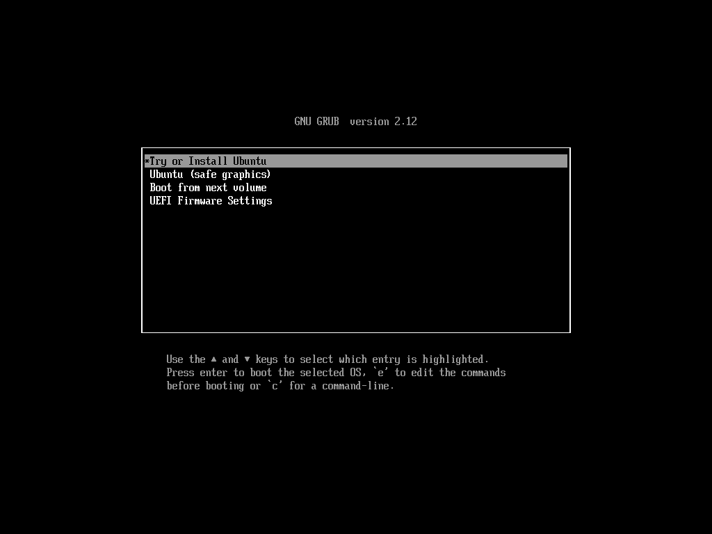

---

### 系统语言（Language）

选择系统语言，并点击 **"Next"** 下一步

> 中文（简体）在选项最底部

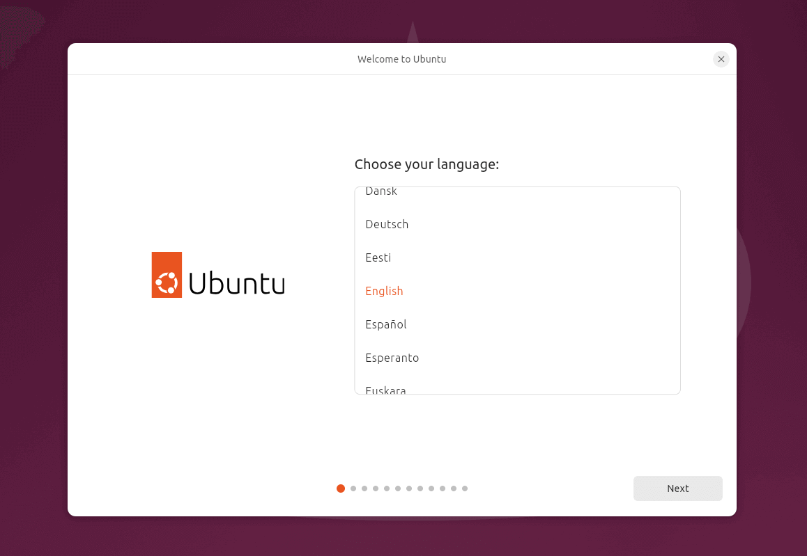

---

### 可访问性（Accessibility）

如无特殊需求，可以点击 **"Next"** 跳过

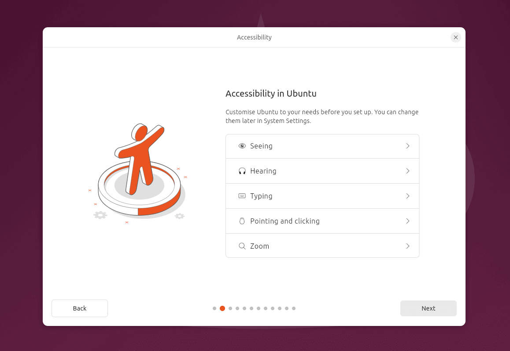

---

### 键盘布局（Keyboard Layout）

选择 `English`（英文）或 `Chinese`（中文）均可，也可以之后再安装其他输入法

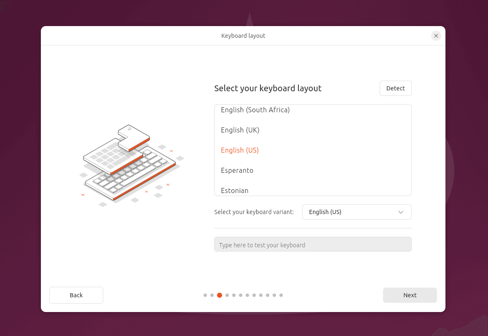

---

### 网络连接（Internet Connection）

选择一种网络类型，根据网络情况选择是否连接至互联网

!!! tip "额外安装与联网更新"

    连接网络后会提供额外的安装选项（如可选专有软件），并在安装过程中自动获取更新，但可能会导致安装时间大大延长。

    如果网络较差，建议选择 `Do not connect to the internet` 暂不连接网络。

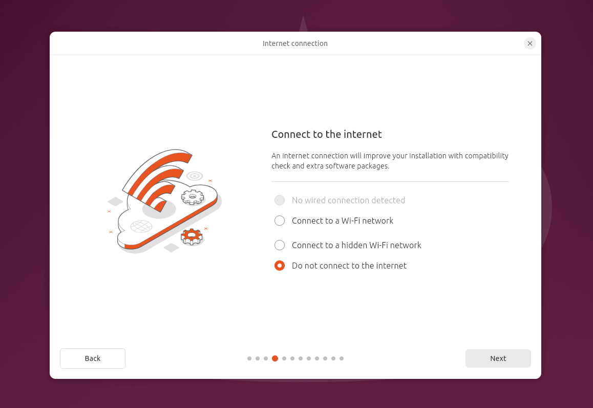

---

### 安装类型（Type of Installation）

选择 **"Install Ubuntu"** 安装 Ubuntu 系统

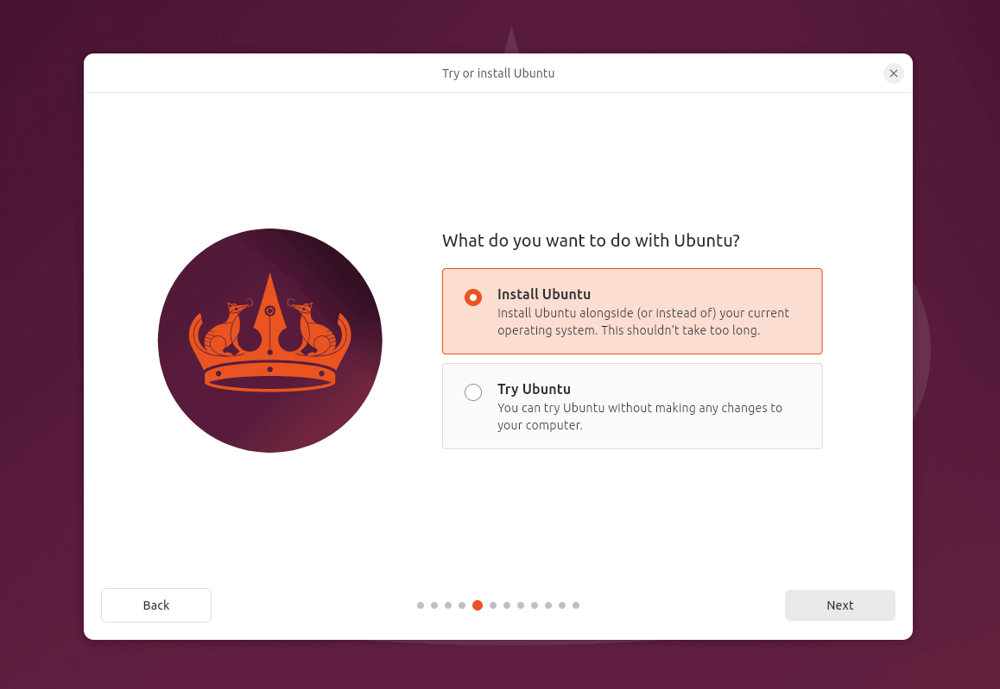

---

选择 **"Interactive installation"**（交互安装）进行自定义配置安装

!!! info "选项说明"

    - **Interactive installation（交互安装）**：即传统的安装方式，在安装过程中，用户需要根据引导逐一选择或输入相关配置信息（如分区、账户、时区等），直到完成所有配置后才会开始安装，适用于普通用户的自定义安装。
    - **Automated installation（自动安装）**：一种无需用户干预、提前配置的高级安装方式，通过网络从指定的 URL 加载 autoinstall.yaml 配置文件，可以按照设定好安装选项进行自动化安装，适用于高级用户或企业统一批量部署。

    自动安装详见：[Introduction to autoinstall - Ubuntu installation documentation](https://canonical-subiquity.readthedocs-hosted.com/en/latest/intro-to-autoinstall.html)

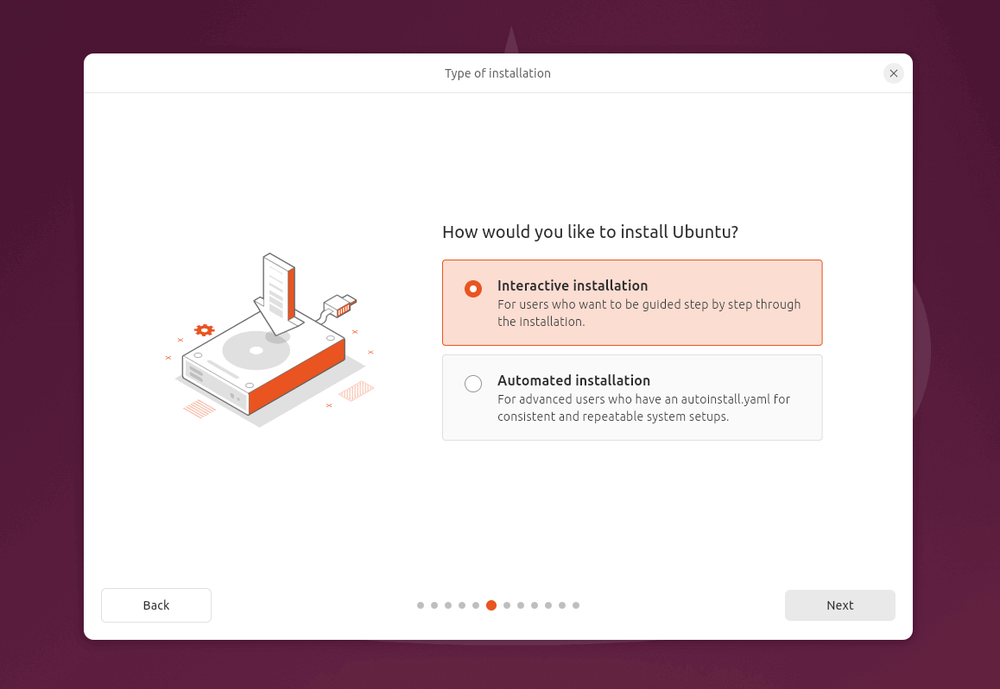

---

### 应用程序（Applications）

根据需要选择预安装的应用，推荐选择 **"Default selection"**（默认集合）进行最小化安装

!!! info "选项说明"

    - **Default selection（默认集合）**：即最小化安装，仅预装一些基本的应用，但依然包括捆绑的软件（如 Snap、FireFox）。
    - **Extened selection（扩展集合）**：附带安装一些常用的办公应用、工具（如 LibreOffice、Rhythmbox、GNOME Calendar），无需网络连接即可离线安装（使用 snap 包）。

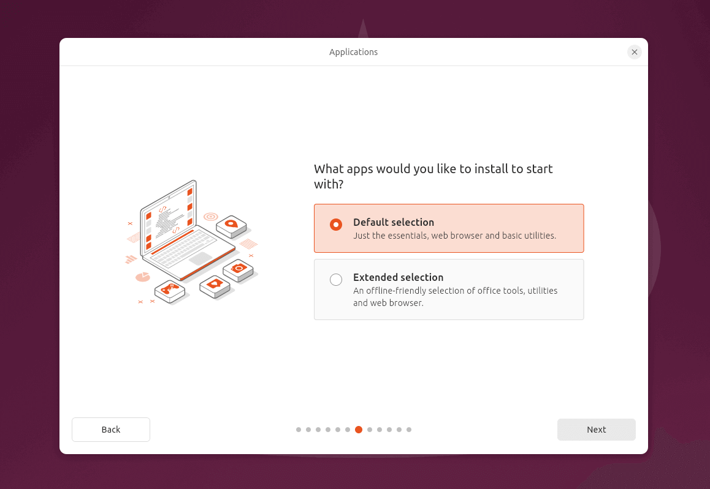

---

### 专有软件（Proprietary Software）

选择是否安装推荐的专有软件（如显卡驱动、Wi-Fi 驱动和编解码器等），建议**均不勾选**，后续再自行安装

!!! warning "开源显卡驱动"

    如果勾选 `Install third-party software for graphics and Wi-Fi hardware`，将会安装第三方专有驱动（如
    NVIDIA 驱动），否则将默认使用开源的显卡驱动（Xorg）。

    另外，勾选后安装的第三方专有驱动（如 NVIDIA 驱动）可能会默认安装非最新稳定版本，如出现问题可以在后续更换。

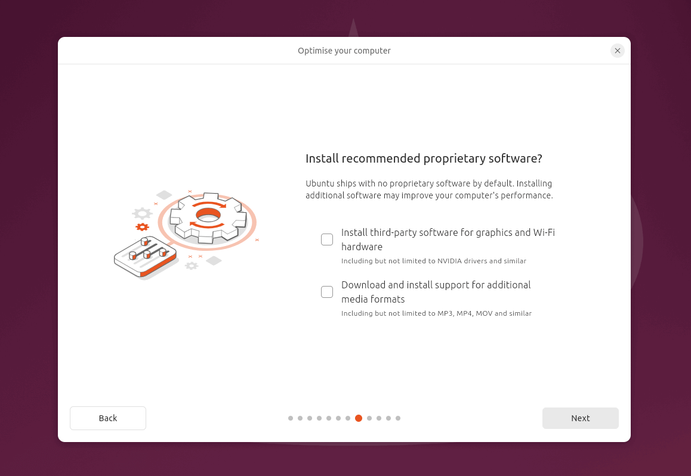

---

### 磁盘与分区（Disk Setup）

根据实际情况选择安装类型和磁盘分区

!!! question "选择安装类型"

    - 如果已有 Windows 系统且需要安装双系统，可以选择 **"Install Ubuntu alongside Windows Boot Manager
    and Ubuntu 24.04 LTS"**，保留 Windows 相关文件并与 Ubuntu 共存，将会自动进行分区。
    - 如果安装双系统或自定义分区，选择 **"Manual installation"**（手动安装/分区），自定义磁盘分区。
    - 如果仅使用 Ubuntu（不存在 Windows 系统），选择 **"Erase disk and install Ubuntu"**（擦除磁盘并安装 Ubuntu）。

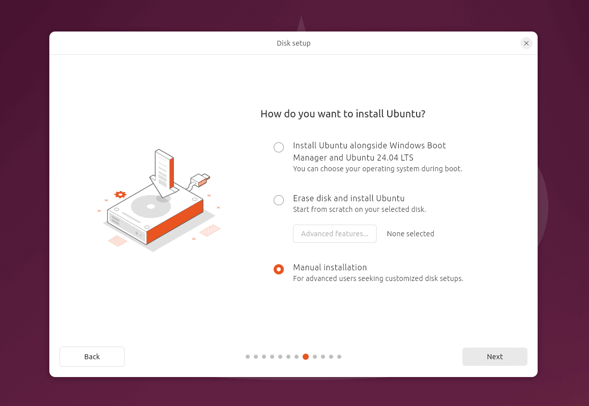

---

!!! example "手动分区"

    以下步骤为自定义分区，即选择 **"Manual installation"**（手动安装）的情况。

选择一块磁盘的 **"Free space"**（空闲区）(1)，注意不同磁盘分区的命名差异
{ .annotate }

1. 空闲区，即 Windows 系统的磁盘管理中的 "未分配空间"

!!! info "分区命名"

    - `/dev/sda1`：第1块 ^^**SATA/SCSI/USB 硬盘**^^（`a`）的第1块分区（`1`）
    - `/dev/sdb2`：第2块 ^^**SATA/SCSI/USB 硬盘**^^（`b`）的第2块分区（`2`）
    - `/dev/nvme0n1p1`：第1块 ^^**NVMe 硬盘**^^（`nvme0`）的第1个命名空间（`n1`）的第1块分区（`p1`）
    - `/dev/nvme1n1p2`：第2块 ^^**NVMe 硬盘**^^（`nvme1`）的第1个命名空间（`n1`）的第2块分区（`p2`）
    - ......以此类推

!!! warning "注意正确选择硬盘空闲区"

    如果有两块或两块以上的硬盘，例如想要将 Ubuntu 安装在第二块硬盘，务必选择**第二块硬盘下方**的空闲区（`Free space`）！

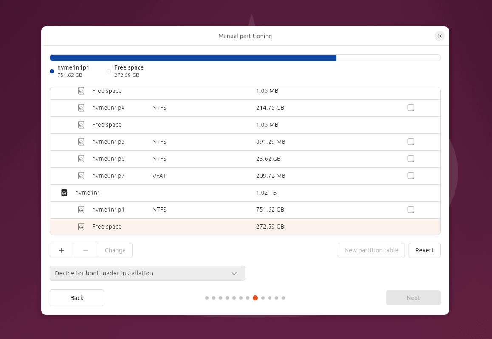

/// caption
图中，欲将 Ubuntu 安装在第二块硬盘的第二块分区（nvme1n1n1p1）之后，具体以实际情况为准
///

---

!!! info "Linux 根挂载点"

    在基于 Linux 内核的系统中，默认所有的目录和文件都置于**根挂载点`/`**下，可以为某些重要分区/目录单独地分配一个独立的分区，
    以提高系统的管理效率、安全性和性能，并避免数据损坏或丢失。

| Linux 常见分区/目录[^1]                  | 描述                                 |
|:-----------------------------------|:-----------------------------------|
| `/boot`（MBR）  `/boot/efi`（GPT） | **引导分区**，存放引导程序文件                  |
| `swap`                             | **内存交换分区**，相当于虚拟内存                 |
| `/`                                | **根挂载点**，整个文件系统的根目录                |
| `/home`                            | **普通用户主目录**，存储普通用户的一般文件            |
| `/root`                            | **root 用户主目录**，存储 root 用户的数据和脚本文件  |
| `/bin`                             | 存储基本命令的二进制文件                       |
| `/usr`                             | 存储系统软件，包含用户数据和应用程序                 |
| `/etc`                             | 存储系统配置文件                           |
| `/tmp`                             | 存储临时文件，通常在重启后自动删除                  |
| `/var`                             | 存储变量文件，比如日志或缓存                     |
| `/dev`                             | 存储设备文件，通常是硬件设备的接口文件                |

---

??? info "常用分区方案（GPT，200 GB）"

    以下分区方案仅供参考，可以根据具体需求适当调整，或是减少/增加独立分区，例如不单独分配 `/home` 分区，或增加 `/usr`、`/var` 分区。

    一般而言，如果电脑内存为 16GB 或以上，`swap` 分区可以不分配或少分配（日常使用基本不会占满）。

    对于根目录 `/` 和用户主目录 `/home`，建议用剩余的所有空间以 4:6 或 5:5 比例分配，两者至少为 20GB。

    <table><thead>
      <tr>
        <th style="text-align: center;">独立分区</th>
        <th style="text-align: center;">分区类型 （Type）</th>
        <th style="text-align: center;">文件系统 （File System）</th>
        <th style="text-align: center;">挂载点 （Mount Point）</th>
        <th style="text-align: center;">大小 （Size）</th>
      </tr></thead>
    <tbody>
      <tr>
        <td style="text-align: center;">引导分区 <code>/boot/efi</code></td>
        <td style="text-align: center;">逻辑分区（Logical）</td>
        <td style="text-align: center;" colspan="2">EFI 系统分区（EFI System Partition）</td>
        <td style="text-align: center;">1 GB</td>
      </tr>
      <tr>
        <td style="text-align: center;">内存交换分区 <code>swap</code></td>
        <td style="text-align: center;">逻辑分区（Logical）</td>
        <td style="text-align: center;" colspan="2">交换空间（swap area）</td>
        <td style="text-align: center;">4096 MB</td>
      </tr>
      <tr>
        <td style="text-align: center;">根挂载点 <code>/</code></td>
        <td style="text-align: center;">主分区（Primary）</td>
        <td style="text-align: center;">Ext4 日记文件系统</td>
        <td style="text-align: center;"><code>/</code></td>
        <td style="text-align: center;">81920 MB</td>
      </tr>
      <tr>
        <td style="text-align: center;">用户主目录 <code>/home</code></td>
        <td style="text-align: center;">逻辑分区（Logical）</td>
        <td style="text-align: center;">Ext4 日记文件系统</td>
        <td style="text-align: center;"><code>/home</code></td>
        <td style="text-align: center;">剩余所有</td>
      </tr>
    </tbody>
    </table>

!!! tip "Ubuntu 24.04 建议仅划分出根挂载点"

    在 Ubuntu 24.04 之后，引导分区会自动分配大小，因此建议**仅划分出根挂载点 `/`** 即可。

---

先在左下方选择安装所在硬盘的 **"Device for boot loader installation"** （安装引导程序的设备），即引导分区 `/boot/efi`，默认会自动分配分区大小

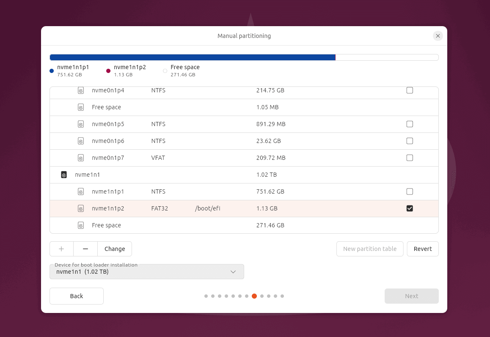

---

按照类似于上述方案进行分区，选择 **"Free space"**（空闲区），并点击左下方 **"+"** 按钮，依次新建分区

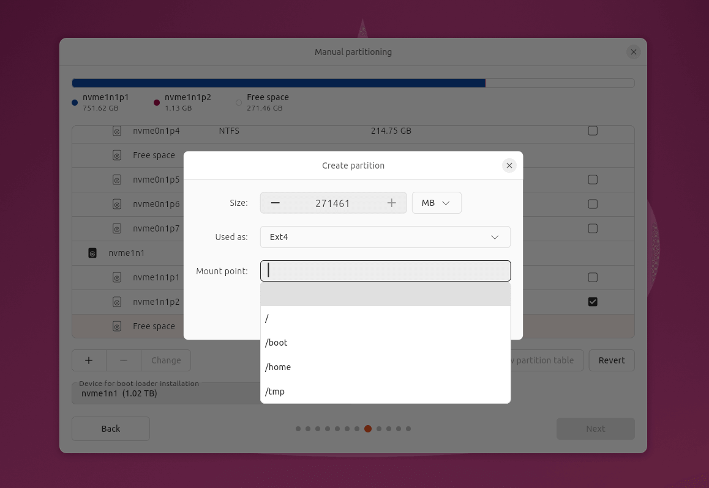

---

分区完成后如下图所示，选择 **"install new"**（立刻安装），后续将会对所分区进行划分和格式化

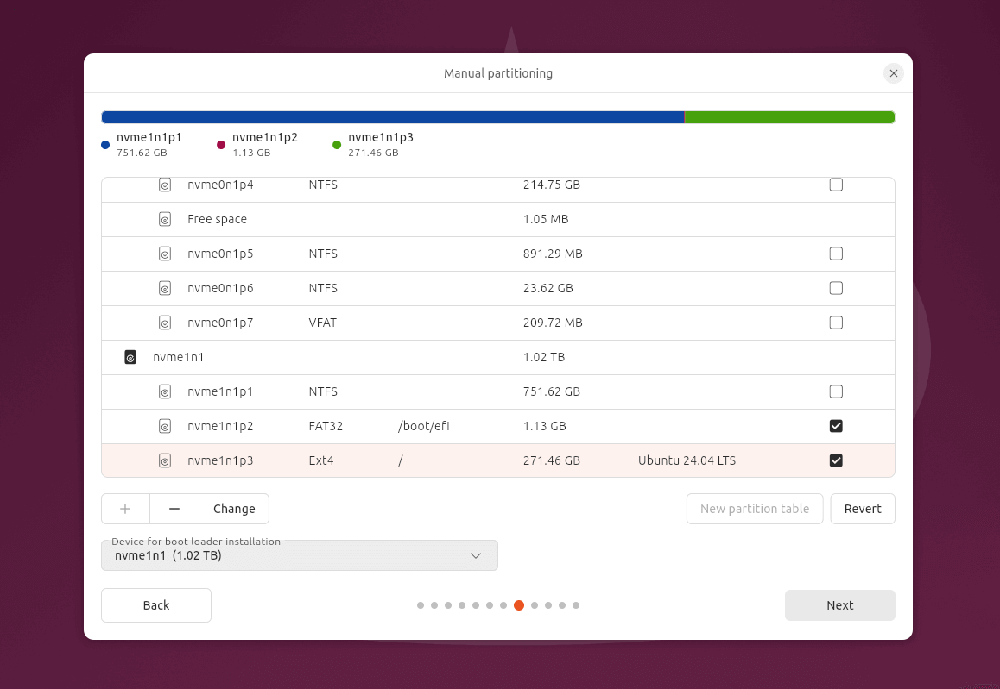

---

### 设置账户（Account）

设置用户名、计算机名和密码，其中用户和计算机名不宜过长，否则会出现终端输入命令时过长的提示

!!! tip "远程控制取消密码"

    如果该电脑/系统常被用于远程操控，可以取消 `Require my password to log in`（登录时需要密码），以便每次重启后无需密码直接进入桌面。

!!! info annotate "Use Active Directory（使用活动目录）[^2]"

    Active Directory（AD）是用于在网络环境中为企业和组织提供存储和组织网络资源和用户信息的组策略服务，以及统一身份验证和访问控制的能力；
    在安装 Ubuntu 时，可以选择使用 AD 对 Ubuntu 进行用户身份验证和集中式管理。

---

### 选择时区（Timezone）

点击中国版图的任意区域，即 `Asia/Shanghai` 时区（北京时间，UTC/GMT+08:00）即可

!!! tip "自动选择镜像站"

    选择位置（Location）后，如果先前连接了网络将会自动将软件源更换至选定位置附近的镜像源，例如
    `Shanghai`（上海）时区可能会选择 "清华大学镜像站"（tsinghua）。

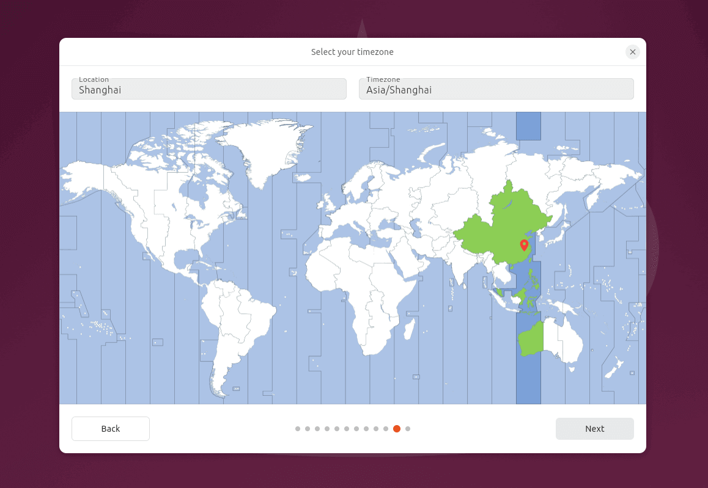

---

### 确认安装（Install）

确认并核对安装选项和信息，点击 **"Install"** 执行安装

!!! danger "务必确认硬盘分区！"

    务必再三确认磁盘分区是否正确，一旦开始安装将进行磁盘格式化，重要数据务必提前备份！

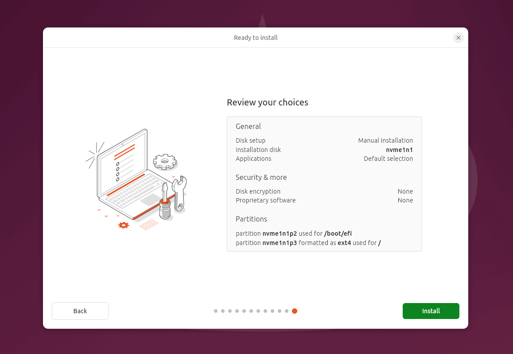

---

等待安装完成，可能需要十分钟左右，点击右下方的 **"终端"** 图标可以查看安装详情

> 如果先前连接网络并勾选了专有软件，安装时将会依据网络状况、更新内容需要额外的安装时间

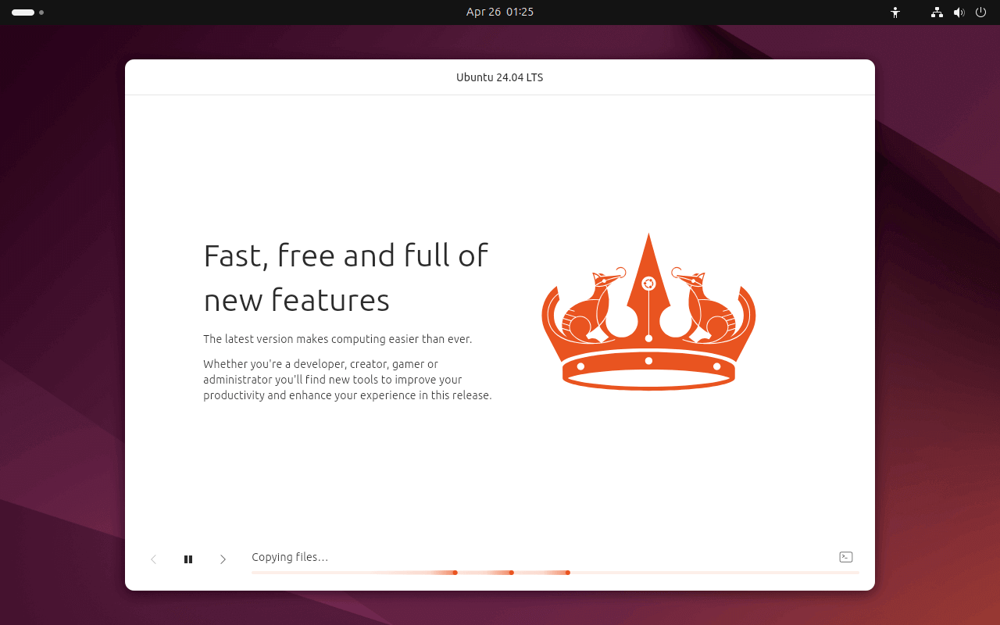

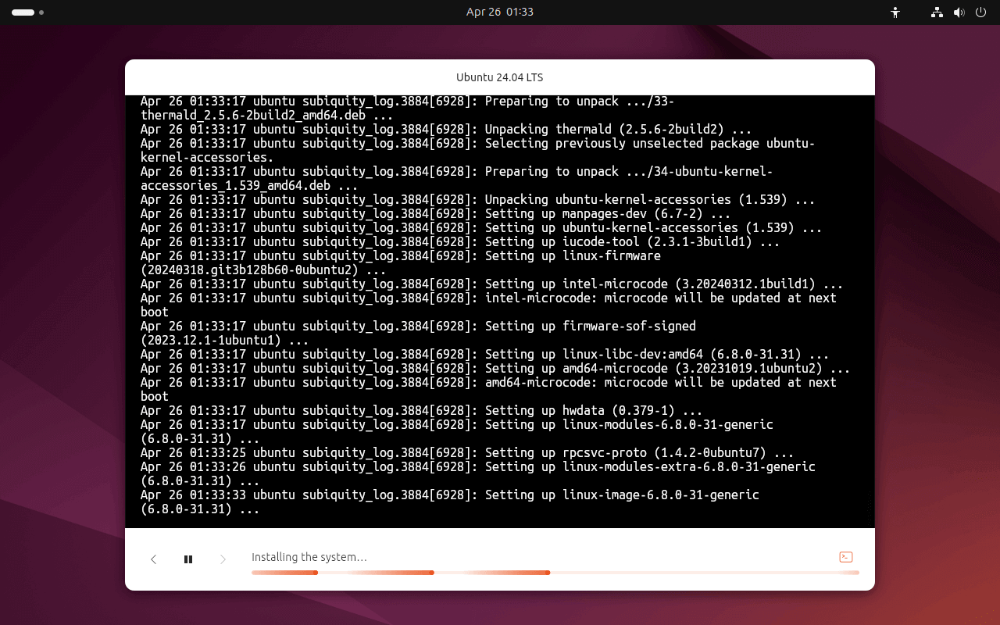

---

### 重启系统（Restart）

安装完成后，需要重启系统（Restart）

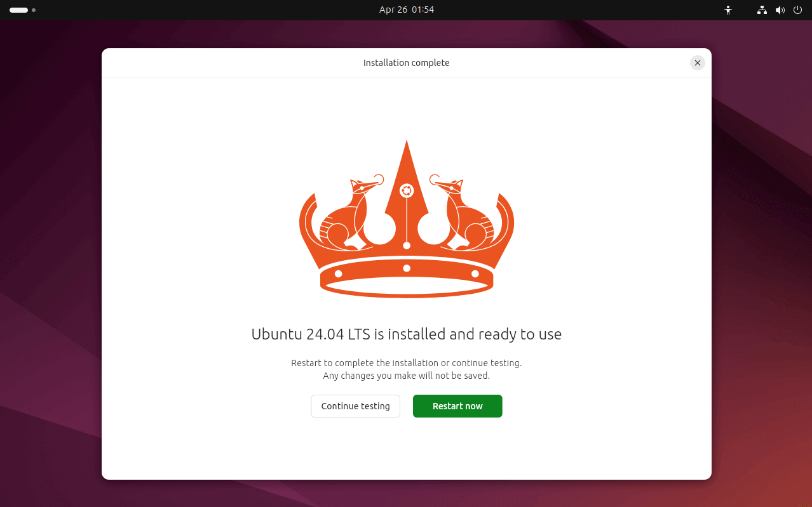

---

重启时需要将启动 U 盘拔出，并按下 ++enter++ 键。

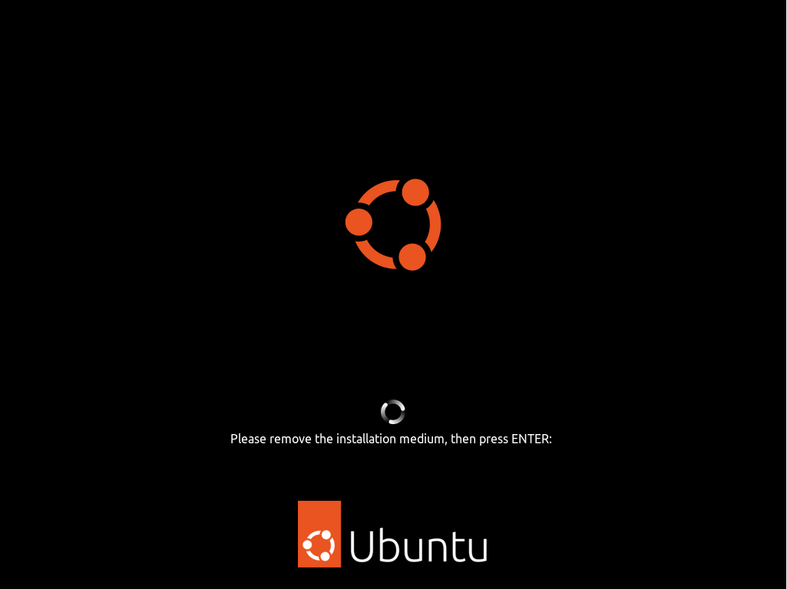

---

启动后进入 GNU GRUB 系统，要求选择启动引导（Boot）项，或是等待 10s 后自动选择第一默认启动项

> Window Boot Manager 为 Windows 启动管理器，用于启动 Windows 系统。

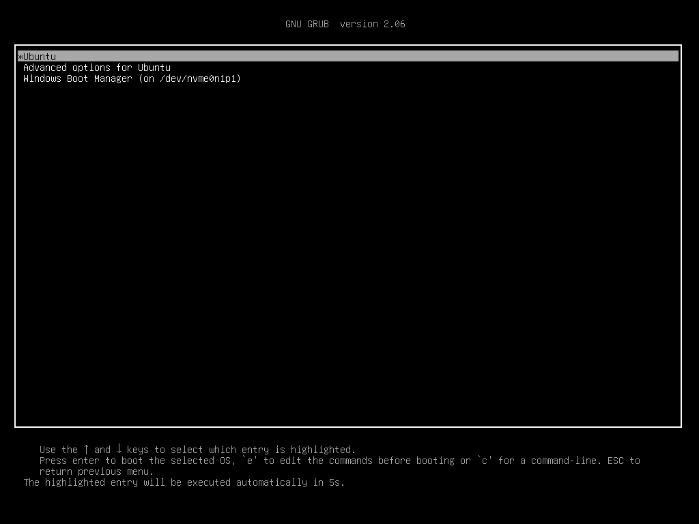

[^1]: [文件系统层次结构标准 - 维基百科，自由的百科全书](https://zh.wikipedia.org/wiki/%E6%96%87%E4%BB%B6%E7%B3%BB%E7%BB%9F%E5%B1%82%E6%AC%A1%E7%BB%93%E6%9E%84%E6%A0%87%E5%87%86)
[^2]: [Active Directory GPO client documentation](https://documentation.ubuntu.com/adsys/en/stable/)
