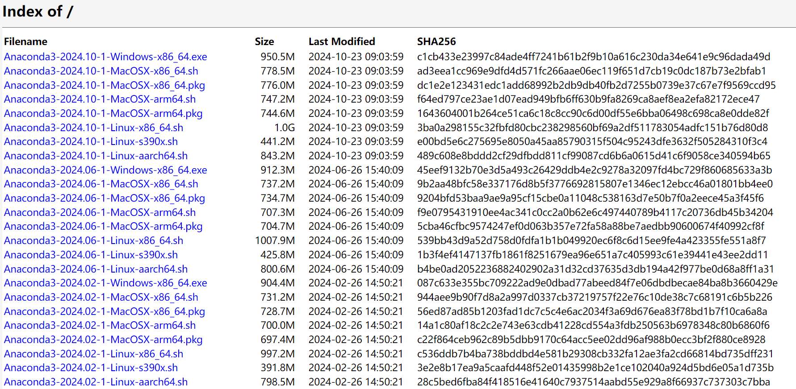
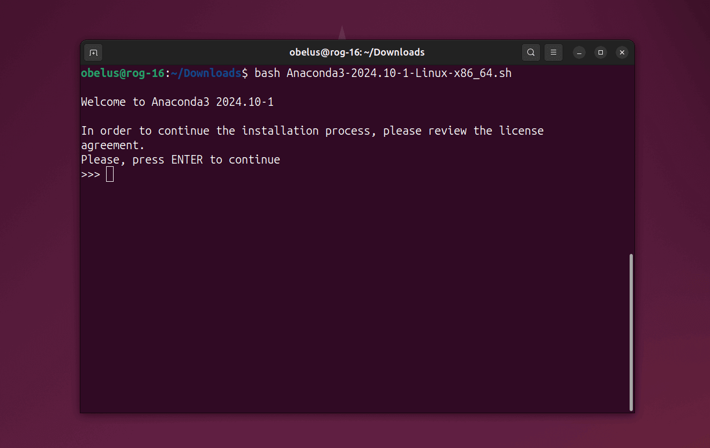
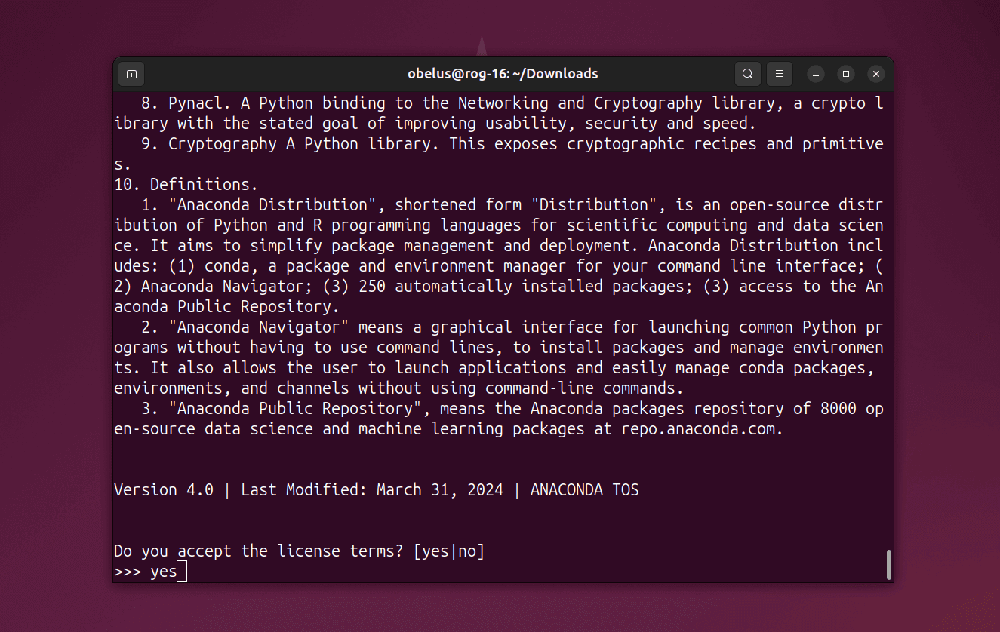
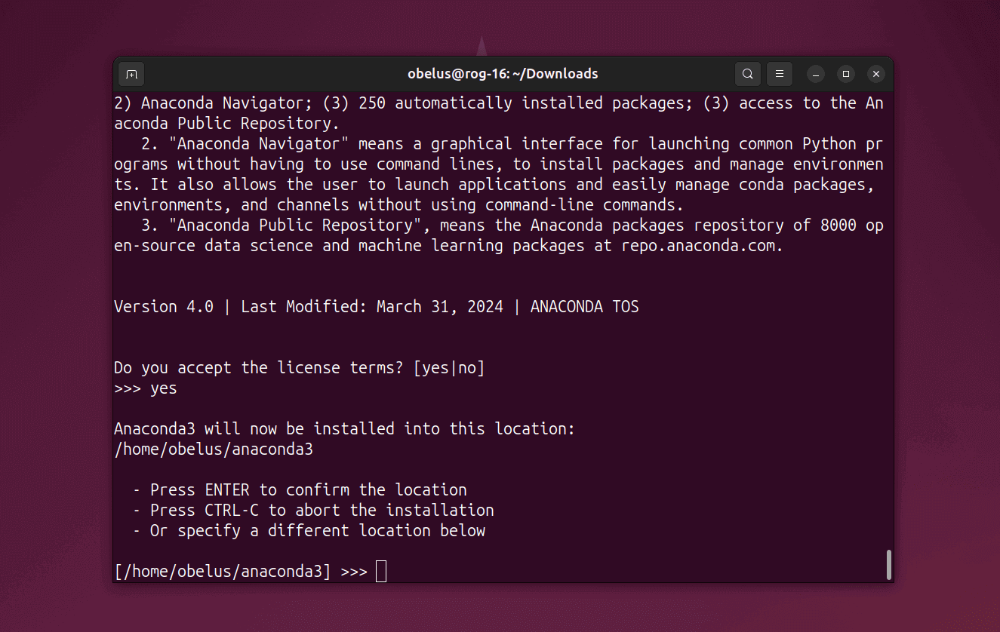
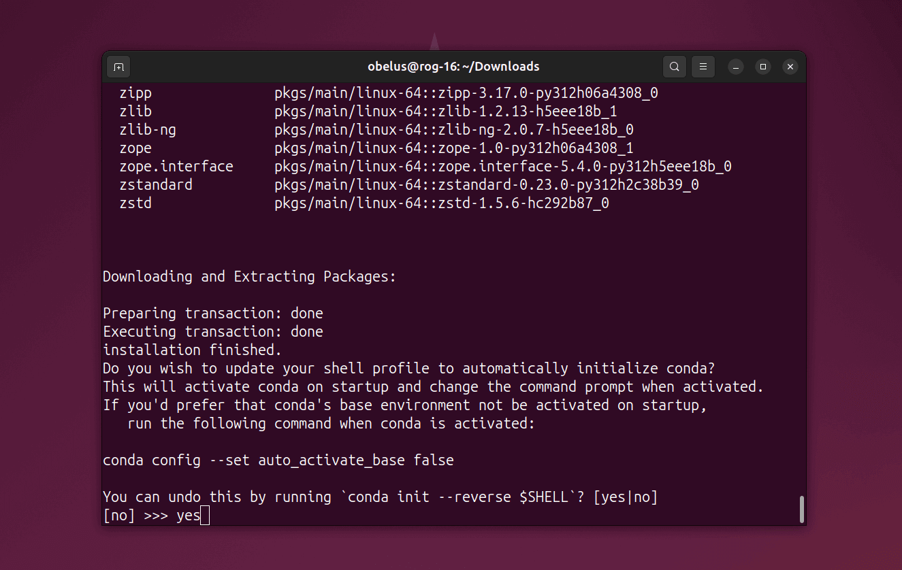
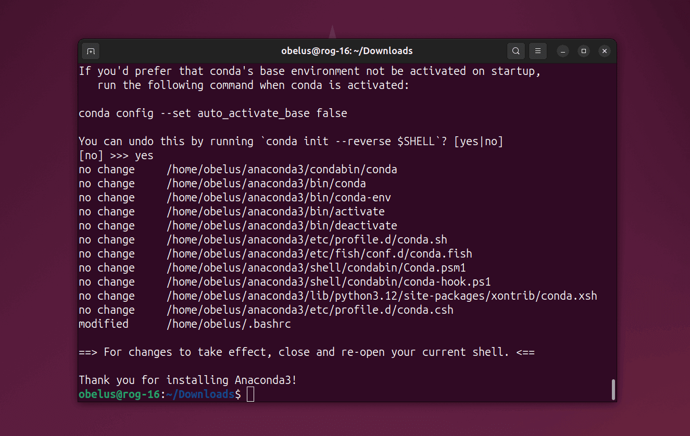
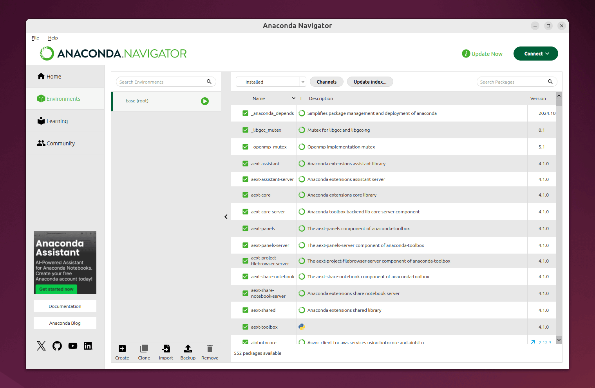
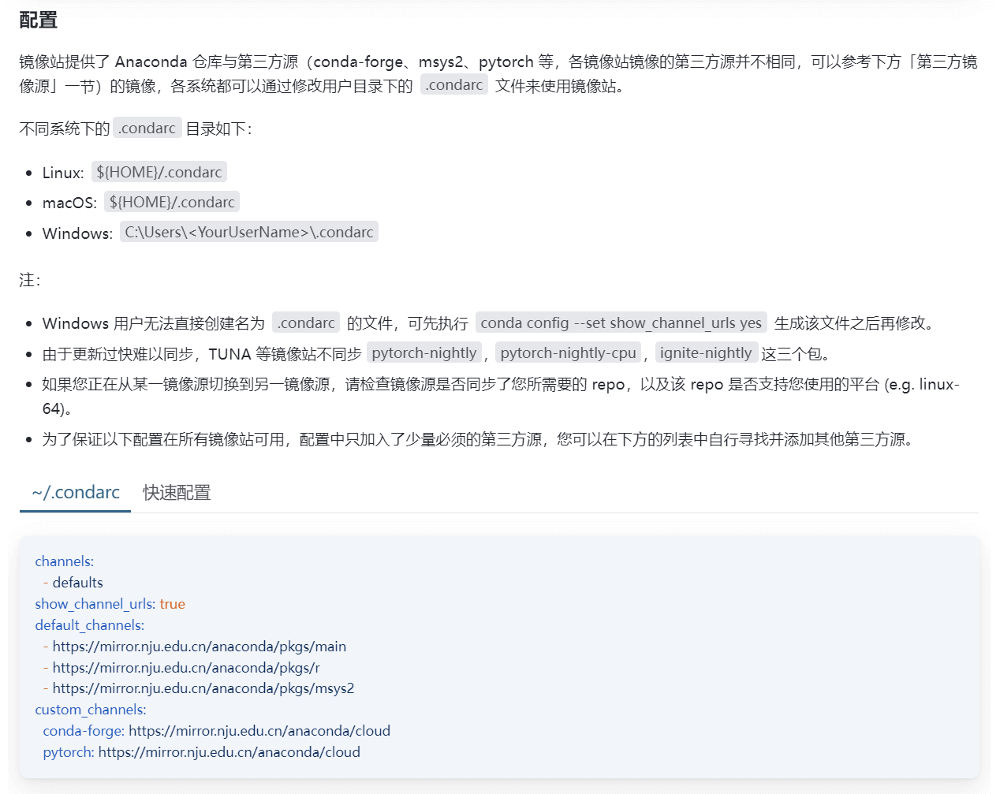
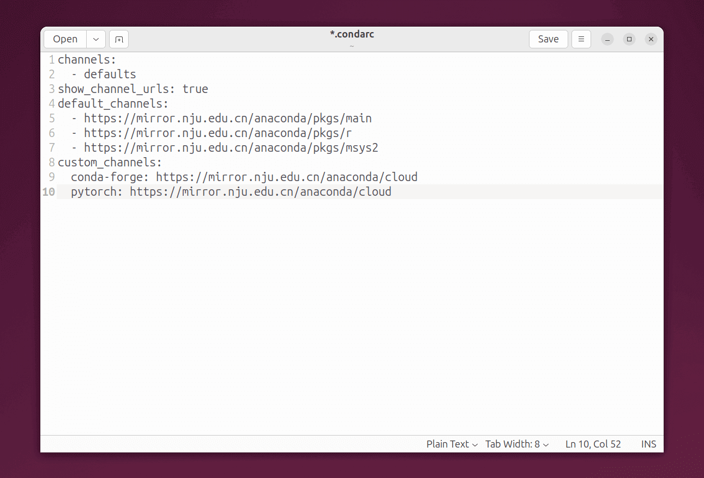

## 安装 Anaconda [^1]

访问 [Anaconda Archive 官网](https://repo.anaconda.com/archive/)，选择相应架构（如 `Linux-x86_64`）的最新版本下载 (1)
{ .annotate }

1. 可以通过 `wget` 命令在终端中下载，例如：
```bash
wget https://repo.anaconda.com/archive/Anaconda3-2024.10-1-Linux-x86_64.sh
```



---

执行下列命令，安装 Anaconda 发行版

!!! warning "不要以管理员身份运行"

    不要使用 `sudo` 以管理员身份运行，否则会默认安装至 `root` 目录，之后安装软件包可能会出现权限问题

```bash
bash ${Anaconda3-xxxx.xx-xx-Linux-x86_64.sh}
```

---

按下回车键继续，查看许可协议



---

使用上下方向键阅读协议，最后输入 `yes` 并回车确认



---

确认安装位置，默认位置为 `~/anaconda3`，按下回车或输入新位置继续安装



---

选择是否初始化 `conda`：

<div class="annotate" markdown>

- `yes`：更新 `bash` 配置文件，使其能够识别 `conda` 命令，并默认激活 `base` 环境 (1)
- `no`：不会修改 `bash` 配置文件，如果后续使用 `conda`，需要手动初始化

</div>

1. 如果需要取消默认激活 `base` 环境，可以使用下列命令：
```bash
conda config --set auto_activate_base false 
```

??? note "手动初始化 `conda`"

    如果需要手动初始化 `conda`，可以使用下列命令：

    > 将 `${PATH_TO_CONDA}` 替换为 Anaconda 的安装目录，默认为 `~/anaconda3`

    ```bash
    source ${PATH_TO_CONDA}/bin/activate
    conda init --all # (1)!
    ```

    1. `--all` 选项将初始化所有支持的 shell，详见：[conda init](https://docs.conda.io/projects/conda/en/stable/commands/init.html)



---

安装完成，重启终端即可使用 `conda`



---

## 安装 Miniconda [^2]

执行下列命令，下载 Miniconda 最新发行版 (1)
{ .annotate }

1. 对于其他版本，查看 [Miniconda Archive 官网](https://repo.anaconda.com/miniconda/)

```bash
wget https://repo.anaconda.com/miniconda/Miniconda3-latest-Linux-x86_64.sh
```

---

执行下列命令，安装 Miniconda 发行版

```bash
bash Miniconda3-latest-Linux-x86_64.sh
```

---

## 启动 Navigator

!!! abstract "Anaconda Navigator"

    **Anaconda Navigator** 是 Anaconda 发行版中包含的桌面图形用户界面（GUI），可以通过 Navigator 轻松地管理 Python 环境、安装、更新和卸载各种软件包以及使用各种 IDE 工具，而无需使用终端命令。

    !!! tip annotate ""

        Anaconda 已附带安装 Navigator，对于 Miniconda，可以使用 `conda install anaconda-navigator` 命令安装 (1)

    1. 如果需要卸载 Navigator，可以使用 `conda remove anaconda-navigator` 命令

使用下列命令启动 Navigator：

```bash
anaconda-navigator
```



---

## 更换软件源

选择一个国内镜像站，建议优先选择地理位置较近、相同运营商的镜像站 (1)
{ .annotate }

1. 可在[校园网联合镜像站](https://mirrors.cernet.edu.cn/site)中查询

|       推荐镜像站       | 镜像站帮助页（Anaconda）                                              |
|:-----------------:|---------------------------------------------------------------|
| 清华大学镜像站（tsinghua） | <https://mirror.tuna.tsinghua.edu.cn/help/anaconda/>          |
|   南京大学镜像站（nju）    | <https://mirror.nju.edu.cn/mirrorz-help/anaconda/?mirror=NJU> |
|  上海交通大学镜像站（sjtu）  | <https://mirrors.sjtug.sjtu.edu.cn/docs/anaconda>             |
|  阿里云镜像站（aliyun）   | <https://developer.aliyun.com/mirror/anaconda>                |

---

以南京大学镜像站为例，复制下方的镜像源

??? note "常用第三方源 `custom_channels`"

    - **conda-forge**：社区维护的开源包仓库，提供大量最新版本的跨平台软件。
    - **pytorch**：PyTorch 官方频道，提供深度学习框架及其扩展库。
    - **nvidia**：NVIDIA 维护的频道，包含 CUDA 工具包等 GPU 加速库。
    - **intel**：Intel 优化的数学库（如 MKL），提升 CPU 计算性能。
    - **msys2**：Windows 系统工具链频道，包含编译工具和依赖库（如 GCC、Git）。
    - **bioconda**：生物信息学专用频道，提供生物数据分析工具（如 SAMtools、BLAST）。
    - **menpo**：计算机视觉和图像处理工具库（如 dlib、OpenCV）。



---

在终端中执行下列命令，编辑软件源配置文件

```bash
gedit ~/.condarc
```

---

将配置文件中 `channels` 及相关部分替换为镜像源，并保存文件



---

更改为镜像源后，需要清除索引缓存

```bash
conda clean -i
```

---

## 更新 Conda 和 Navigator

!!! tip annotate "指定更新版本"

    如果 `conda` 需要安装指定版本或最新版本 (1)，可以执行下列命令：

    > 如果版本过低，更新需要分阶段进行（逐级更新）

    ```bash
    conda install -n base conda=xx.xx.xx
    ```

1. 最新版本可查看 [GitHub Releases](https://github.com/conda/conda/releases)

```bash
conda update -n base conda
conda update anaconda-navigator
```

---

## 卸载 Navigator

```bash
conda remove anaconda-navigator
```

---

## 卸载 Anaconda

（可选）移除 `anaconda3` 目录以外的环境

<div class="annotate" markdown>

> 将 `${PATH_TO_ENV_DIRECTORY}` 替换为环境目录 (1)

</div>

1. 可以使用 `conda info --envs` 命令查看所有环境及其目录

```bash
~/anaconda3/_conda constructor uninstall --prefix ${PATH_TO_ENV_DIRECTORY}
```

---

（可选）移除所有终端配置文件中的 `conda` 初始化脚本

```bash
conda init --reverse --all
```

---

移除整个 `anaconda3` 目录

```bash
rm -rf anaconda3
rm -rf ~/anaconda3
sudo rm -rf /opt/anaconda3
```

---

（可选）移除 `.condarc` 文件和 `.conda`、`.continuum` 目录

```bash
rm -rf ~/.condarc ~/.conda ~/.continuum
```

---

## 卸载 Miniconda

???+ example "命令可选项"

    - `--remove-caches`：删除缓存文件（例如包缓存和索引缓存等）
    - `--remove-config-files {user,system,all}`：删除配置文件（例如 `.condarc` 文件），`user` 会移除当前用户主目录内的文件，而 `system` 会移除该目录外的所有文件
    - `--remove-user-data`：删除用户数据（例如 `~/.conda` 目录）

```bash
~/miniconda3/uninstall.sh
```

## 常用命令 [^3]

| 描述                                                                   	 | 命令                                                                                                            	         |
|:-----------------------------------------------------------------------|:------------------------------------------------------------------------------------------------------------------------|
| 验证 conda 安装，检查版本等                                            	         | `conda info`                                                                                                      	     |
| 创建环境                                                               	   | `conda create --name ENVNAME python=3.10`                                                                         	     |
| 删除环境                                                               	   | `conda remove -n ENVNAME --all`                                                                                   	     |
| 激活环境                                                               	   | `conda activate ENVNAME`                                                                                          	     |
| 列出已安装包                                                           	     | `conda list`                                                                                                      	     |
| 更新所有包                                                             	    | `conda update --all`                                                                                              	     |
| 安装包（指定 channel）                                                 	      | `conda install -c CHANNELNAME PKG1 PKG2`<br>`conda install CHANNELNAME::PKGNAME`                                    	   |
| 安装包（指定版本）                                                     	        | `conda install PKGNAME=3.1.4`<br>`conda install "PKGNAME>2.5,<3.2"`<br>`conda install "PKGNAME [version='2.5|3.2']`" 	   |
| 安装包（文件列表）                                                     	        | `conda install --file FILENAME`                                                                                   	     |
| 卸载包                                                                 	  | `conda uninstall PKGNAME`                                                                                         	     |
| 列出所有环境及其位置                                                   	         | `conda env list`                                                                                                  	     |
| 导出环境文件<br>1. 跨平台兼容<br>2. 指定平台 + 包<br>3. 指定平台 + 包 + channel 	           | `conda env export --from-history>ENV.yml`<br>`conda env export ENVNAME>ENV.yml`<br>`conda list --explicit>ENV.txt`    	 |
| 导入环境文件                                                           	     | `conda env create -n ENVNAME --file ENV.yml`<br>`conda create -n ENVNAME --file ENV.txt`                            	   |
| 删除所有未使用文件                                                     	        | `conda clean --all`                                                                                               	     |
| 检查 conda 配置                                                        	   | `conda config --show`                                                                                             	     |

[^1]: [Installing Anaconda Distribution — Anaconda documentation](https://docs.anaconda.com/anaconda/install/)
[^2]: [Installing Miniconda — Miniconda documentation](https://docs.anaconda.com/navigator/install/)
[^3]: [Conda Commands](https://docs.conda.io/projects/conda/en/stable/commands/index.html)
