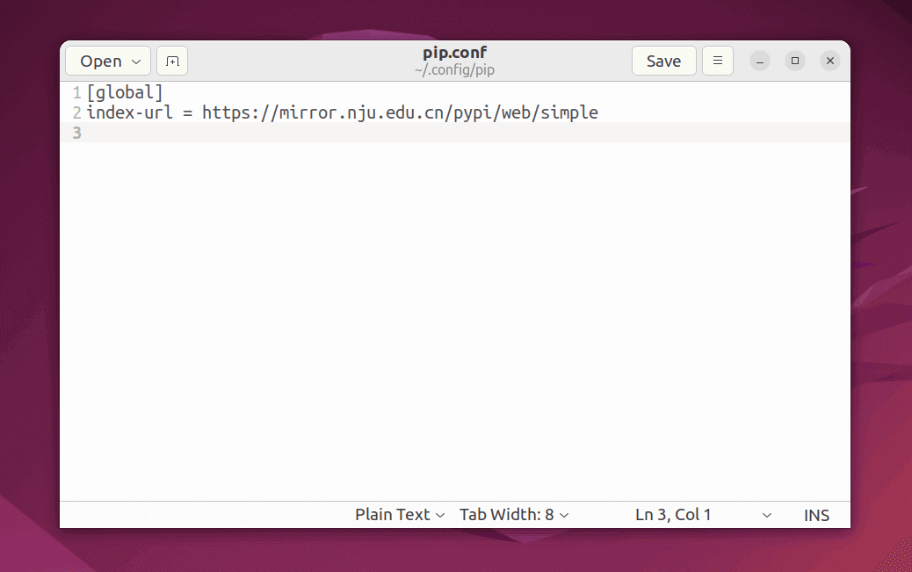

## 安装 Pip [^1]

!!! note "默认已安装 Pip"

    大多数情况下，Python 已经附带安装了 `pip`，可以使用下列命令检查版本：

    ```bash
    python --version
    ```

    部分 Linux 发行版会处理 Python3 的迁移，如果使用系统自带的 Python 而未处于虚拟环境，可能需要将后续的 `python` 命令替换为 `python3`。

=== "使用 APT 安装"

    ``` bash
    sudo apt install python3-pip
    ```

=== "使用 `ensurepip` 模块安装"
    
    ``` bash
    python -m ensurepip # (1)!
    ```

    1. `ensurepip` 模块需要 Python 3.4 及以上版本

=== "使用 `get-pip.py` 脚本安装"

    ``` bash
    wget https://bootstrap.pypa.io/get-pip.py  # 下载 get-pip.py 脚本

    python get-pip.py
    ```

---

## 更新 Pip

!!! tip "更新 Pip"

    默认安装的 Pip 可能较旧，建议使用以下命令更新至最新版

``` bash
python -m pip install --upgrade pip
```

---

## 更新 setuptools 和 wheel

!!! note "setuptools、wheel 和 pip 三者之间的关系"
    
    `pip` 是 Python 的包管理工具，负责从 PyPI（Python Package Index）下载和安装第三方包。

    `setuptools` 是用于构建和打包 Python 项目的工具，定义了项目元数据、依赖关系和构建流程（如通过 `setup.py`），是 `pip` 安装源码包（如 `.tar.gz`）时的底层依赖。

    `wheel` 则是一种预构建的二进制包格式（`.whl` 文件），由 `setuptools` 或类似工具生成，能够显著加快安装速度并减少环境依赖问题，而 `pip` 可直接安装 `wheel` 包。

    三者共同支撑了 Python 包的打包、分发和安装流程，其中 `setuptools` 负责“构建”，`wheel` 优化“分发”，而 `pip` 完成“安装”。

```bash
python -m pip install --upgrade setuptools wheel
```

---

## 更换软件源

选择一个国内镜像站，建议优先选择地理位置较近、相同运营商的镜像站 (1)
{ .annotate }

1. 可在[校园网联合镜像站](https://mirrors.cernet.edu.cn/site)中查询

|       推荐镜像站       | 镜像站帮助页（PyPI）                                              |
|:-----------------:|-----------------------------------------------------------|
| 清华大学镜像站（tsinghua） | <https://mirror.tuna.tsinghua.edu.cn/help/pypi/>          |
|   南京大学镜像站（nju）    | <https://mirror.nju.edu.cn/mirrorz-help/pypi/?mirror=NJU> |
|  上海交通大学镜像站（sjtu）  | <https://mirrors.sjtug.sjtu.edu.cn/docs/pypi-packages>    |
|  阿里云镜像站（aliyun）   | <https://developer.aliyun.com/mirror/pypi>                |

=== "临时使用"

    ``` bash
    pip install -i ${index-url} ${package}
    ```

=== "设为默认（使用命令）"

    ``` bash
    pip config set global.index-url ${index-url}
    ```

=== "设为默认（编辑配置文件）"

    ``` bash
    gedit ~/.config/pip/pip.conf
    ```

    
    /// caption
    图中，使用南京大学镜像站
    ///

---

## 常用命令 [^2]

| 描述              | 命令                                                                                                                                              |
|:----------------|:------------------------------------------------------------------------------------------------------------------------------------------------|
| 验证 pip 安装，检查版本等 | `pip --version, pip -V`                                                                                                                         |
| 安装包             | `pip install <options> <package>` <br/> &emsp; `-r, --requirement <file>` <br/> &emsp; `-U, --upgrade` <br/> &emsp; `-e, --editable <path/url>` |
| 卸载包             | `pip uninstall <options> <package>` <br/> &emsp; `-r, --requirement <file>` <br/> &emsp; `-y, --yes`                                            |
| 列出已安装包          | `pip list`                                                                                                                                      |
| 显示已安装包的信息       | `pip show <package>`                                                                                                                            |
| 显示缓存信息          | `pip cache info`                                                                                                                                |
| 删除所有缓存          | `pip cache purge`                                                                                                                               |

[^1]: [Installing Packages - Python Packaging User Guide](https://packaging.python.org/en/latest/tutorials/installing-packages/)
[^2]: [Commands - pip documentation](https://pip.pypa.io/en/stable/cli/)
