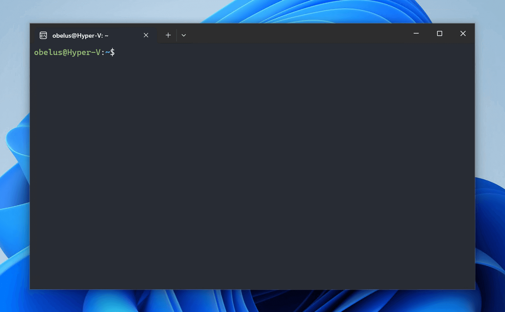
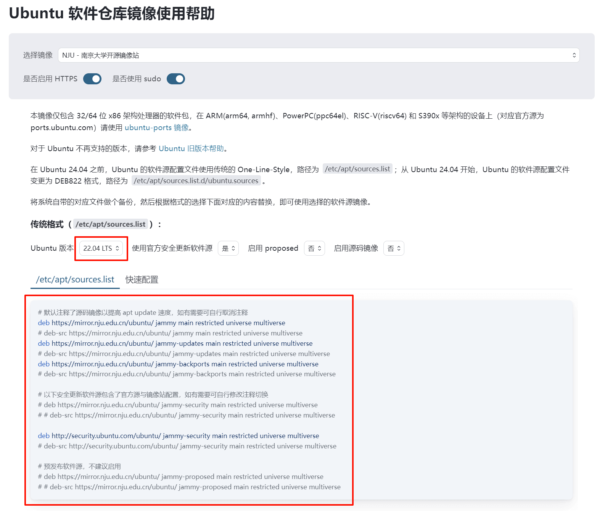
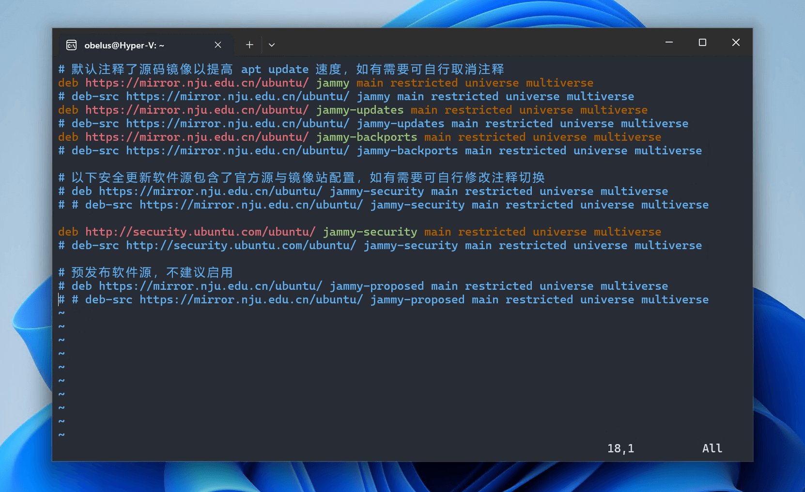

## 认识 Linux Shell 终端

!!! abstract "Linux Shell"

    在 WSL 中，大部分的操作都需要通过 **Linux Shell（Windows Terminal）**输入命令执行，而不像 Windows 系统一样使用图形界面，因此认识并熟练使用
    Shell 尤为重要。可以在 Windows 任意目录下按住 ++shift++ + 右键单击，在菜单中选择 **"在此处打开 Linux shell"** 打开终端。


/// caption
Linux 终端默认使用 Bash（Bourne-Again Shell）
///

---

Bash 命令提示符中，如 `obelus@Hyper-V:~$`、`root@mypc:/home#`

- `obelus`、`root`：当前用户名
- `Hyper-V`、`mypc`：当前主机名
- `~`、`/home`：当前路径（工作目录）
- `$`：表示终端准备接收命令输入
- `#`：表示正在使用管理员用户（root）权限

!!! tip "Shell 使用提示"

    - 在终端中要求输入密码时，为确保安全，输入的密码不会被显示。
    - Bash 提供了命令自动补全功能，按下 ++tab++ 键可以根据当前已输入到字符自动补全完整的命令/参数/路径。

    建议参考：[Linux 常用命令学习 | 菜鸟教程](https://www.runoob.com/w3cnote/linux-common-command-2.html)

---

## 使用跨文件系统工作

!!! quote "TODO[^3]"

---

## 更新 Ubuntu 与软件

### 更换软件源

!!! info "国内镜像站"

    在安装和更新软件之前，建议先将软件包的下载源更换至国内的镜像站，以获得最佳的下载速度。

选择一个国内镜像站，建议优先选择地理位置较近、相同运营商的镜像站 (1)
{ .annotate }

1. 可在[校园网联合镜像站](https://mirrors.cernet.edu.cn/site)中查询

|       推荐镜像站       |   速度    | 镜像站帮助页（Ubuntu）                                              |
|:-----------------:|:-------:|:------------------------------------------------------------|
| 清华大学镜像站（tsinghua） | 10 Gbps | <https://mirror.tuna.tsinghua.edu.cn/help/ubuntu>           |
|   南京大学镜像站（nju）    | 10 Gbps | <https://mirror.nju.edu.cn/mirrorz-help/ubuntu/?mirror=NJU> |
| 中国科学技术大学镜像站（ustc） | ? Gbps  | <https://mirrors.ustc.edu.cn/help/ubuntu.html>              |
|  上海交通大学镜像站（sjtu）  | 1 Gbps  | <https://mirrors.sjtug.sjtu.edu.cn/docs/ubuntu>             |
|  阿里云镜像站（aliyun）   | ? Gbps  | <https://developer.aliyun.com/mirror/ubuntu>                |

---

以南京大学镜像站为例，选择相应的 Ubuntu 版本，并复制下方的镜像源



---

在终端中执行下列命令，使用 `vim` (1) 编辑软件源配置文件 `sources.list`
{ .annotate }

1. 如果对 `vim` 操作不熟练，可以使用其他文本编辑器（如 `gedit`），或使用 Windows 跨系统编辑此文件

``` bash
sudo vim /etc/apt/sources.list
```

---

将配置文件内容全部替换为镜像源，并保存文件



---

### 更新软件包

!!! tip "获取最新软件包列表"
    
    每次更新/安装软件前，确保已获取最新的软件包列表

更新软件包列表以获取最新版本

``` bash
sudo apt update
```

---

更新所有可更新软件包

``` bash
sudo apt upgrade
```

[^3]: [跨文件系统工作 | Microsoft Learn](https://learn.microsoft.com/zh-cn/windows/wsl/filesystems)
