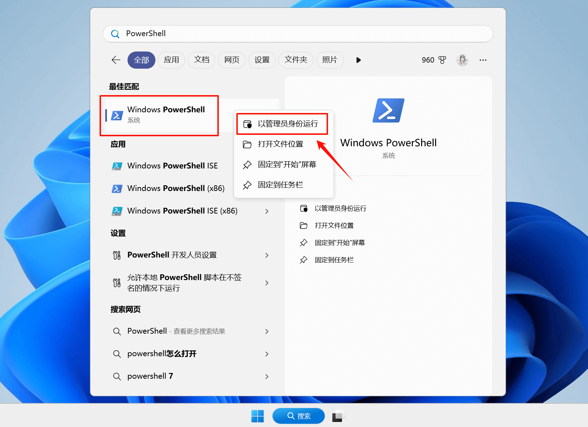
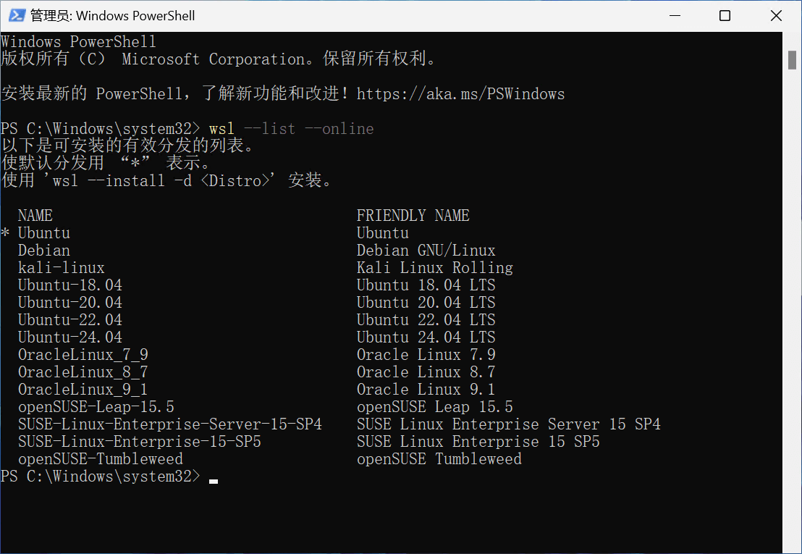
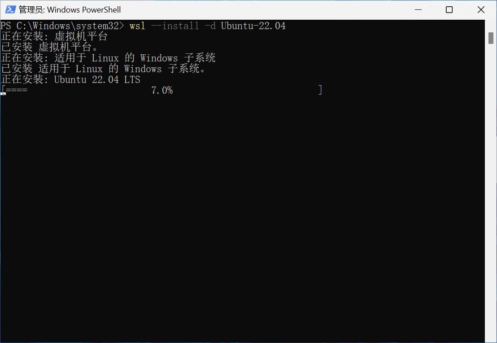
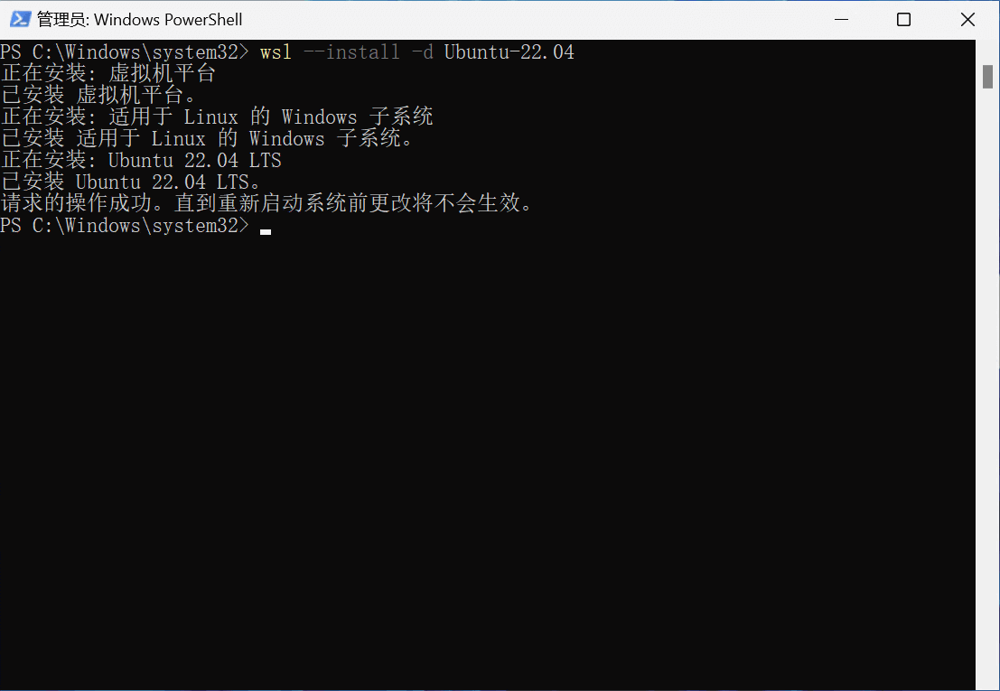
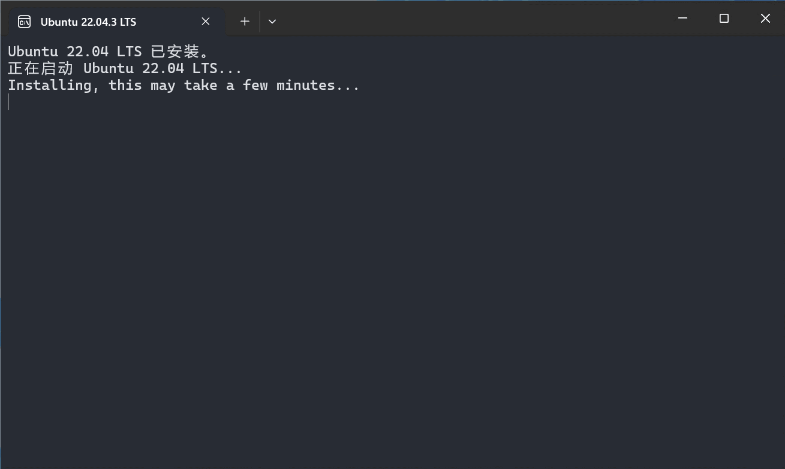
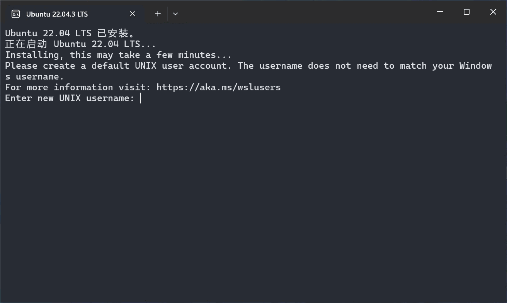
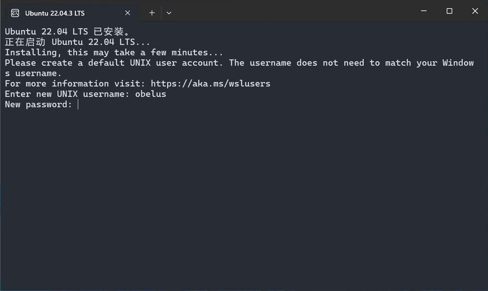
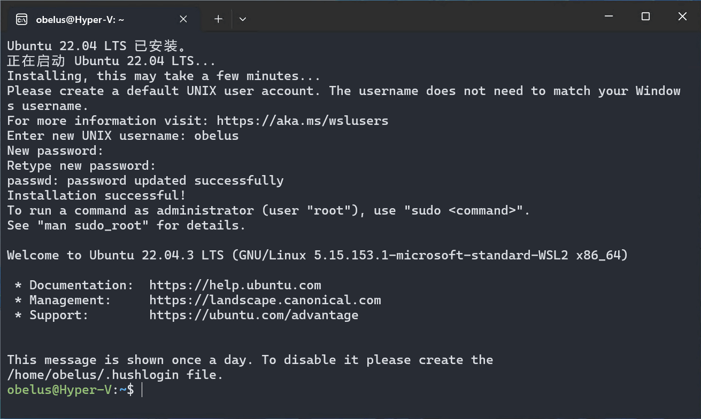

在 Windows 搜索栏搜索 **"PowerShell"**，并右键点击 **"Windows PowerShell"**，选择 **"以管理员身份运行"**



---

## 查询 Linux 发行版

在 PowerShell 中输入并执行下列命令，列出当前可用的 Linux 发行版

``` powershell
wsl --list --online # (1)!
```

1. 或 `wsl -l -o`

{: .shadow }

---

## 安装 Ubuntu 发行版

选择一个合适的 Ubuntu 发行版，使用下列命令安装

> 将 `[Distro]` 替换为发行版名称，例如 `wsl --install -d Ubuntu-22.04`

``` powershell
wsl --install -d [Distro] [Option] # (1)!
```

1. 或使用 `wsl --install` 安装默认 Ubuntu 发行版

!!! tip "`wsl --install`"

    默认情况下，`wsl --install` 命令将从 Microsoft Store 获取并安装默认 Ubuntu 发行版，此版本可能并不适用于当前开发环境；Windows
    上可以同时安装多个 Linux 发行版，且相互独立，根据具体需求选择安装即可；如果无法从 Microsoft Store 下载安装，可以尝试附加 `--web-download`
    选项更改为从 GitHub 下载。

??? example "命令可选项 `[Option]`"

    - `--no-launch`、`-n`：安装后不要启动分发版
    - `--web-download`：从 GitHub 而不是 Microsoft Store 下载发行版
    - `--inbox`：使用 Windows 组件而不是 Microsoft Store 安装 WSL
    - `--no-distribution`：仅安装所需的可选组件，不安装发行版
    - `--enable-wsl1`：启用 WSL 1 支持（即启用 "适用于 Linux 的 Windows 子系统" 可选组件）
    
    详见：<https://learn.microsoft.com/zh-cn/windows/wsl/basic-commands#install>

{: .shadow }

---

安装完成后，需要重启系统以应用更改（需要更新系统）

{: .shadow }

---

重启后将自动启动 WSL 以完成安装

> 如果并未启动也可以手动打开 Ubuntu 发行版

{: .shadow }

---

## 创建 Unix 用户账户

安装完成后需要创建用户 (1)，输入用户名（UNIX username）并回车确认
{ .annotate }

1. 此帐户将作为 Linux 管理员，能够执行 `sudo`（Super User Do）管理命令。

!!! warning "用户名规范"

    用户名必须以英文开头，且全为小写，不宜过长

{: .shadow }

---

输入用户密码，要求重复输入两次以确认

!!! question "输入的密码不显示"

    在终端中要求输入密码时，为确保安全，输入的密码不会被显示

{: .shadow }

---

创建用户后，将自动进入 Ubuntu 系统

{: .shadow }
