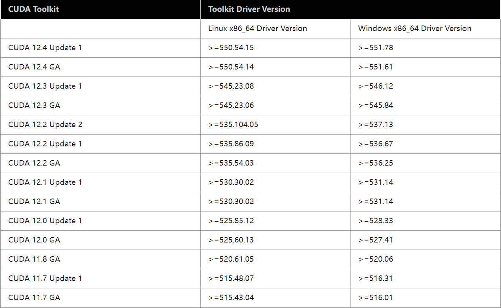
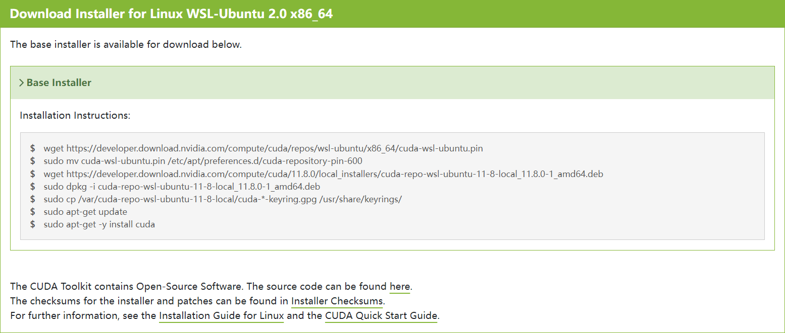
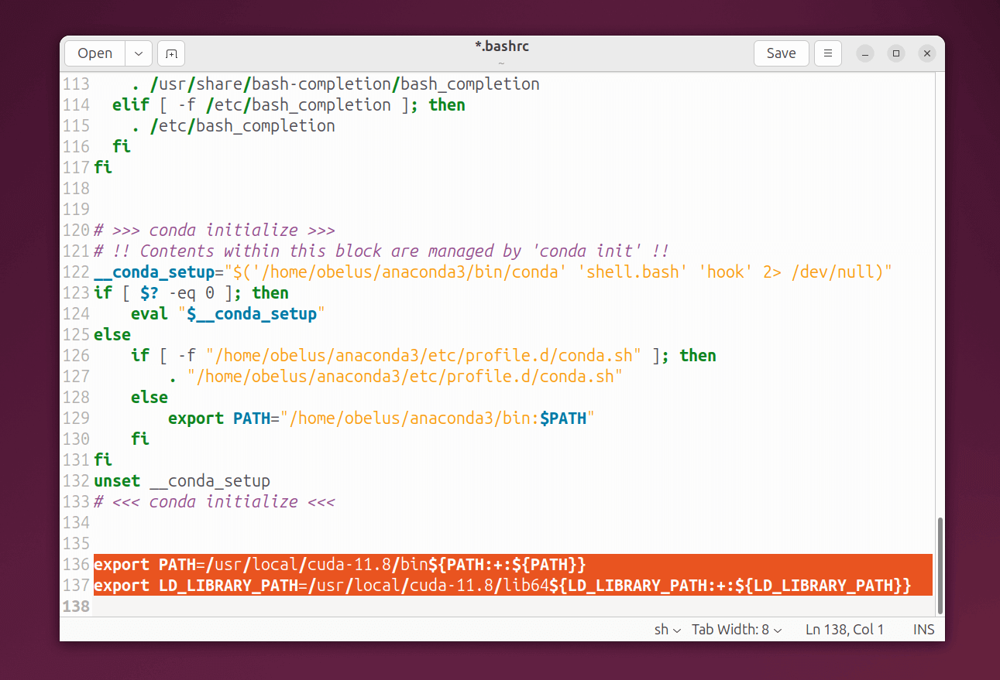
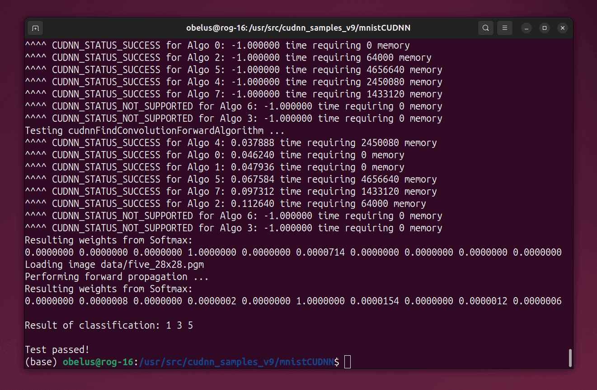

!!! danger "无需再为 WSL 安装 NVIDIA 显卡驱动！"

    只要在 Windows 上安装了 NVIDIA 显卡驱动，CUDA 就能够在 WSL 2 中使用；安装在 Windows 主机上的 CUDA 驱动程序将在 WSL 2 内部以
    `libcuda.so` 库的形式进行模拟（stub），因此不应在 WSL 2 环境中安装任何 NVIDIA 显卡的 Linux 驱动程序。

    **使用 `WSL-Ubuntu CUDA toolkit` 安装程序安装将不会附带 NVIDIA 显卡驱动。**

??? example "NVIDIA 显卡驱动、CUDA、PyTorch 和 Python 的兼容版本要求"

    
    
    
    
    <table><thead>
      <tr>
        <th>PyTorch</th>
        <th>CUDA</th>
        <th>CUDNN</th>
        <th>Python</th>
      </tr></thead>
    <tbody>
      <tr>
        <td>2.6</td>
        <td>11.8, 12.4, 12.6</td>
        <td rowspan="3">~ 9.1.0.70</td>
        <td rowspan="2">&gt;=3.9, &lt;=3.13</td>
      </tr>
      <tr>
        <td>2.5</td>
        <td rowspan="2">11.8, 12.1, 12.4</td>
      </tr>
      <tr>
        <td>2.4</td>
        <td rowspan="3">&gt;=3.8, &lt;=3.12</td>
      </tr>
      <tr>
        <td>2.3</td>
        <td rowspan="3">11.8, 12.1</td>
        <td rowspan="3">~ 8.7.0.84</td>
      </tr>
      <tr>
        <td>2.2</td>
      </tr>
      <tr>
        <td>2.1</td>
        <td rowspan="2">&gt;= 3.8, &lt;=3.11</td>
      </tr>
      <tr>
        <td>2.0</td>
        <td>11.7, 11.8</td>
        <td>~ 8.5.0.96</td>
      </tr>
      <tr>
        <td>1.13</td>
        <td>11.6, 11.7</td>
        <td rowspan="2">~ 8.3.2.44</td>
        <td rowspan="2">&gt;= 3.7, &lt;=3.10</td>
      </tr>
      <tr>
        <td>1.12</td>
        <td>11.3, 11.6</td>
      </tr>
    </tbody>
    </table>

    详见：[CUDA Toolkit Major Component Versions](https://docs.nvidia.com/cuda/cuda-toolkit-release-notes/index.html#cuda-toolkit-major-component-versions)
    和 [Releasing PyTorch | Release Compatibility Matrix](https://github.com/pytorch/pytorch/blob/main/RELEASE.md#release-compatibility-matrix)

---

## 安装 CUDA Toolkit [^1]

!!! tip "选择合适的 CUDA 版本"

    选择 CUDA Toolkit 版本时，需要根据实际开发环境和兼容版本要求（如 PyTorch）选择

首先，删除过时的 GPG 密钥

``` bash
sudo apt-key del 7fa2af80
```

=== "使用 APT 安装（网络安装）"
    
    安装 NVIDIA CUDA 密钥环，以获取最新软件源
    
    ``` bash
    wget https://developer.download.nvidia.com/compute/cuda/repos/wsl-ubuntu/x86_64/cuda-keyring_1.1-1_all.deb

    sudo dpkg -i cuda-keyring_1.1-1_all.deb

    sudo apt update
    ```
    
    ---
    
    使用 APT 命令，选择一个合适的 CUDA Toolkit 版本进行安装
    
    ???+ example "可用的 CUDA Toolkit 版本 `${cuda-toolkit}`"

        - `cuda-toolkit-11-8`
        - `cuda-toolkit-12-0`
        - `cuda-toolkit-12-1`
        - `cuda-toolkit-12-2`
        - `cuda-toolkit-12-3`
        - `cuda-toolkit-12-4`
        - `cuda-toolkit-12-5`
        - `cuda-toolkit-12-6`
        - `cuda-toolkit-12-8`

        !!! tip ""
    
            建议使用 ++tab++ 键自动补全，或执行 `apt search cuda-toolkit` 命令，搜索当前可用的 CUDA Toolkit 版本

    !!! note ""

        目前兼容性最佳的版本为：`CUDA Toolkit 11.8`
    
    ``` bash
    sudo apt install ${cuda-toolkit}
    ```

=== "使用软件包安装（本地安装）"

    访问 [CUDA Toolkit Archive 官网](https://developer.nvidia.com/cuda-toolkit-archive)，根据实际开发需求，选择一个合适的版本
    
    !!! note ""

        目前兼容性最佳的版本为：`CUDA Toolkit 11.8`
    
    
    
    ---
    
    选择目标平台的操作系统（`Linux`）、架构（`x86_64`）、发行版（`WSL-Ubuntu`）和安装类型
    
    !!! danger "务必选择 `deb (local)` 方式安装"
    
        安装类型务必选择 `deb (local)`，**使用 `deb (network)` 将会在线安装最新版，而 `runfile (local)` 无法确保不安装驱动**！
    
    

    /// caption
    图中，以 CUDA Toolkit 11.8 为例
    ///
    
    ---
    
    依照所选 Installer Type（安装类型）的安装命令进行安装
    
    

    /// caption
    图中，以 CUDA Toolkit 11.8 为例
    ///
    
---

编辑 `.bashrc` 文件，配置环境变量

```bash
gedit ~/.bashrc
```

---

将 CUDA 的路径 `PATH` 和 `LD_LIBRARY_PATH` 写入 `.bashrc` 文件

> 需要将 `cuda-x.x` 替换为实际安装的版本，例如 `cuda-11.8`

```bash title=".bashrc"
export PATH=/usr/local/cuda-x.x/bin${PATH:+:${PATH}}
export LD_LIBRARY_PATH=/usr/local/cuda-x.x/lib64${LD_LIBRARY_PATH:+:${LD_LIBRARY_PATH}}
```



---

保存更改后，使用下列命令使配置立即生效：

```bash
source ~/.bashrc
```

---

安装完成后，查看 CUDA 版本以验证安装

> 建议重启系统以重新加载图形界面

``` bash
nvcc --version
```

---

## 卸载 CUDA Toolkit

- **移除 CUDA Toolkit**

``` bash
sudo apt --purge remove "*cuda*" "*cublas*" "*cufft*" "*cufile*" "*curand*" \
 "*cusolver*" "*cusparse*" "*gds-tools*" "*npp*" "*nvjpeg*" "nsight*" "*nvvm*"
```

- **清理缓存及无用的相关依赖**

``` bash
sudo apt autoremove --purge -V
```

---

## 安装 cuDNN [^2]

!!! abstract "cuDNN（CUDA Deep Neural Network Library）"

    **NVIDIA CUDA 深度神经网络库（cuDNN）**是由 NVIDIA 推出的专为深度学习设计的 GPU 加速库，专注于优化深度神经网络的核心计算操作。
    它通过高度优化的卷积、池化、归一化和激活函数等算法，显著提升了训练和推理任务的效率，并与主流深度学习框架（如
    TensorFlow、PyTorch）无缝集成，使开发者无需手动编写底层代码即可充分利用 GPU 性能，广泛应用于学术和工业领域的高性能计算场景。

!!! note annotate "更新至 cuDNN 9"

    2024年2月，cuDNN 9.0.0 发布，主要引入了对动态形状推理的优化支持，显著提升了可变输入尺寸场景（如自然语言处理）的计算效率，同时新增了针对
    Ampere 架构 GPU（如A100）的细粒度 Tensor Core 加速功能，优化了卷积、池化和归一化等核心操作的性能，并扩展了 API 以支持更灵活的模型设计。

    **为了获得最佳性能，建议安装最新的 cuDNN 9 及与之兼容的 CUDA 11/12 最新版本 ！** (1)

1. cuDNN 9 可以与之前的 7/8 版本共存，安装新版将不会自动删除较旧的版本

---

安装 cuDNN 依赖项 zlib（数据压缩软件库）

```bash
sudo apt install zlib1g
```

=== "使用 APT 安装（网络安装）"

    !!! warning "默认安装最新版本"

        网络安装将默认安装最新版的 cuDNN，如需安装特定版本，建议使用软件包本地安装
    
    安装 NVIDIA CUDA 密钥环，以获取最新软件源
    
    ``` bash
    wget https://developer.download.nvidia.com/compute/cuda/repos/$distro/$arch/cuda-keyring_1.1-1_all.deb
    
    sudo dpkg -i cuda-keyring_1.1-1_all.deb
    
    sudo apt update
    ```
    
    ???+ example "根据实际版本和架构，`$distro/$arch` 需要替换为以下字段："
    
        - `ubuntu2004/x86_64`
        - `ubuntu2004/sbsa`
        - `ubuntu2004/arm64`
        - `ubuntu2204/x86_64`
        - `ubuntu2204/sbsa`
        - `ubuntu2204/arm64`
        - `ubuntu2404/x86_64`
        - `ubuntu2404/sbsa`
        - `ubuntu2404/arm64`
    
        详见：<https://developer.download.nvidia.com/compute/cuda/repos/>
    
    ---
    
    安装适用于 CUDA 版本的 cuDNN：
    
    - **对于 CUDA 11：**
    
    ```bash
    sudo apt install cudnn9-cuda-11
    ```
    
    - **对于 CUDA 12：**
    
    ```bash
    sudo apt install cudnn9-cuda-12
    ```

=== "使用 APT 安装（本地安装）"

    访问 [cuDNN Archive 官网](https://developer.nvidia.com/cudnn-archive)，选择一个合适的版本

    

    ---

    选择目标平台的操作系统、架构、发行版，其中，**安装类型选择 `deb (local)`**

    

    /// caption
    图中，以 cuDNN 9.7.1 为例
    ///

    ---

    依照所选 Installer Type（安装类型）的安装命令进行安装

    

    /// caption
    图中，以 cuDNN 9.7.1 为例
    ///

---

## 验证 cuDNN

安装 cuDNN 示例

```bash
sudo apt install libcudnn9-samples
```

---

编译 `mnistCUDNN` 示例

```bash
cd /usr/src/cudnn_samples_v9/mnistCUDNN

sudo make clean && sudo make
```

---

运行 `mnistCUDNN` 示例

```bash
./mnistCUDNN
```

---

如果运行结果提示 `Test passed!`，则说明已正确安装 cuDNN



[^1]: [NVIDIA CUDA Installation Guide for Linux | WSL](https://docs.nvidia.com/cuda/cuda-installation-guide-linux/index.html#wsl)
[^2]: [Installing cuDNN Backend on Linux — NVIDIA cuDNN Installation](https://docs.nvidia.com/deeplearning/cudnn/installation/latest/linux.html)

