!!! abstract "适用于 Linux 的 Windows 子系统（Windows Subsystem for Linux，WSL）[^1]"

    **WSL** 是 Windows 的一项功能，可用于在 Windows 计算机上运行 Linux 环境，而无需单独的虚拟机或双引导。 WSL 旨在为希望同时使用 Windows 和
    Linux 的开发人员提供无缝高效的体验。
    
    - **多发行版支持**：使用 WSL 安装和运行各种 Linux 发行版，例如 Ubuntu、Debian、Kali 等。 安装 Linux 发行版并从 Microsoft Store
      接收自动更新、导入 Microsoft Store 中不可用的 Linux 发行版。
    - **文件系统共享**：将文件存储在独立的 Linux 文件系统中，并实现 Windows 与 Linux 文件系统之间的双向访问。
    - **Shell 环境**：运行常用的 Bash 命令行工具（例如 `grep`、`sed`、`awk`）或其他 ELF-64 二进制文件；运行 Bash 脚本和 GNU/Linux
      命令行应用程序，包括 Vim、Python、C/C++、MySQL 等。
    - **包管理器**：通过自带的 GNU/Linux 软件包管理器安装其他软件。
    - **跨平台调用**：使用类似于 Unix 的命令行 Shell 调用 Windows 应用程序，或在 Windows 上调用 GNU/Linux 应用程序。
    - **图形界面集成**：运行直接集成到 Windows 桌面的 GNU/Linux 图形应用程序。
    - **GPU 加速**：使用 GPU 加速 Linux 上运行的机器学习工作负载。

---

**WSL 安装要求**

!!! Warning "安装 WSL 需要满足以下要求："

    - **Windows 10/11**
        - 对于 x64 系统：版本 1903 或更高版本，内部版本为 18362.1049 或更高版本。
        - 对于 ARM64 系统：版本 2004 或更高版本，内部版本为 19041 或更高版本。
    - **支持虚拟化（Intel VT 或 AMD-V）**
        - 安装 Hyper-V 虚拟化组件（如 Windows 虚拟机监控程序）
    - **至少 4GB 可用内存和 20GB 存储空间**

---

**WSL 1 vs WSL 2**

!!! info "WSL 1 和 WSL 2 之间的主要区别[^2]"

    - 在托管 VM 内使用 **实际的 Linux 内核**、支持**完整的系统调用兼容性**以及**跨 Linux 和 Windows 操作系统的性能**。
    - WSL 2 是安装 Linux 发行版时的当前默认版本，它使用最新最好的虚拟化技术在**轻量级实用工具虚拟机 (VM)** 内运行 Linux 内核。
    - WSL2 将 Linux 发行版作为**托管 VM 内的隔离容器**运行。

| 功能                                |      WSL 1       |      WSL 2       |
|:----------------------------------|:----------------:|:----------------:|
| Windows 和 Linux 之间的集成             | :material-check: | :material-check: |
| 启动时间短                             | :material-check: | :material-check: |
| 与传统虚拟机相比，占用的资源量少                  | :material-check: | :material-check: |
| 可以与当前版本的 VMware 和 VirtualBox 一起运行 | :material-check: | :material-close: |
| 托管 VM                             | :material-close: | :material-check: |
| 完整的 Linux 内核                      | :material-close: | :material-check: |
| 完全的系统调用兼容性                        | :material-close: | :material-check: |
| 跨 OS 文件系统的性能                      | :material-check: | :material-close: |
| systemd 支持                        | :material-close: | :material-check: |
| IPv6 支持                           | :material-check: | :material-check: |

!!! note "本指南主要聚焦于 WSL 2 和 Ubuntu"

    WSL 2 使用虚拟化技术并拥有完整的 Linux 内核，在文件 IO 性能和系统调用兼容性上相比 WSL 1 均有巨大提升，因此**建议安装最新的 WSL 2**。

---

## 1. 安装 WSL

在 Windows 搜索栏搜索 **"PowerShell"**，并右键点击 **"Windows PowerShell"**，选择 **"以管理员身份运行"**

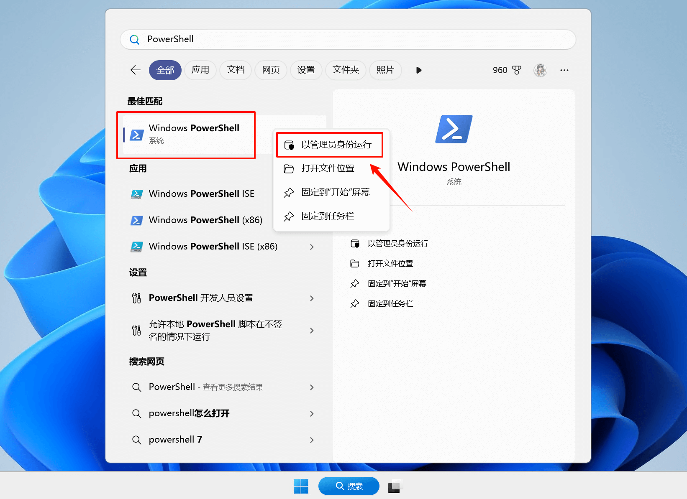

---

### 查询 Linux 发行版

在 PowerShell 中输入并执行下列命令，列出当前可用的 Linux 发行版

``` powershell
wsl --list --online # (1)!
```

1. 或 `wsl -l -o`

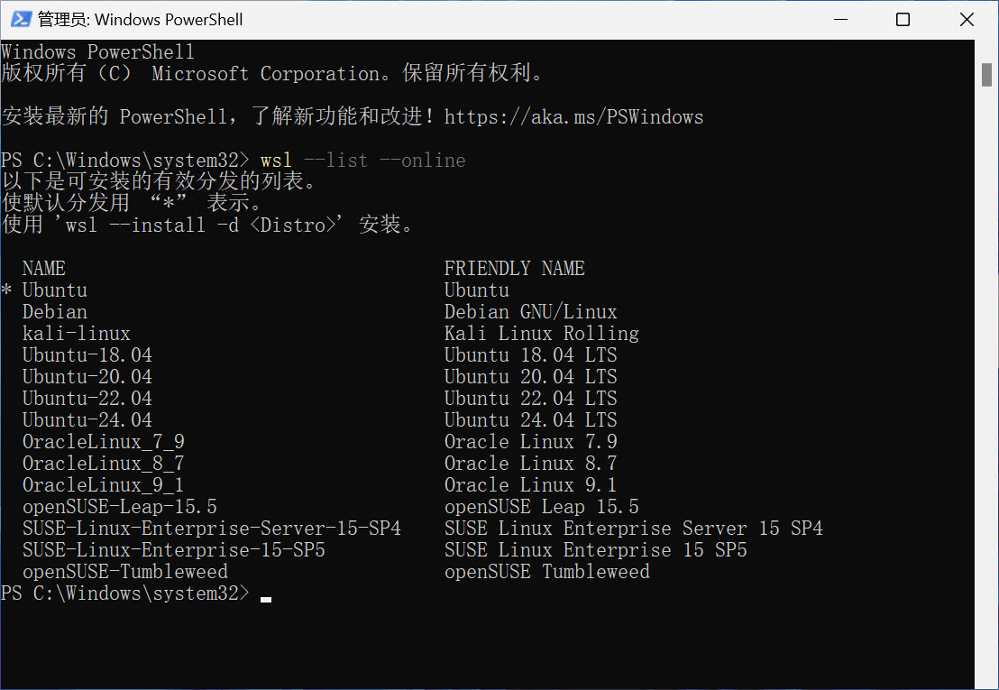{: .shadow }

---

### 安装 Ubuntu 发行版

选择一个合适的 Ubuntu 发行版，使用下列命令安装

> 将 `[Distro]` 替换为发行版名称，例如 `wsl --install -d Ubuntu-22.04`

``` powershell
wsl --install -d [Distro] [Option] # (1)!
```

1. 或使用 `wsl --install` 安装默认 Ubuntu 发行版

!!! tip "`wsl --install`"

    默认情况下，`wsl --install` 命令将从 Microsoft Store 获取并安装默认 Ubuntu 发行版，此版本可能并不适用于当前开发环境；Windows
    上可以同时安装多个 Linux 发行版，且相互独立，根据具体需求选择安装即可；如果无法从 Microsoft Store 下载安装，可以尝试附加 `--web-download`
    选项更改为从 GitHub 下载。

??? example "命令可选项 `[Option]`"

    - `--no-launch`、`-n`：安装后不要启动分发版
    - `--web-download`：从 GitHub 而不是 Microsoft Store 下载发行版
    - `--inbox`：使用 Windows 组件而不是 Microsoft Store 安装 WSL
    - `--no-distribution`：仅安装所需的可选组件，不安装发行版
    - `--enable-wsl1`：启用 WSL 1 支持（即启用 "适用于 Linux 的 Windows 子系统" 可选组件）
    
    详见：<https://learn.microsoft.com/zh-cn/windows/wsl/basic-commands#install>

{: .shadow }

---

安装完成后，需要重启系统以应用更改（需要更新系统）

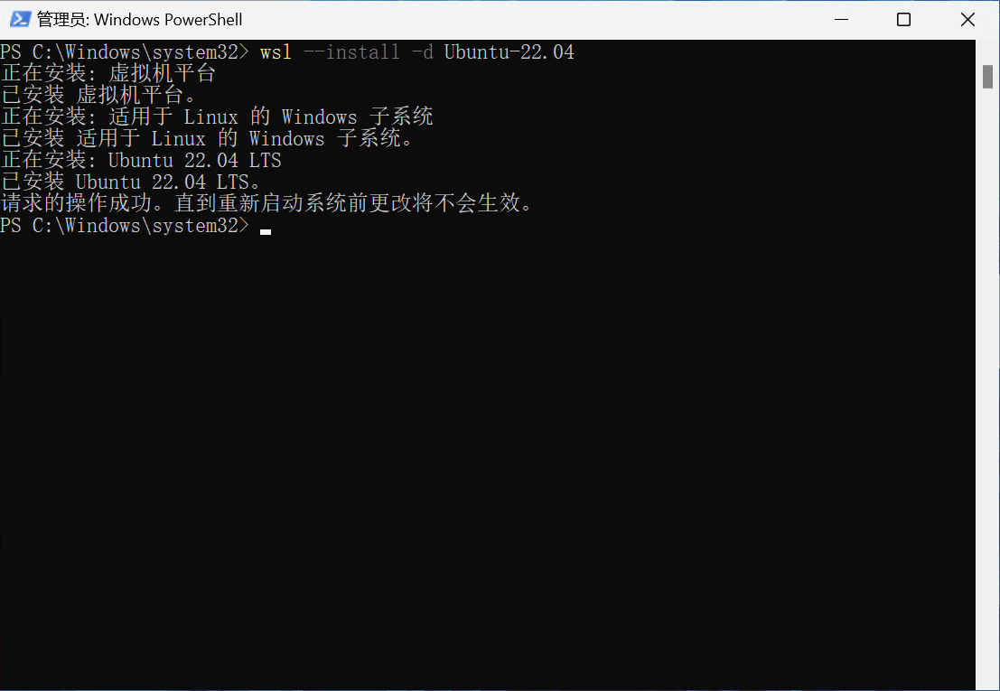{: .shadow }

---

重启后将自动启动 WSL 以完成安装

> 如果并未启动也可以手动打开 Ubuntu 发行版

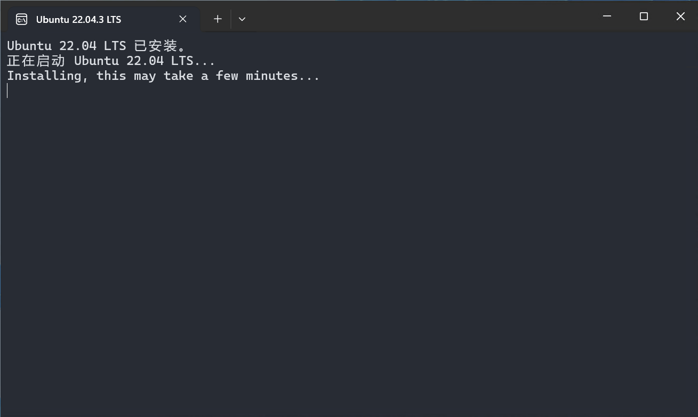{: .shadow }

---

### 创建 Unix 用户账户

安装完成后需要创建用户 (1)，输入用户名（UNIX username）并回车确认
{ .annotate }

1. 此帐户将作为 Linux 管理员，能够执行 `sudo`（Super User Do）管理命令。

!!! warning "用户名规范"

    用户名必须以英文开头，且全为小写，不宜过长

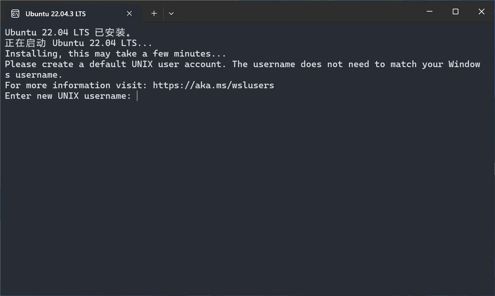{: .shadow }

---

输入用户密码，要求重复输入两次以确认

!!! question "输入的密码不显示"

    在终端中要求输入密码时，为确保安全，输入的密码不会被显示

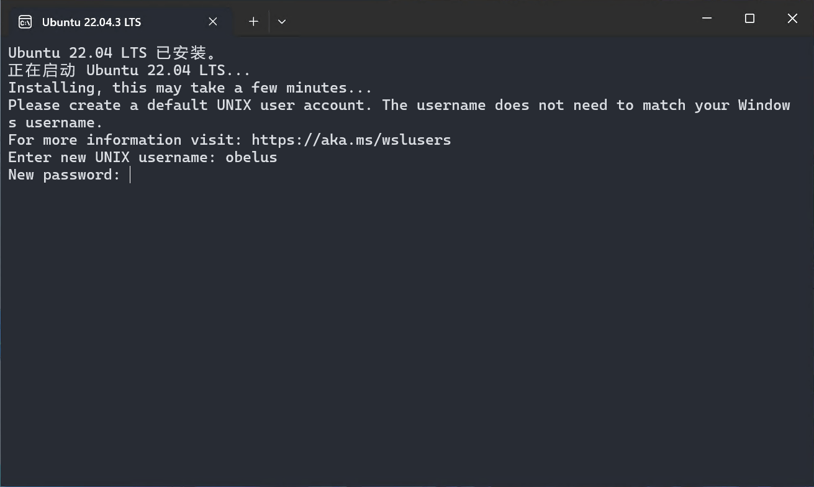{: .shadow }

---

创建用户后，将自动进入 Ubuntu 系统

{: .shadow }

---

## 2. 配置 WSL

### 认识 Linux Shell 终端

!!! abstract "Linux Shell"

    在 WSL 中，大部分的操作都需要通过 **Linux Shell（Windows Terminal）**输入命令执行，而不像 Windows 系统一样使用图形界面，因此认识并熟练使用
    Shell 尤为重要。可以在 Windows 任意目录下按住 ++shift++ + 右键单击，在菜单中选择 **"在此处打开 Linux shell"** 打开终端。

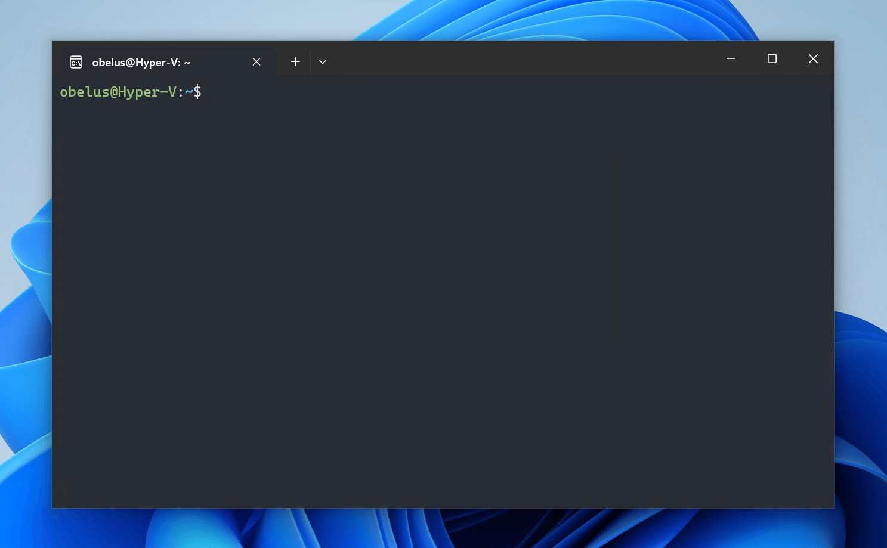{: .shadow }
/// caption
Linux 终端默认使用 Bash（Bourne-Again Shell）
///

---

Bash 命令提示符中，如 `obelus@Hyper-V:~$`、`root@mypc:/home#`

- `obelus`、`root`：当前用户名
- `Hyper-V`、`mypc`：当前主机名
- `~`、`/home`：当前路径（工作目录）
- `$`：表示终端准备接收命令输入
- `#`：表示正在使用管理员用户（root）权限

!!! tip "Shell 使用提示"

    - 在终端中要求输入密码时，为确保安全，输入的密码不会被显示。
    - Bash 提供了命令自动补全功能，按下 ++tab++ 键可以根据当前已输入到字符自动补全完整的命令/参数/路径。

    建议参考：[Linux 常用命令学习 | 菜鸟教程](https://www.runoob.com/w3cnote/linux-common-command-2.html)

---

### 使用跨文件系统工作

!!! quote "TODO[^3]"

---

### 更新软件源与更新软件包

!!! info "国内镜像站"

    在安装和更新软件之前，建议先将软件包的下载源更换至国内的镜像站，以获得最佳的下载速度。

选择一个国内镜像站，建议优先选择地理位置较近、相同运营商的镜像站 (1)
{ .annotate }

1. 可在[校园网联合镜像站](https://mirrors.cernet.edu.cn/site)中查询

|       推荐镜像站       |   速度    | 镜像站帮助页（Ubuntu）                                              |
|:-----------------:|:-------:|:------------------------------------------------------------|
| 清华大学镜像站（tsinghua） | 10 Gbps | <https://mirror.tuna.tsinghua.edu.cn/help/ubuntu>           |
|   南京大学镜像站（nju）    | 10 Gbps | <https://mirror.nju.edu.cn/mirrorz-help/ubuntu/?mirror=NJU> |
| 中国科学技术大学镜像站（ustc） | ? Gbps  | <https://mirrors.ustc.edu.cn/help/ubuntu.html>              |
|  上海交通大学镜像站（sjtu）  | 1 Gbps  | <https://mirrors.sjtug.sjtu.edu.cn/docs/ubuntu>             |
|  阿里云镜像站（aliyun）   | ? Gbps  | <https://developer.aliyun.com/mirror/ubuntu>                |

---

以南京大学镜像站为例，选择相应的 Ubuntu 版本，并复制下方的镜像源

{: .shadow }

---

在终端中执行下列命令，使用 `vim` (1) 编辑软件源配置文件 `sources.list`
{ .annotate }

1. 如果对 `vim` 操作不熟练，可以使用其他文本编辑器（如 `gedit`），或使用 Windows 跨系统编辑此文件

``` bash
sudo vim /etc/apt/sources.list
```

---

将配置文件内容全部替换为镜像源，并保存文件

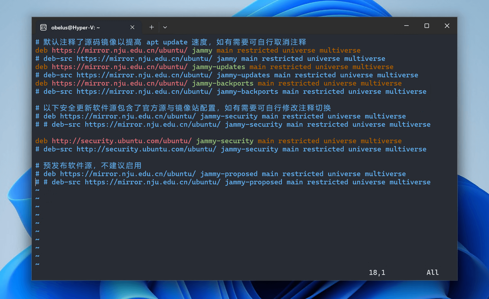{: .shadow }

---

更新软件包列表以获取最新版本

``` bash
sudo apt update
```

---

更新所有可更新软件包

``` bash
sudo apt upgrade
```

---

## 3. 管理 WSL

### 管理 WSL 磁盘空间

#### 查找 WSL 硬盘位置

在 PowerShell 中输入并执行下列命令，需要将 `<distribution-name>` 替换为特定发行版名称（如 Ubuntu）

``` powershell
(Get-ChildItem -Path HKCU:\Software\Microsoft\Windows\CurrentVersion\Lxss | Where-Object { $_.GetValue("DistributionName") -eq '<distribution-name>' }).GetValue("BasePath") + "\ext4.vhdx"
```

!!! tip "使用 Everything 搜索"

    除此之外，也可以使用 [Everything](https://www.voidtools.com) 工具，搜索文件名 `ext4.vhdx` 快速定位到 WSL 硬盘位置

---

#### 扩展 WSL 空间大小

!!! quote "TODO"

---

#### 压缩 WSL 空间大小

!!! quote "TODO"

---

## 4. 软件安装与配置

!!! abstract "WSL 配置差异"

    大部分软件的安装和配置均与其他 Ubuntu 发行版相同，但需要注意以下两点：
    
    - WSL 主要以 Shell 环境与 [Windows Terminal](https://learn.microsoft.com/zh-cn/windows/terminal/) 交互使用，**对 WSL 上的
      GUI 应用的支持不提供完整的桌面体验**，它依赖于 Windows 桌面，因此可能不支持安装以桌面为中心的工具或应用
    - 某些硬件驱动和软件（如 NVIDIA 显卡驱动、CUDA）会**直接调用 Windows 所安装的版本（而无需另行安装）**，如果在 WSL 再次安装适用于 Linux
      的版本可能会出现问题

---

### 文本编辑器

!!! info "文本编辑器（Text Editor）"

    当使用命令打开文本文件并编辑时，需要用到文本编辑器，WSL 的 Ubuntu 可能并未默认安装，主要推荐三款文本编辑器：Vim、Gedit 和 
    GNOME Text Editor。

    **本篇指南所有涉及文本编辑的命令，均使用具有图形界面的 `gedit` 编辑，可自行更换。**

!!! warning "中文乱码问题"

    在 WSL Ubuntu 中使用图形化文本编辑器（如 Gedit 和 GNOME Text Editor），打开含有中文字符的文本文件时可能会出现乱码，
    可以通过**设置字符编码**、**安装中文字体**等方法解决。

=== "Vim"

    [Vim](https://www.vim.org/) 是一款功能强大的、基于命令行的文本编辑器，支持语法高亮、智能缩进、代码折叠等高级编辑功能，
    还可以通过插件扩展它的功能，特别适合于程序员和系统管理员等专业人士使用。
    
    ``` bash
    sudo apt install vim
    ```

=== "Gedit"

    [Gedit](https://gedit-text-editor.org/) 是一款轻量级的、基于图形界面的文本编辑器，具有代码高亮、自动缩进、多标签编辑、插件扩展等功能，是
    Ubuntu GNOME 桌面环境中预安装的编辑器之一。
    
    ``` bash
    sudo apt install gedit
    ```

=== "GNOME Text Editor"

    [GNOME Text Editor](https://apps.gnome.org/TextEditor/) 是一款专注于会话管理的简单文本编辑器，致力于跟踪更改和状态，
    具有现代化的界面和功能，包括语法高亮显示、搜索替换、内联拼写检查、文档打印等特性，并且支持 Vim 键绑定。目前在 Ubuntu 24.04 上，已取代 Gedit
    成为 GNOME 默认的文本编辑器（Text Editor）。
    
    ``` bash
    sudo apt install gnome-text-editor
    ```

---

### CUDA Toolkit

!!! danger "无需再为 WSL 安装 NVIDIA 显卡驱动！"

    只要在 Windows 上安装了 NVIDIA 显卡驱动，CUDA 就能够在 WSL 2 中使用；安装在 Windows 主机上的 CUDA 驱动程序将在 WSL 2 内部以
    `libcuda.so` 库的形式进行模拟（stub），因此不应在 WSL 2 环境中安装任何 NVIDIA 显卡的 Linux 驱动程序。

    **使用 `WSL-Ubuntu CUDA toolkit` 安装程序安装将不会附带 NVIDIA 显卡驱动。**

??? example "NVIDIA 显卡驱动、CUDA、PyTorch 的兼容版本要求"

    
    
    
    
    | PyTorch |   torchvision   |      CUDA Toolkit       |     Python     |
    |:-------:|:---------------:|:-----------------------:|:--------------:|
    |  2.3.1  |     0.18.1      |       11.8, 12.1        | >= 3.8, <=3.11 |
    |  2.3.0  |     0.18.0      |       11.8, 12.1        | >= 3.8, <=3.11 |
    |  2.2.2  |     0.17.2      |       11.8, 12.1        | >= 3.8, <=3.11 |
    |  2.2.1  |     0.17.1      |       11.8, 12.1        | >= 3.8, <=3.11 |
    |  2.2.0  |     0.17.0      |       11.8, 12.1        | >= 3.8, <=3.11 |
    |  2.1.2  |     0.16.2      |       11.8, 12.1        | >= 3.8, <=3.11 |
    |  2.1.1  |     0.16.1      |       11.8, 12.1        | >= 3.8, <=3.11 |
    |  2.1.0  |     0.16.0      |       11.8, 12.1        | >= 3.8, <=3.11 |
    |  2.0.1  |     0.15.2      |       11.7, 11.8        | >= 3.8, <=3.11 |
    |  2.0.0  | 0.15.0 (0.15.1) |       11.7, 11.8        | >= 3.8, <=3.11 |
    | 1.13.1  |     0.14.1      |       11.6, 11.7        | >= 3.7, <=3.11 |
    | 1.13.0  |     0.14.0      |       11.6, 11.7        | >= 3.7, <=3.11 |
    | 1.12.1  |     0.13.1      |    10.2, 11.3, 11.6     | >= 3.7, <=3.10 |
    | 1.12.0  |     0.13.0      |    10.2, 11.3, 11.6     | >= 3.7, <=3.10 |
    | 1.11.0  |     0.12.0      |       10.2, 11.3        | >= 3.7, <=3.10 |
    | 1.10.1  |     0.11.2      |       10.2, 11.3        | >= 3.6, <=3.9  |
    | 1.10.0  |     0.11.0      | 10.2, 11.3 (10.2, 11.1) | >= 3.6, <=3.9  |

    详见：[CUDA Toolkit Major Component Versions](https://docs.nvidia.com/cuda/cuda-toolkit-release-notes/index.html#cuda-toolkit-major-component-versions)
    和 [Previous PyTorch Versions](https://pytorch.org/get-started/previous-versions)

---

#### 安装 CUDA Toolkit

!!! tip "CUDA 版本选择"

    选择 CUDA Toolkit 版本时，需要根据实际开发环境（如 PyTorch）选择

=== "使用 APT 安装（网络安装）"

    删除旧的 GPG 密钥
    
    ``` bash
    sudo apt-key del 7fa2af80
    ```
    
    ---
    
    安装 NVIDIA CUDA 密钥环，以获取最新软件源
    
    ``` bash
    wget https://developer.download.nvidia.com/compute/cuda/repos/wsl-ubuntu/x86_64/cuda-keyring_1.1-1_all.deb

    sudo dpkg -i cuda-keyring_1.1-1_all.deb
    ```
    
    ---
    
    使用 APT 命令，选择一个合适的 CUDA Toolkit 版本进行安装
    
    !!! example "可用的 CUDA Toolkit 版本 `${cuda-toolkit}`"
    
        - `cuda-toolkit-11-6`
        - `cuda-toolkit-11-7`
        - `cuda-toolkit-11-8`
        - `cuda-toolkit-12-0`
        - `cuda-toolkit-12-1`
        - `cuda-toolkit-12-2`
        - `cuda-toolkit-12-3`
        - `cuda-toolkit-12-4`

    !!! tip ""

        目前兼容性最佳的版本为：`CUDA Toolkit 11.8.0`    

    !!! tip "自动补全"

        建议使用 ++tab++ 键自动补全，或执行 `apt search cuda-toolkit` 命令，搜索当前可用的 CUDA Toolkit 版本
    
    ``` bash
    sudo apt install ${cuda-toolkit}
    ```
    
    ---
    
    安装完成后，可以使用以下命令查看 CUDA 版本以验证安装：
    
    ``` bash
    nvcc --version
    ```

=== "使用软件包安装（本地安装）"

    访问 [CUDA Toolkit Archive 官网](https://developer.nvidia.com/cuda-toolkit-archive)，根据实际开发需求，选择一个合适的 CUDA
    Toolkit 版本
    
    !!! tip ""

        目前兼容性最佳的版本为：`CUDA Toolkit 11.8.0`
    
    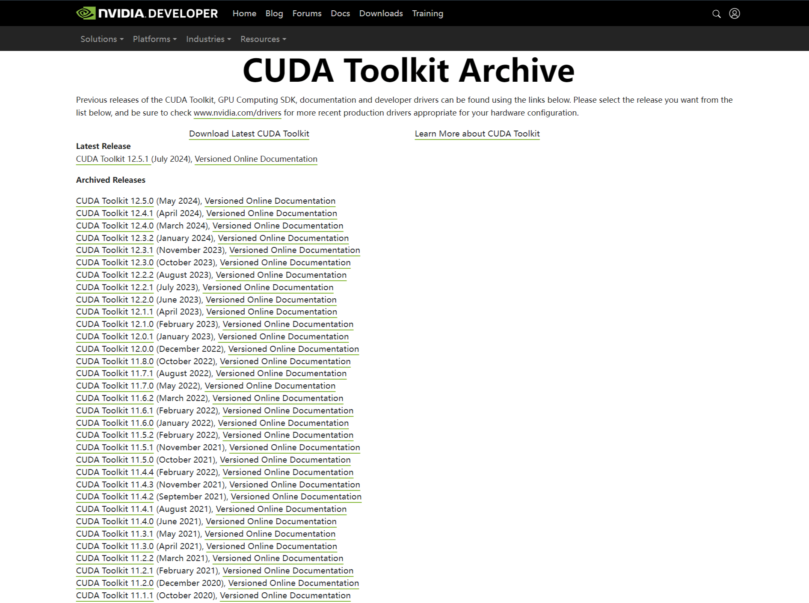{: .shadow }
    
    ---
    
    选择目标平台的操作系统（Linux）、架构（x86_64）、发行版（WSL-Ubuntu）和安装类型
    
    !!! danger "务必选择 `deb (local)` 方式安装"
    
        安装类型**务必选择 `deb (local)`**，使用 `deb (network)` 将会在线安装最新版，而 `runfile (local)` 无法确保不安装驱动！
    
    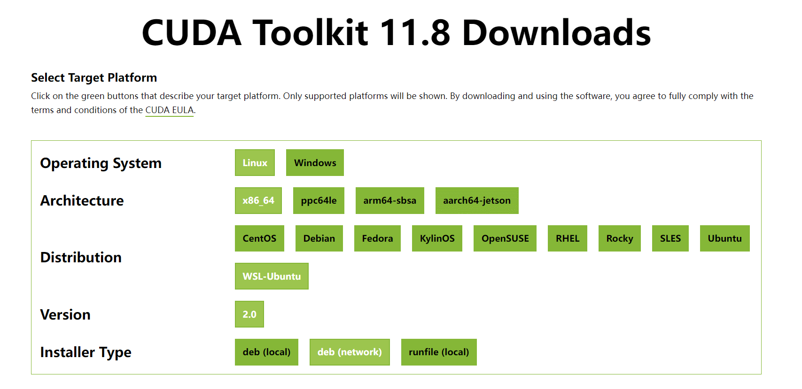{: .shadow }
    
    ---
    
    依照所选 Installer Type（安装类型）的安装命令进行安装
    
    ``` bash
    wget https://developer.download.nvidia.com/compute/cuda/repos/wsl-ubuntu/x86_64/cuda-wsl-ubuntu.pin

    sudo mv cuda-wsl-ubuntu.pin /etc/apt/preferences.d/cuda-repository-pin-600

    wget https://developer.download.nvidia.com/compute/cuda/11.8.0/local_installers/cuda-repo-wsl-ubuntu-11-8-local_11.8.0-1_amd64.deb
    
    sudo dpkg -i cuda-repo-wsl-ubuntu-11-8-local_11.8.0-1_amd64.deb

    sudo cp /var/cuda-repo-wsl-ubuntu-11-8-local/cuda-*-keyring.gpg /usr/share/keyrings/

    sudo apt-get update

    sudo apt-get -y install cuda
    ```
    
    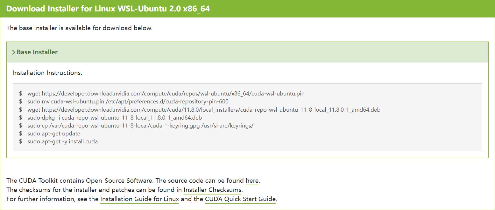{: .shadow }
    
    ---

    安装完成后，可以使用以下命令查看 CUDA 版本以验证安装：
    
    ``` bash
    nvcc --version
    ```

---

**卸载 CUDA Toolkit**

- **删除 CUDA Toolkit**

``` bash
sudo apt --purge remove "*cuda*" "*cublas*" "*cufft*" "*cufile*" "*curand*" \
  "*cusolver*" "*cusparse*" "*gds-tools*" "*npp*" "*nvjpeg*" "nsight*" "*nvvm*"
```

- **删除 NVIDIA 驱动程序**

``` bash
sudo apt --purge remove "*nvidia*" "libxnvctrl*"
```

- **清理缓存及无用的相关依赖**

``` bash
sudo apt autoremove
```

---

### Pip (Python Install Package)

#### 安装 Pip

=== "使用 APT 安装"

    ``` bash
    sudo apt install python3-pip
    ```

=== "使用 `ensurepip` 模块安装"
    
    ``` bash
    python -m ensurepip --upgrade # (1)!
    ```

    1. `ensurepip` 模块需要 Python 3.4 及以上版本

=== "使用 `get-pip.py` 脚本安装"

    ``` bash
    wget https://bootstrap.pypa.io/get-pip.py # (1)!

    python get-pip.py
    ```

    1. 下载 `get-pip.py` 脚本

---

#### 更新 Pip

!!! tip "更新 Pip"

    默认安装的 Pip 可能较旧，建议使用以下命令更新至最新版

``` bash
pip install --upgrade pip # (1)!
```

1. 或 `python -m pip install --upgrade pip`

---

#### 更换软件源

选择一个国内镜像站，建议优先选择地理位置较近、相同运营商的镜像站 (1)
{ .annotate }

1. 可在[校园网联合镜像站](https://mirrors.cernet.edu.cn/site)中查询

|       推荐镜像站       | 镜像站帮助页（Ubuntu）                                            |
|:-----------------:|-----------------------------------------------------------|
| 清华大学镜像站（tsinghua） | <https://mirror.tuna.tsinghua.edu.cn/help/pypi/>          |
|   南京大学镜像站（nju）    | <https://mirror.nju.edu.cn/mirrorz-help/pypi/?mirror=NJU> |
|  上海交通大学镜像站（sjtu）  | <https://mirrors.sjtug.sjtu.edu.cn/docs/pypi-packages>    |
|  阿里云镜像站（aliyun）   | <https://developer.aliyun.com/mirror/pypi>                |

=== "临时使用"

    ``` bash
    pip install -i ${index-url} ${package}
    ```

=== "设为默认（使用命令）"

    ``` bash
    pip config set global.index-url ${index-url}
    ```

=== "设为默认（编辑配置文件）"

    ``` bash
    gedit ~/.config/pip/pip.conf
    ```

    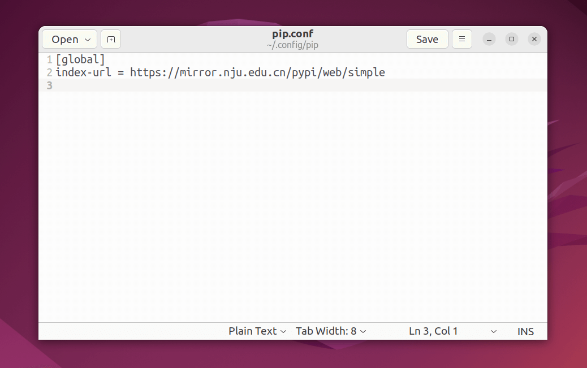{: .shadow }
    /// caption
    图中，使用南京大学镜像站
    ///

---

#### 常用命令

| 描述              | 命令                                                                                                                                              |
|:----------------|:------------------------------------------------------------------------------------------------------------------------------------------------|
| 验证 pip 安装，检查版本等 | `pip --version, pip -V`                                                                                                                         |
| 安装包             | `pip install <options> <package>` <br/> &emsp; `-r, --requirement <file>` <br/> &emsp; `-U, --upgrade` <br/> &emsp; `-e, --editable <path/url>` |
| 卸载包             | `pip uninstall <options> <package>` <br/> &emsp; `-r, --requirement <file>` <br/> &emsp; `-y, --yes`                                            |
| 列出已安装包          | `pip list`                                                                                                                                      |
| 显示已安装包的信息       | `pip show <package>`                                                                                                                            |
| 显示缓存信息          | `pip cache info`                                                                                                                                |
| 删除所有缓存          | `pip cache purge`                                                                                                                               |

[^1]: [适用于 Linux 的 Windows 子系统文档 | Microsoft Learn](https://learn.microsoft.com/zh-cn/windows/wsl/)
[^2]: [比较 WSL 版本 | Microsoft Learn](https://learn.microsoft.com/zh-cn/windows/wsl/compare-versions)
[^3]: [跨文件系统工作 | Microsoft Learn](https://learn.microsoft.com/zh-cn/windows/wsl/filesystems)
